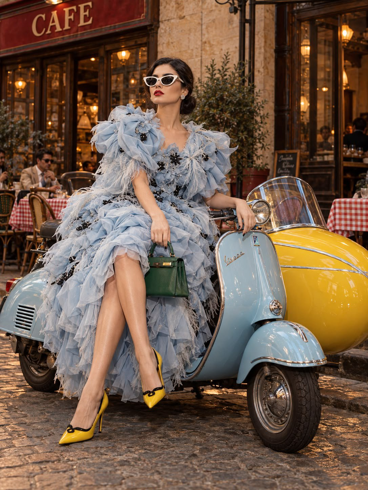

# 1960s Italian Street Fashion Editorial with Vespa & Sidecar

**中文标题：** 意大利复古街头时装大片  
**ID:** `gi25-x-640` · **Mode:** `generate`  
**Categories:** `general`  
**Tags:** `x-twitter`, `community`, `gpt-image-2.5`, `bravoneo`, `en`



### 1960s Italian Street Fashion Editorial with Vespa & Sidecar

```text
Create a photorealistic high-fashion street photograph set on a charming European café street, styled like a surreal yet believable 1960s Italian fashion editorial.

A young adult woman is seated gracefully along the edge of a vintage powder-blue Vespa-inspired scooter. Attached to the scooter is an unusually large, highly polished canary-yellow sidecar, creating a bold pop of color and an eccentric fashion-editorial focal point.

She wears an extravagant icy-blue couture midi dress constructed from layers of sculptural 3D ruffles, delicate shredded tulle, feather-like fabric petals, translucent organza strips, and subtle dark decorative accents. The silhouette is intentionally oversized and cloud-like, with a dramatic neckline and exaggerated architectural shoulders. The outfit should feel luxurious, theatrical, and unmistakably haute couture rather than costume-like.

Her styling is distinctly retro-glamorous: sleek jet-black hair pulled into a perfectly smooth low bun with a precise center part, porcelain-toned skin, sharply defined brows, dramatic black winged eyeliner, and intensely vivid matte-red lipstick. Oversized white cat-eye sunglasses with deep black lenses complete the look.

Accessories include a structured emerald-green handbag and striking yellow pointed-toe stiletto pumps featuring refined black detailing.

Her pose is elegant and controlled, with a sophisticated, slightly aloof expression. Capture her entire figure naturally within the frame, emphasizing the dramatic proportions of the couture silhouette and the unusual scooter-sidecar combination.

The setting is an authentic old European café with dark wooden window frames, weathered beige plaster walls, gingham-covered outdoor tables, and a vintage red “CAFE” sign. Warm amber illumination spills from inside the café, contrasting beautifully with the cooler blue dress and scooter.

Photograph the scene with direct on-camera flash combined with the existing warm environmental lighting. Use saturated but natural colors, crisp flash highlights, subtle shadows, realistic skin texture, authentic fabric detail, and fine 35mm film grain. The final image should resemble a rare vintage Italian fashion editorial photographed for a contemporary luxury magazine.

Vertical 3:4 composition, full-body framing, realistic perspective, high-resolution photography, sophisticated color grading, tactile materials, natural anatomy, believable reflections, cinematic depth, premium editorial photography.

Avoid: generic or minimalist café interiors, ordinary casual clothing, understated fashion, simple dresses, soft beauty lighting, artificial-looking skin, CGI appearance, illustration, anime, cartoon styling, distorted anatomy, malformed hands or feet, warped scooter geometry, unrealistic sidecar proportions, excessive blur, plastic textures, or an obviously AI-generated appearance.
```

- **Recommended model:** `gpt-image-2.5-sunburst`
- **Settings:** _(defaults)_
- **Source:** [community](https://x.com/mehvishs25/status/2104927737014329524) — @mehvishs25 (via BravoNeo/awesome-gpt-image-2-5-prompts)
- **License note:** Original X post credited via BravoNeo/awesome-gpt-image-2-5-prompts (third-party source, no new license granted); remix with attribution
- **Notes:** BravoNeo entry x-2104927737014329524; use=fashion-editorial; style=photorealistic,retro; prompt matches original X post text; verified=True
- **Preview:** `previews/gi25-x-640.jpg`
