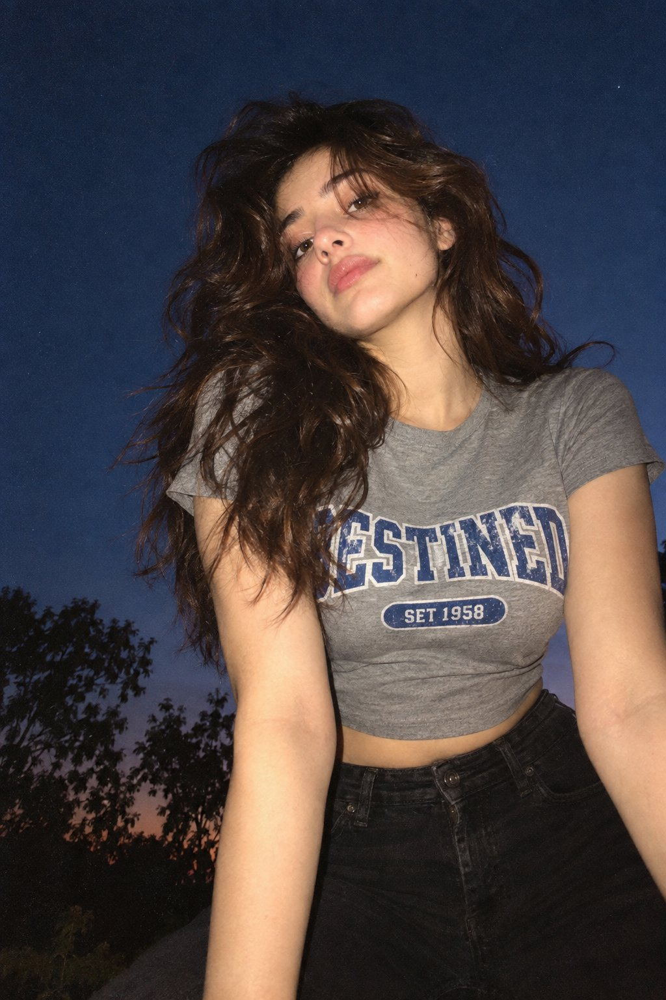

# Dusk Flash Portrait with Grainy Film Texture

**中文标题：** 黄昏直闪胶片人像  
**ID:** `gi25-x-642` · **Mode:** `generate`  
**Categories:** `general`  
**Tags:** `x-twitter`, `community`, `gpt-image-2.5`, `bravoneo`, `en`



### Dusk Flash Portrait with Grainy Film Texture

```text
A low-angle, close-up photograph capturing a young woman with wavy brown hair outdoors at dusk. She is wearing a grey cropped t-shirt with a blue and white graphic text that reads 'DESTINED' above 'SET 1958' and black denim bottoms. Her head is tilted, and she is looking directly into the camera lens. The dark blue evening sky serves as the background, with silhouetted tree branches visible at the bottom of the frame. Strong flash lighting is directed from the front, illuminating her face and highlighting strands of her hair. The composition has a grainy film photography aesthetic.
```

- **Recommended model:** `gpt-image-2.5-sunburst`
- **Settings:** _(defaults)_
- **Source:** [community](https://x.com/chatgptpaglu/status/2105219509791678731) — @chatgptpaglu (via BravoNeo/awesome-gpt-image-2-5-prompts)
- **License note:** Original X post credited via BravoNeo/awesome-gpt-image-2-5-prompts (third-party source, no new license granted); remix with attribution
- **Notes:** BravoNeo entry x-2105219509791678731; use=portraits; style=photorealistic,film; prompt matches original X post text; verified=True
- **Preview:** `previews/gi25-x-642.jpg`
