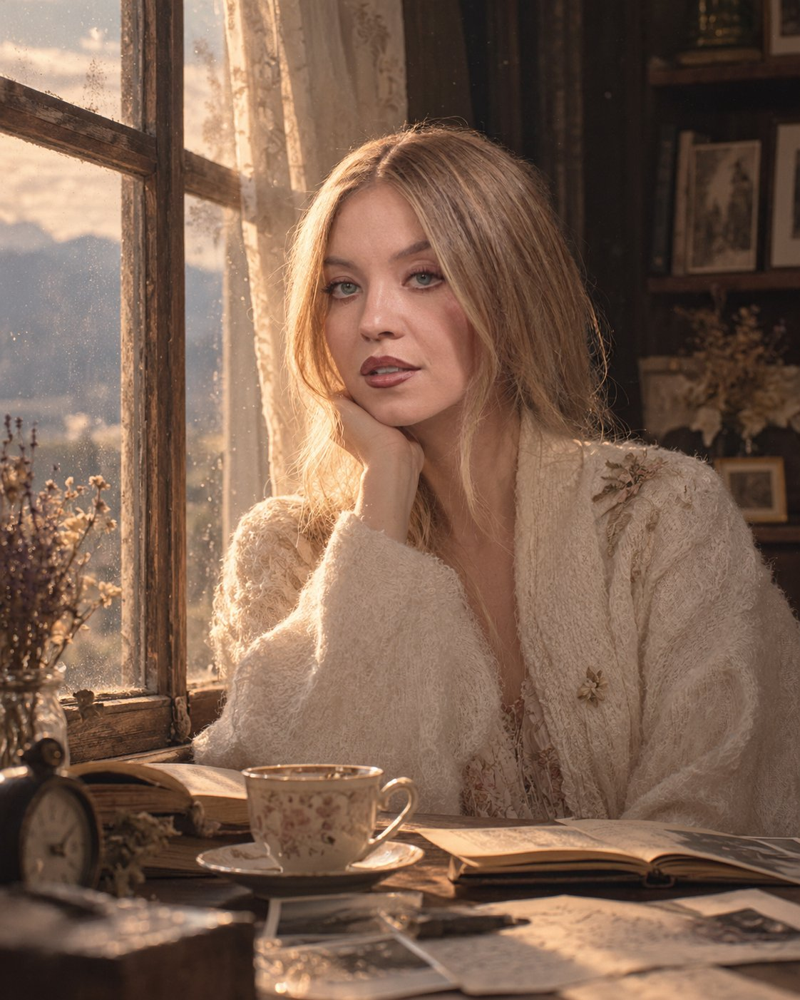

# Quiet Inner World: Cinematic Window Portrait

**中文标题：** 内心世界：窗边电影感人像  
**ID:** `gi25-x-649` · **Mode:** `generate`  
**Categories:** `general`  
**Tags:** `x-twitter`, `community`, `gpt-image-2.5`, `bravoneo`, `en`



### Quiet Inner World: Cinematic Window Portrait

```text
Create an exceptionally artistic cinematic portrait of a person, designed as a visual representation of their quiet inner world.

Show the person standing beside a large old window in a softly lit vintage room. Their face and identity remain natural, realistic, and highly detailed. They are not posing directly for the camera; instead, capture a subtle candid moment as they look slightly away, as if lost in thought.

The room should feel like a collection of memories: an open old book, a half-filled teacup, handwritten notes, dried flowers, a small vintage clock, scattered photographs, and delicate curtains moving slightly in the breeze.

Create a beautiful contrast between warm sunlight entering through the window and soft cool shadows surrounding the subject. Let tiny dust particles float through the light, creating a dreamy atmospheric glow.

Use muted earthy tones, warm ivory, faded brown, dusty beige, soft sage, and subtle golden highlights. Natural skin texture, realistic eyes, delicate hair strands, soft fabric details, cinematic depth of field.

Add subtle visual storytelling: reflections in the window should contain faint, almost imperceptible fragments of landscapes, clouds, trees, and distant mountains, as though the person's memories are quietly appearing in the glass.

Composition should feel like a frame from an intimate arthouse film — elegant, peaceful, nostalgic, sophisticated, emotionally expressive without being dramatic.

Editorial photography + cinematic realism + fine-art portraiture + nostalgic film grain + soft natural light + subtle analog texture.

No excessive makeup, no artificial beauty retouching, no exaggerated pose, no fantasy costume, no plastic skin, no text, no watermark.
```

- **Recommended model:** `gpt-image-2.5-sunburst`
- **Settings:** _(defaults)_
- **Source:** [community](https://x.com/Naiknelofar788/status/2105563599527964741) — @Naiknelofar788 (via BravoNeo/awesome-gpt-image-2-5-prompts)
- **License note:** Original X post credited via BravoNeo/awesome-gpt-image-2-5-prompts (third-party source, no new license granted); remix with attribution
- **Notes:** BravoNeo entry x-2105563599527964741; use=portraits; style=photorealistic,film; prompt matches original X post text; verified=True
- **Preview:** `previews/gi25-x-649.jpg`
