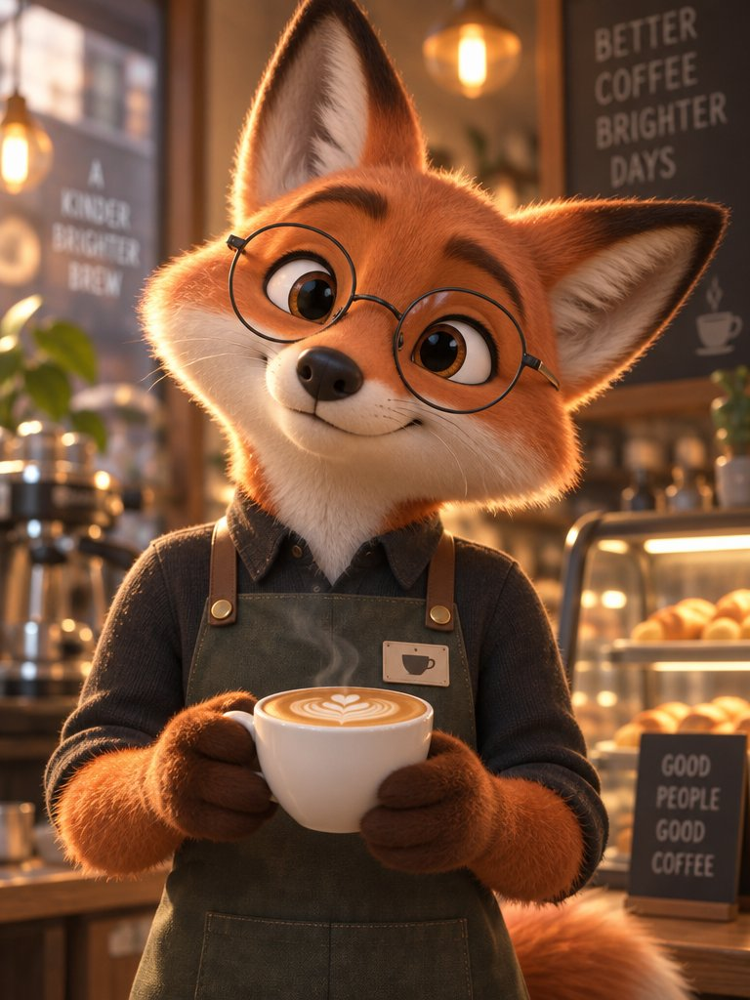

# Pixar-Style Fox Barista 3D Character Portrait

**中文标题：** 皮克斯风狐狸咖啡师 3D 角色  
**ID:** `gi25-x-654` · **Mode:** `generate`  
**Categories:** `general`  
**Tags:** `x-twitter`, `community`, `gpt-image-2.5`, `x-direct`, `en`



### Pixar-Style Fox Barista 3D Character Portrait

```text
Stylized 3D character portrait. Pixar-style fox barista with round glasses holding a latte, warm cafe bokeh, soft subsurface fur, big expressive eyes, cinematic rim light.
```

- **Recommended model:** `gpt-image-2.5-sunburst`
- **Settings:** _(defaults)_
- **Source:** [community](https://x.com/avocadoai_co/status/2107777216822256063) — @avocadoai_co
- **License note:** Original public X post; quoted with attribution — remix with attribution
- **Notes:** Collected directly from X; original post https://x.com/avocadoai_co/status/2107777216822256063; post text names GPT Image 2.5; verified=True; from a Nano Banana 2.1 vs GPT Image 2.5 Sunburst comparison thread — preview is the right-hand (Sunburst) image
- **Preview:** `previews/gi25-x-654.jpg`
