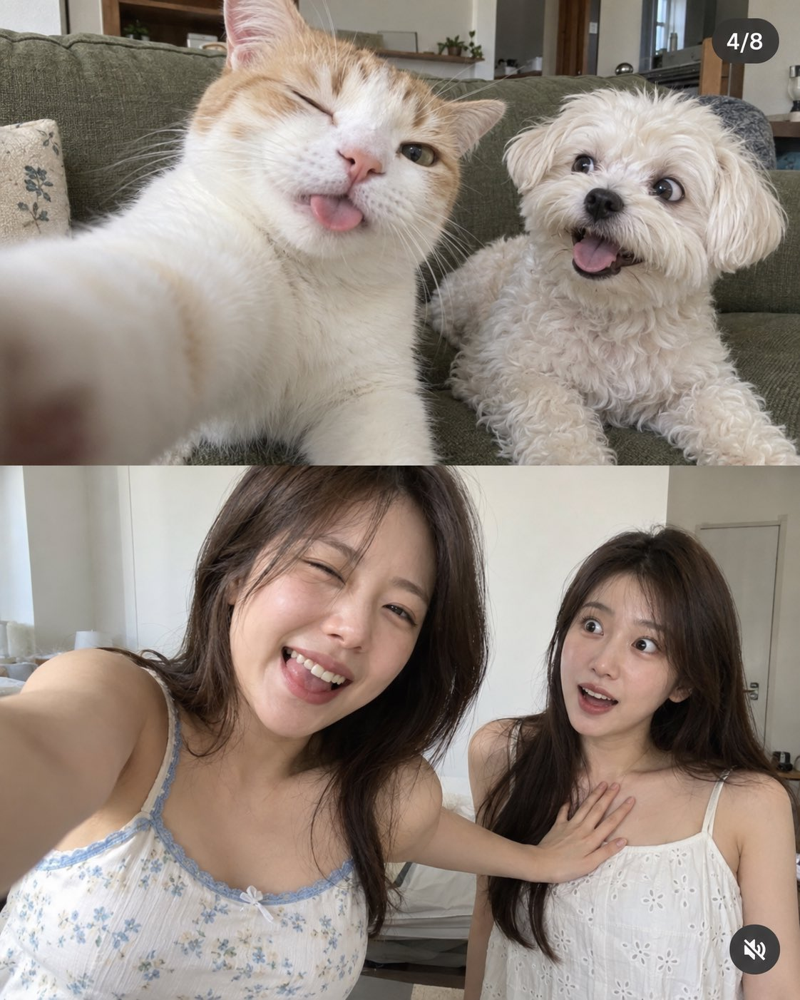

# Pets vs Friends Selfie Instagram Carousel

**中文标题：** 宠物与闺蜜对照 Instagram 轮播图  
**ID:** `gi25-x-659` · **Mode:** `generate`  
**Categories:** `general`  
**Tags:** `x-twitter`, `community`, `gpt-image-2.5`, `x-direct`, `en`



### Pets vs Friends Selfie Instagram Carousel

```text
Create a realistic vertical social-media carousel image with two stacked photographs, matching the composition of a casual Instagram-style post.

Top half:
A funny close-up selfie-style photograph of two pets sitting together on a muted olive-green sofa indoors.

On the left is a large white-and-light-orange short-haired cat very close to the camera. The cat is extending one front paw toward the lens as if taking a selfie. One eye is closed in a playful wink, its tongue is slightly sticking out, and its expression looks silly and mischievous. The paw in the extreme foreground is slightly blurred because it is very close to the lens.

On the right is a small fluffy white dog, sitting slightly farther back. The dog has bright dark eyes, a black nose, fluffy cream-white fur, and an open-mouth happy expression with its tongue slightly visible. The dog looks toward the cat with an excited, amused expression.

Use realistic pet fur, natural whiskers, believable paw anatomy, soft indoor daylight, casual smartphone photography, slight wide-angle distortion, and spontaneous humorous timing.

Bottom half:
A realistic casual indoor smartphone photo of two adult East Asian women posing together in a bright minimal room with plain pale walls.

The woman on the left is positioned closer to the camera and appears larger because of perspective. She has medium-length dark brown hair, natural feminine makeup, and is laughing with one eye squeezed shut in a playful wink. She wears a light-colored summer camisole with delicate pale-blue trim and a subtle floral pattern.

The woman on the right stands slightly behind her. She has long dark brown hair and wears a simple white sleeveless summer top with subtle eyelet embroidery. She has a surprised, wide-eyed expression, as if reacting to a joke.

The woman closer to the camera extends one arm toward her friend, with her hand resting naturally on the friend’s upper chest / collarbone area in a playful, non-romantic gesture. Keep the pose humorous and spontaneous rather than glamorous or suggestive.

Both women should appear relaxed and candid, like close friends filming a funny short-form social-media clip.

Composition: vertical 4:5 or 3:4 frame divided horizontally into two equal stacked images. The upper pet photo fills the top half and the two-woman photo fills the bottom half. Keep the framing slightly imperfect and casual, like screenshots taken from a Reel or carousel.

Add a small dark translucent “4/8” carousel indicator in the upper-right corner. Add a small muted-speaker UI icon near the lower-right corner, subtle and realistic.

Camera style: authentic modern smartphone photography, natural exposure, realistic skin texture, realistic pet fur, moderate sharpness, slight mobile-camera processing, natural depth of field, no cinematic color grading.

Overall aesthetic: humorous social-media post, playful comparison between pets and humans, candid expressions, natural indoor lighting, spontaneous viral-post energy, not a professional photoshoot.

Negative prompt:

CGI, 3D render, anime, illustration, plastic skin, beauty filter, distorted hands, extra fingers, malformed paws, extra legs, duplicated limbs, unnatural facial symmetry, excessive retouching, exaggerated body proportions, studio lighting, cinematic lighting, fake bokeh, over-sharpening, HDR, distorted UI, unreadable interface text, watermark, logo
```

- **Recommended model:** `gpt-image-2.5-sunburst`
- **Settings:** _(defaults)_
- **Source:** [community](https://x.com/msslindia/status/2107047699338158431) — @msslindia
- **License note:** Original public X post; quoted with attribution — remix with attribution
- **Notes:** Collected directly from X; original post https://x.com/msslindia/status/2107047699338158431 (prompt posted as the author's reply to https://x.com/msslindia/status/2107047639120253068, which carries the images); post text names GPT Image 2.5; verified=True
- **Preview:** `previews/gi25-x-659.jpg`
