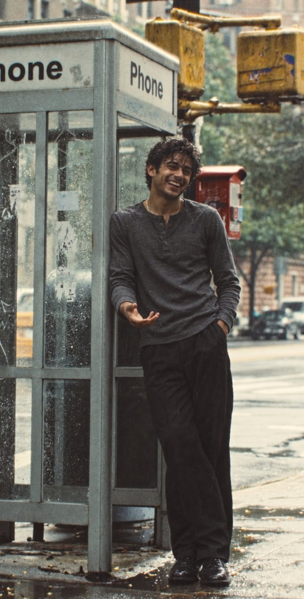

# JSON Rainy Phone-Booth Street Portrait

**中文标题：** JSON 雨后电话亭街拍人像  
**ID:** `gi25-x-660` · **Mode:** `generate`  
**Categories:** `general`  
**Tags:** `x-twitter`, `community`, `gpt-image-2.5`, `x-direct`, `en`



### JSON Rainy Phone-Booth Street Portrait

```text
{
  "task": "photorealistic still photograph, not illustration",
  "aspect_ratio": "9:16",
  "camera": {
    "format": "35mm film still",
    "lens": "50mm",
    "aperture": "f/2.8",
    "distance": "full body, slight low angle from sidewalk",
    "focus": "sharp on face and torso, street softly falling off"
  },
  "look": {
    "stock": "Kodak Portra 400",
    "grain": "fine visible grain",
    "color": "muted, slightly warm skin, cool wet pavement",
    "contrast": "soft, overcast, no ring light, no beauty lighting"
  },
  "subject": {
    "identity": "original Indian man, early 20s, not a celebrity, not a lookalike",
    "face": "natural skin texture, visible pores, light stubble, no airbrush",
    "hair": "short dark wavy hair, slightly wet from rain, a few strands on forehead",
    "expression": "open laugh, teeth showing, eyes narrowed, unposed",
    "body": "lean, relaxed, about 5'10\""
  },
  "wardrobe": {
    "top": "heather charcoal long-sleeve henley, no logos, no text",
    "bottom": "dark loose trousers, slight rain darkening at hems",
    "shoes": "black leather derby shoes, wet",
    "jewelry": "thin gold chain only"
  },
  "pose": {
    "stance": "full body, weight on left leg",
    "lean": "right shoulder and hip against the phone booth frame",
    "right_hand": "open palm, mid-gesture, as if mid-sentence",
    "left_hand": "in trouser pocket",
    "gaze": "just off camera, toward the street"
  },
  "set": {
    "hero_prop": "classic metal-and-glass sidewalk phone booth, rain beading on glass, faded stickers inside, no carrier branding",
    "signage": "simple white 'Phone' plates on the booth, no other logos",
    "ground": "wet asphalt, puddles, fallen leaves",
    "background": "overcast city street, trees, parked cars, brick buildings, yellow traffic lights above, red metal box behind him",
    "weather": "light rain, just after a shower",
    "time": "daytime, overcast, no sun shafts"
  },
  "must_not": [
    "celebrity likeness",
    "perfect skin",
    "ring light",
    "brand logos on clothes or booth",
    "readable store names",
    "famous landmark named in frame",
    "extra phones in his hands",
    "text overlay, watermark, UI"
  ],
  "negative": "cgi, plastic skin, beauty campaign, studio backdrop, wide smile with no rain, dry pavement, neon, cyberpunk"
}
```

- **Recommended model:** `gpt-image-2.5-sunburst`
- **Settings:** _(defaults)_
- **Source:** [community](https://x.com/adithatipalli/status/2107027410822771072) — @adithatipalli
- **License note:** Original public X post; quoted with attribution — remix with attribution
- **Notes:** Collected directly from X; original post https://x.com/adithatipalli/status/2107027410822771072 (prompt posted as the author's reply to https://x.com/adithatipalli/status/2107027405974147393, which carries the images); post text names GPT Image 2.5; verified=True
- **Preview:** `previews/gi25-x-660.jpg`
