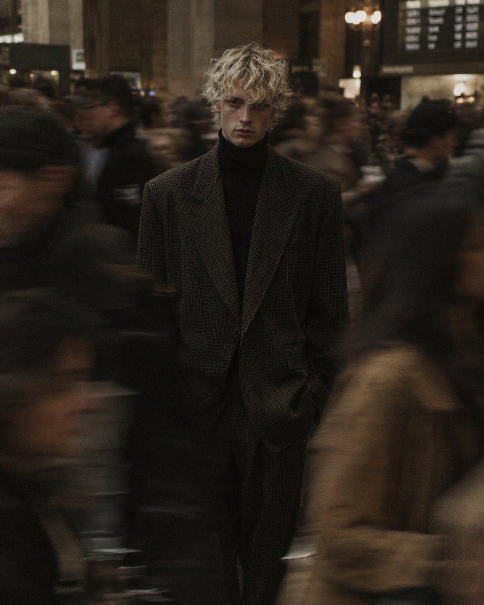

# Still Model in a Rushing Crowd Fashion Editorial

**中文标题：** 人潮中静止的男模时尚大片  
**ID:** `gi25-x-663` · **Mode:** `generate`  
**Categories:** `general`  
**Tags:** `x-twitter`, `community`, `gpt-image-2.5`, `x-direct`, `en`



### Still Model in a Rushing Crowd Fashion Editorial

```text
Cinematic high-fashion editorial photograph of a young male model standing perfectly still in the center of a crowded urban interior, surrounded by people rushing past him with strong motion blur. The model has tousled platinum-blond curly hair partially covering his forehead, pale skin, an intense neutral expression, and wears an oversized dark brown/black micro-checkered tailored suit with a black turtleneck. Sharp focus on the central subject while the surrounding crowd is heavily motion-blurred, creating a frozen-in-time effect. Moody low-key lighting, warm skin tones, muted brown and charcoal color palette, shallow depth of field, natural grain, subtle film texture, realistic photography, 35mm analog film aesthetic, fashion magazine editorial, dramatic composition, eye-level camera, slightly desaturated, atmospheric, sophisticated, raw and candid, vertical portrait, 4:5 aspect ratio.
```

- **Recommended model:** `gpt-image-2.5-sunburst`
- **Settings:** _(defaults)_
- **Source:** [community](https://x.com/iamsofiaijaz/status/2106608174820417549) — @iamsofiaijaz
- **License note:** Original public X post; quoted with attribution — remix with attribution
- **Notes:** Collected directly from X; original post https://x.com/iamsofiaijaz/status/2106608174820417549 (prompt posted as the author's reply to https://x.com/iamsofiaijaz/status/2106608153614057523, which carries the images); post text names GPT Image 2.5; verified=True
- **Preview:** `previews/gi25-x-663.jpg`
