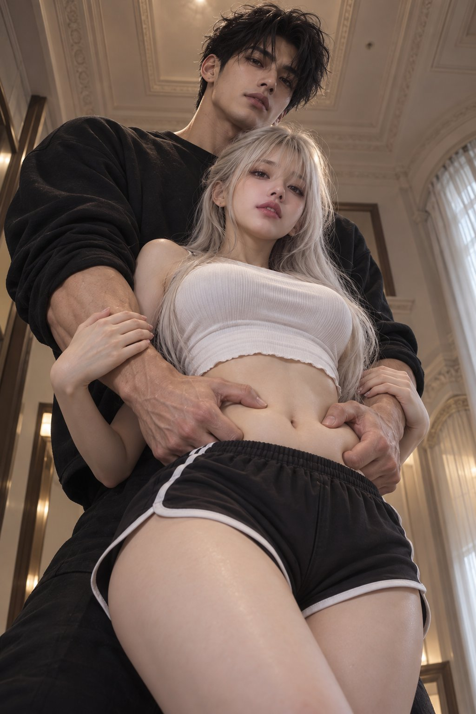

# Worm's-Eye Penthouse Hallway Couple Film Still

**中文标题：** 仰拍顶层公寓走廊情侣剧照  
**ID:** `gi25-x-671` · **Mode:** `generate`  
**Categories:** `general`  
**Tags:** `x-twitter`, `community`, `gpt-image-2.5`, `x-direct`, `en`



### Worm's-Eye Penthouse Hallway Couple Film Still

```text
Dramatically low-angle, worm's-eye perspective cinematic film still of a live-action, exceptionally handsome couple posing inside a high-ceiling luxury penthouse hallway. The camera looks steeply upward from below, emphasizing extreme height and physical contrast. A tall, broodingly handsome East Asian man in his mid-20s stands directly behind a delicate, gorgeous young woman in her early 20s. His large, muscular, veined hands reach forward around her waist, with fingers deliberately pressing and gently pinching the soft skin of her bare lower stomach. Her slender hands rest firmly against his thick forearms, gripping him as she tilts her head slightly, gazing downward toward the lens with a calm, magnetic expression.

The man possesses an intense, sharp masculine face: a chiseled jawline, prominent cheekbones, high straight nose bridge, and a piercing, calm gaze from dark eyes, with messy tousled black hair hanging over his brow. His frame is towering and muscular, wearing an oversized matte-black crewneck sweatshirt with sleeves pushed up past his strong wrists.

The woman is an ethereal, petite doll-like beauty: porcelain skin, a soft heart-shaped jawline, and two fully healthy, large, luminous dark-brown almond eyes with fluttery lashes and subtle aegyo-sal, completely free of any medical patches or bandages. Her straight platinum-white hair reaches past her shoulders with clean, wispy fringe bangs. She wears a fitted white crop top exposing her bare midriff, paired with high-waisted black athletic dolphin shorts with white piping, highlighting her feminine hourglass shape.

The low-angle perspective looks straight up past them toward an ornate, towering classical ceiling with elegant crown moldings and a soft draped curtain along an arched doorway.

Lit with dramatic cinematic chiaroscuro: directional overhead key light sculpts their jawlines and shoulders, casting deep cinematic contrast and revealing the tactile warmth of the man's hands grasping her midriff. Shot on an anamorphic 35mm cinema lens at T1.8, ISO 250, 1/120s, rendering authentic skin micro-texture, natural fabric folds, and palpable cinematic physical chemistry.
```

- **Recommended model:** `gpt-image-2.5-sunburst`
- **Settings:** _(defaults)_
- **Source:** [community](https://x.com/johnAGI168/status/2108051379243647303) — @johnAGI168
- **License note:** Original public X post; quoted with attribution — remix with attribution
- **Notes:** Collected directly from X; original post https://x.com/johnAGI168/status/2108051379243647303; post text names GPT Image 2.5; verified=True
- **Preview:** `previews/gi25-x-671.jpg`
