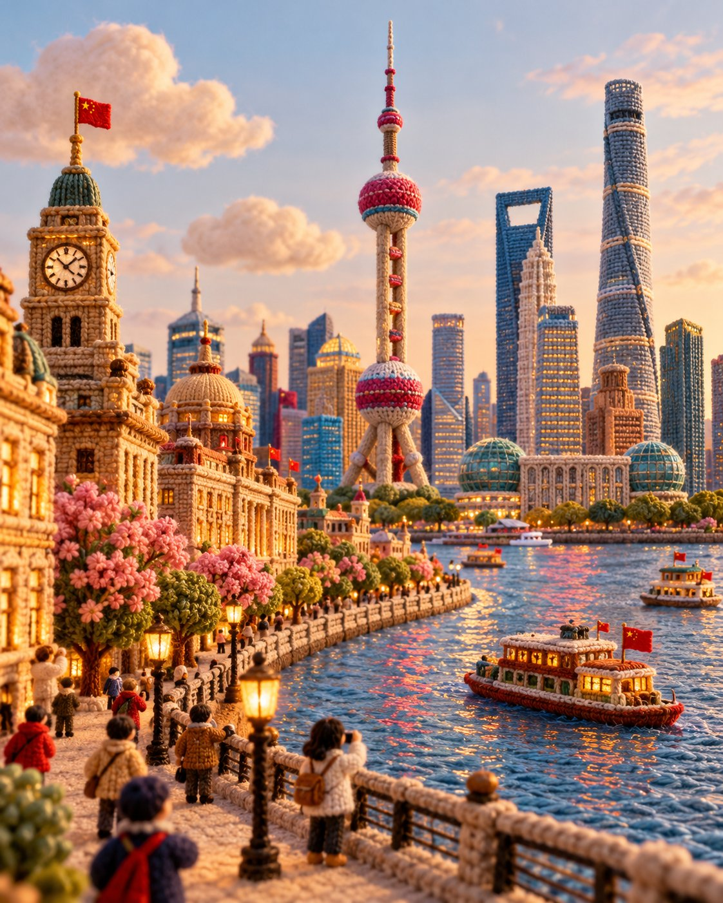

# Knitted Yarn & Felt Miniature Travel Landmark

**中文标题：** 毛线毛毡微缩旅行地标  
**ID:** `gi25-x-674` · **Mode:** `generate`  
**Categories:** `general`  
**Tags:** `x-twitter`, `community`, `gpt-image-2.5`, `x-direct`, `en`



### Knitted Yarn & Felt Miniature Travel Landmark

```text
Create a premium 4:5 vertical architectural travel artwork for [COUNTRY / CITY / LOCATION / LANDMARK].

TEXT-TO-IMAGE ONLY — generate the entire scene creatively from [COUNTRY / CITY / LOCATION / LANDMARK] alone. No reference image required.

CORE CONCEPT

Transform the destination into a charming handcrafted miniature world made entirely from knitted yarn, soft felt, embroidery, and plush textile materials. Reimagine its architecture, streets, nature, transportation, and local atmosphere as a sophisticated collectible textile diorama.

LANDMARK & COMPOSITION

Automatically select ONE unmistakable landmark representing [COUNTRY / CITY / LOCATION / LANDMARK] and make it the central hero.

Build a complete miniature environment around it using authentic local architecture, streets, gardens, trees, shops, landscape, and a few tiny generic yarn characters. Keep the landmark’s recognizable silhouette and defining architectural features while translating everything into rounded handmade textile forms.

MATERIAL LANGUAGE

Every element should visibly feel handmade:
- chunky knitted yarn
- soft felt
- embroidered details
- woven fabric
- stitched edges
- wool fibers
- plush textile surfaces
- tiny handcrafted imperfections

Architecture should look carefully constructed from layered fabric and yarn rather than plastic, clay, or CGI.

ATMOSPHERE

Create a warm, playful, cozy travel atmosphere with soft natural lighting, gentle shadows, tactile fibers, rounded forms, and subtle depth. Add small destination-specific details such as local food, transportation, plants, signs, or cultural objects where they naturally enhance the scene.

Keep the background simple and softly colored so the miniature world remains the focus.

STYLE

Architectural travel poster × knitted miniature diorama × handmade textile art × plush yarn world × sophisticated editorial illustration.

The result should feel like an elaborate handcrafted collectible discovered in a miniature museum — whimsical but visually refined and architecturally recognizable.

COLOR

Use a harmonious palette inspired by the destination itself, combining warm neutrals with a few distinctive local accent colors. Keep the colors soft, rich, and tactile rather than overly bright.

Avoid photorealism, plastic materials, smooth CGI, generic architecture, unrelated landmarks, hard geometric edges, excessive clutter, realistic humans, logos, watermarks, and flat vector illustration.

FORMAT

4:5 vertical, one cohesive miniature world, central landmark, rich textile detail, soft depth of field, premium handcrafted finish, highly detailed yarn and felt textures.
```

- **Recommended model:** `gpt-image-2.5-sunburst`
- **Settings:** _(defaults)_
- **Source:** [community](https://x.com/Goodmanprotocol/status/2108039007376724135) — @Goodmanprotocol
- **License note:** Original public X post; quoted with attribution — remix with attribution
- **Notes:** Collected directly from X; original post https://x.com/Goodmanprotocol/status/2108039007376724135; post text names GPT Image 2.5; verified=True
- **Preview:** `previews/gi25-x-674.jpg`
