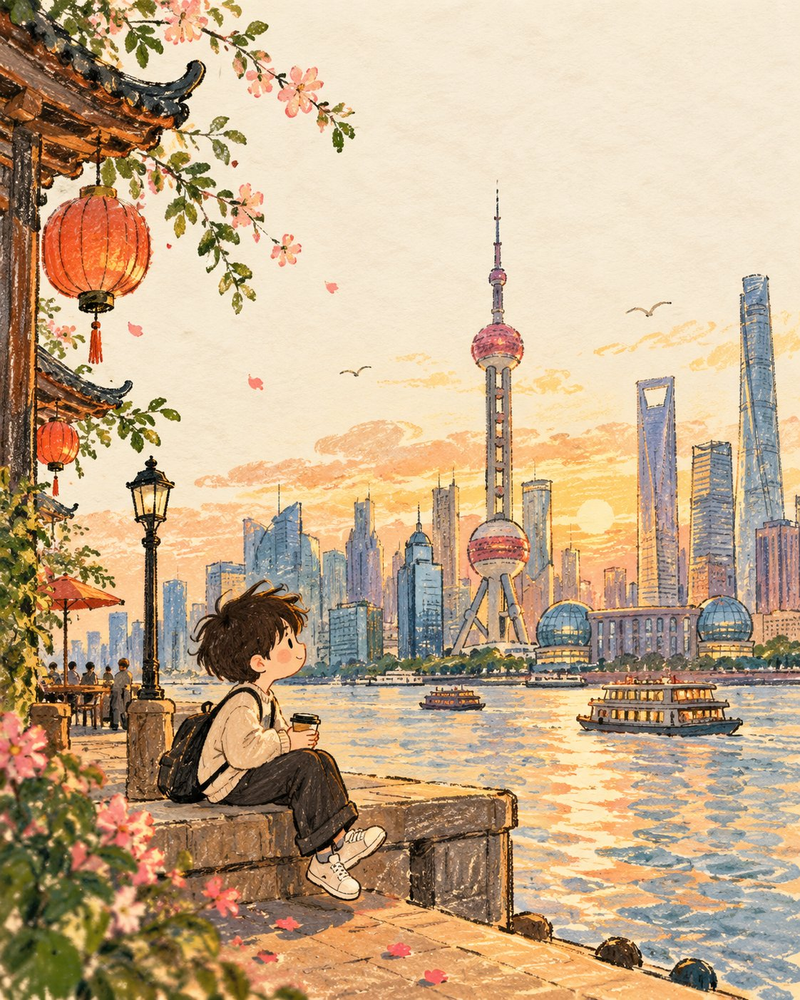

# Minimalist Storybook Travel Illustration

**中文标题：** 极简童书风旅行插画  
**ID:** `gi25-x-675` · **Mode:** `generate`  
**Categories:** `general`  
**Tags:** `x-twitter`, `community`, `gpt-image-2.5`, `x-direct`, `en`



### Minimalist Storybook Travel Illustration

```text
Create a premium 4:5 vertical minimalist illustrated travel artwork for [COUNTRY / CITY / LOCATION / SUBJECT].

TEXT-TO-IMAGE ONLY — generate the artwork creatively from [COUNTRY / CITY / LOCATION / SUBJECT] alone. No reference image required.

CORE CONCEPT

Create a warm, whimsical editorial illustration inspired by the mood, colors, atmosphere, and visual character of the destination. Reduce the scene into one charming hand-drawn moment with a simple, storybook-like composition.

MAIN SUBJECT

Feature a small, cute generic illustrated character naturally interacting with the destination environment. The character should have a simple rounded face, tiny expressive eyes, subtle rosy cheeks, and relaxed natural body language.

Automatically choose appropriate clothing, accessories, pose, and surrounding elements based on [COUNTRY / CITY / LOCATION / SUBJECT], while keeping the character completely original and non-identifiable.

SCENE

Build a minimal environment using a few recognizable destination-inspired elements — architecture, landscape, flowers, local objects, transportation, food, or cultural details.

Do not overcrowd the composition. Use only the strongest visual elements needed to communicate the location.

STYLE

Hand-drawn children's picture book × soft editorial postcard × crayon and gouache illustration.

Use slightly imperfect outlines, visible crayon strokes, soft gouache fills, simple organic shapes, gentle proportions, subtle paper texture, and charming handmade imperfections.

Keep the background predominantly warm off-white/cream with generous negative space. Add only a few delicate lines, small marks, clouds, leaves, or motion strokes where they improve the composition.

COLOR

Use a warm, cheerful palette naturally inspired by [COUNTRY / CITY / LOCATION / SUBJECT]. Combine soft cream with a few muted yet lively destination colors.

Keep the palette cohesive and avoid excessive saturation.

FINAL AESTHETIC

A charming handmade travel postcard that feels intimate, playful, warm, and artistic — like a tiny illustrated memory from the destination rather than a literal recreation of a photograph.

Avoid photorealism, recognizable real people, copyrighted characters, logos, commercial branding, excessive detail, complex backgrounds, glossy 3D rendering, harsh digital outlines, clutter, text, and watermarks.

FORMAT

4:5 vertical, single illustration, warm off-white paper, generous negative space, cute original character, simplified destination storytelling, premium children's-book/editorial finish.
```

- **Recommended model:** `gpt-image-2.5-sunburst`
- **Settings:** _(defaults)_
- **Source:** [community](https://x.com/Goodmanprotocol/status/2107834952318611567) — @Goodmanprotocol
- **License note:** Original public X post; quoted with attribution — remix with attribution
- **Notes:** Collected directly from X; original post https://x.com/Goodmanprotocol/status/2107834952318611567; post text names GPT Image 2.5; verified=True
- **Preview:** `previews/gi25-x-675.jpg`
