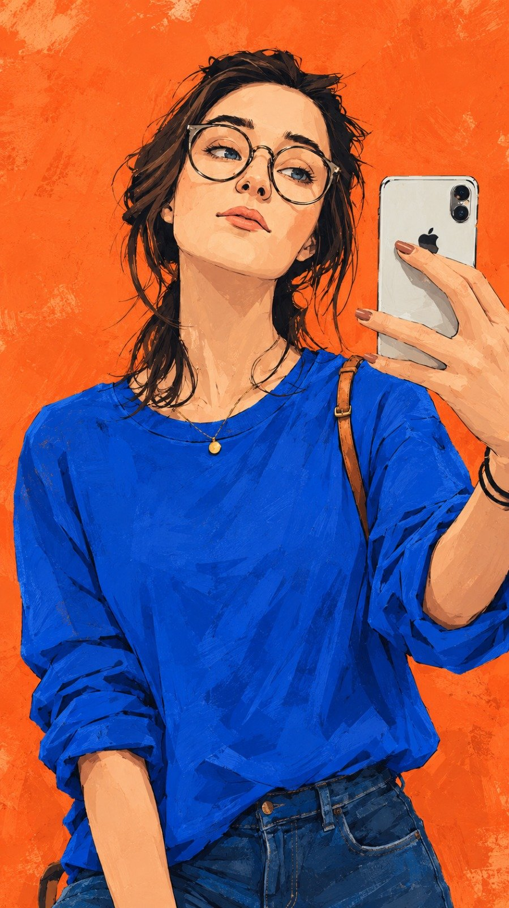

# Ink-Outline Fashion Painting Portrait (JSON)

**中文标题：** 墨线时装插画人像（JSON）  
**ID:** `gi25-x-678` · **Mode:** `generate`  
**Categories:** `general`  
**Tags:** `x-twitter`, `community`, `gpt-image-2.5`, `x-direct`, `en`



### Ink-Outline Fashion Painting Portrait (JSON)

```text
{
  "prompt"{
    "visual_style": {
      "medium": "digital painting with hand-drawn ink outlines",
      "aesthetic": "modern fashion illustration mixed with graphic novel artwork",
      "texture": "visible brush strokes, subtle paper grain, rough painted edges",
      "finish": "expressive, painterly, slightly imperfect handmade look",
      "lighting": "soft warm ambient lighting with gentle facial highlights"
    },

    "subject": {
      "gender": "woman",
      "age": "young adult",
      "appearance": "attractive woman with natural facial proportions",
      "hair": "dark brown, medium-length slightly messy hair with loose strands framing the face",
      "eyewear": "large round black-rimmed glasses",
      "expression": "calm, slightly confident, relaxed expression with a subtle pout",
      "eyes": "light blue-gray eyes, looking toward the smartphone",
      "skin": "natural warm skin tone with painterly shading"
    },

    "pose": {
      "framing": "vertical medium-to-three-quarter portrait",
      "camera_angle": "slightly low-angle selfie perspective",
      "head_position": "head tilted slightly backward and toward the camera",
      "body_position": "standing casually with relaxed shoulders",
      "right_hand": "holding a smartphone near the upper-right side of the frame",
      "phone_position": "smartphone raised at approximately face level",
      "left_arm": "relaxed naturally beside the body",
      "gaze": "looking toward the phone camera"
    },

    "clothing": {
      "top": "oversized loose long-sleeve shirt in rich cobalt blue",
      "fit": "casual relaxed fit",
      "bottom": "dark indigo-blue denim jeans",
      "accessory": "small delicate gold pendant necklace",
      "additional_details": "warm tan leather shoulder strap visible over one shoulder"
    },

    "smartphone": {
      "type": "modern premium smartphone",
      "color": "light silver",
      "camera_module": "visible dual-camera module",
      "position": "held vertically in the raised hand"
    },

    "background": {
      "color": "vivid coral-orange",
      "style": "flat minimal illustrated background",
      "texture": "subtle distressed paint marks, scratches, faded brush patches and paper texture",
      "depth": "minimal depth with no detailed environment"
    },

    "composition": {
      "subject_placement": "woman centered slightly left of frame",
      "phone_placement": "upper-right quadrant",
      "framing": "body visible from head down to upper thighs",
      "negative_space": "large clean coral-orange areas surrounding the subject",
      "visual_balance": "face, cobalt outfit and silver smartphone create the main focal points"
    },

    "color_palette": {
      "background": "vivid coral-orange",
      "outfit": "rich cobalt blue",
      "jeans": "deep indigo blue",
      "hair": "deep brown and near-black",
      "skin": "warm peach and beige tones",
      "jewelry": "soft gold",
      "phone": "light silver",
      "overall_palette": "bold complementary warm-and-cool color contrast"
    },

    "rendering_details": {
      "linework": "loose expressive dark ink outlines",
      "shading": "layered painterly shadows with visible brush strokes",
      "facial_details": "simplified but expressive eyes, nose and lips",
      "edges": "slightly rough hand-painted edges",
      "overall_feel": "vibrant, stylish, youthful, artistic and contemporary"
    },

    "negative_prompt": [
      "photorealistic photography",
      "3D render",
      "anime",
      "cartoon character proportions",
      "plastic skin",
      "overly polished digital art",
      "complex background",
      "extra fingers",
      "extra hands",
      "duplicate smartphone",
      "deformed face",
      "distorted glasses",
      "text",
      "logos",
      "watermarks"
    ]
  }
}
```

- **Recommended model:** `gpt-image-2.5-sunburst`
- **Settings:** _(defaults)_
- **Source:** [community](https://x.com/hey_am_cherry/status/2107687505248256083) — @hey_am_cherry
- **License note:** Original public X post; quoted with attribution — remix with attribution
- **Notes:** Collected directly from X; original post https://x.com/hey_am_cherry/status/2107687505248256083; post text names GPT Image 2.5; verified=True
- **Preview:** `previews/gi25-x-678.jpg`
