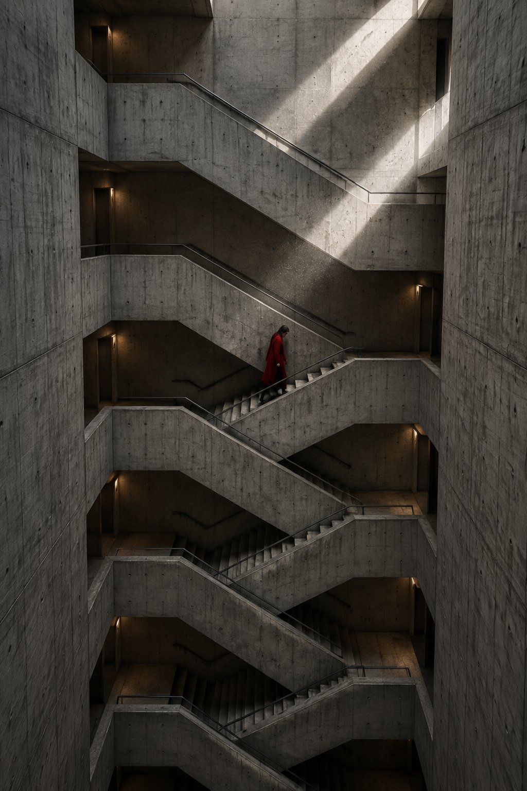

# Sunburst Conceptual Architecture Photography Prompt Set

**中文标题：** Sunburst 概念建筑摄影提示词组  
**ID:** `gi25-x-681` · **Mode:** `generate`  
**Categories:** `general`  
**Tags:** `x-twitter`, `community`, `gpt-image-2.5`, `x-direct`, `en`



### Sunburst Conceptual Architecture Photography Prompt Set

```text
a vertical architectural photograph inside a brutalist concrete stairwell, the stair folding back on itself in six repeating flights, one small figure in a long red coat descending at the middle of the frame, a single shaft of daylight entering from an unseen opening above and crossing the concrete in three hard bright bands, dust suspended in the air, the red coat is the only saturated colour in the whole frame, palette of cold board marked grey, warm shadow and one point of vermilion, wide angle, near symmetrical composition, fine art architectural photography, ultra detailed concrete texture

a contemporary still life of a single white magnolia branch in a tall hand blown smoke grey glass vase, against a deep petrol blue painted wall, one hard light from the left, three petals falling and frozen mid air, long soft shadows on the table, the vase casting a coloured caustic ring where the light passes through it, palette of petrol blue, bone white and pale jade, large format photograph, matte finish, museum quality object photography, quiet and severe, no props other than the vase

a night long exposure of a lone woman standing ankle deep in the shallow water of a black tidal flat, holding one lantern at her side, the lantern drawing a single continuous ribbon of warm light that loops once above her head and ends at her hand, her reflection complete and unbroken below her, the sky a deep indigo gradient with faint stars, four distant wind turbines on the horizon as thin silhouettes, palette of indigo, wet silver and one ribbon of amber, thirty second exposure, tripod sharp, fine art night photography

a minimal surrealist composition, an enormous smooth grey boulder floating one metre above a flat white salt desert, its shadow a perfect dark ellipse on the ground directly below it, a single tall wooden ladder leaning against empty air to the right of the stone, no people, hard low sun from the left, one long clean shadow, palette of chalk white, stone grey and pale sky blue, deadpan, vast negative space, contemporary conceptual photography, impossible logic rendered completely realistically, ultra sharp
```

- **Recommended model:** `gpt-image-2.5-sunburst`
- **Settings:** _(defaults)_
- **Source:** [community](https://x.com/TraffAlex/status/2107544147196314021) — @TraffAlex
- **License note:** Original public X post; quoted with attribution — remix with attribution
- **Notes:** Collected directly from X; original post https://x.com/TraffAlex/status/2107544147196314021; post text names GPT Image 2.5; verified=True; multiple prompts from one post kept together
- **Preview:** `previews/gi25-x-681.jpg`
