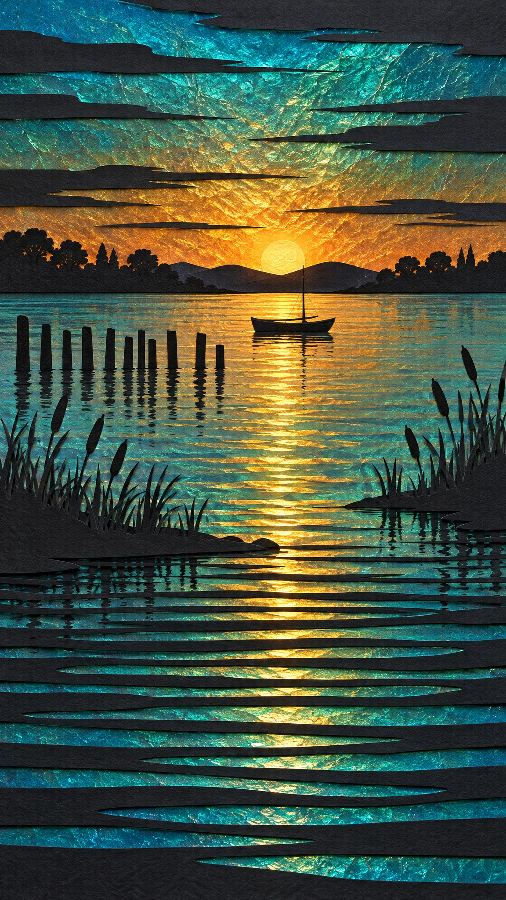

# Layered Cut-Paper Sunset over Still Water

**中文标题：** 层叠剪纸水面日落  
**ID:** `gi25-x-682` · **Mode:** `generate`  
**Categories:** `general`  
**Tags:** `x-twitter`, `community`, `gpt-image-2.5`, `x-direct`, `en`



### Layered Cut-Paper Sunset over Still Water

```text
Hand-cut layered paper artwork of a tranquil sunset over still water. Black paper silhouettes cut from thick textured cardstock are layered over shimmering iridescent foil that glows through every cut-out window.

SKY: a glowing gradient of turquoise, teal and deep cyan blending into warm burnt-gold and amber sunset light at the horizon, the foil surface crinkled and cracked like hammered metal so it sparkles with broken light. Long thin horizontal black streaks of cut paper slice across the sky as stylized clouds.

HORIZON: a solid black silhouette line of low distant hills and rounded trees, with a small simple rowing boat with one thin mast resting just above the waterline at the center.

MIDGROUND: on the left, a row of nine or ten thin black wooden pier posts of uneven height standing in the water; scattered black cattail reeds and grass blades rise along both shores. A narrow band of golden reflected light runs down the water beneath the boat.

FOREGROUND: the water breaks into stacked horizontal cut bands, each a thin black paper strip alternating with a glowing iridescent teal and gold stripe, cascading in gentle perspective toward the bottom edge.

TEXTURE: visible cut-paper edges, slight drop shadows under each layer for real physical depth, fine paper grain, matte black against glossy iridescent foil. Clean, graphic, decorative, serene, no text.
```

- **Recommended model:** `gpt-image-2.5-sunburst`
- **Settings:** _(defaults)_
- **Source:** [community](https://x.com/churvikv/status/2107542566191419650) — @churvikv
- **License note:** Original public X post; quoted with attribution — remix with attribution
- **Notes:** Collected directly from X; original post https://x.com/churvikv/status/2107542566191419650; post text names GPT Image 2.5; verified=True
- **Preview:** `previews/gi25-x-682.jpg`
