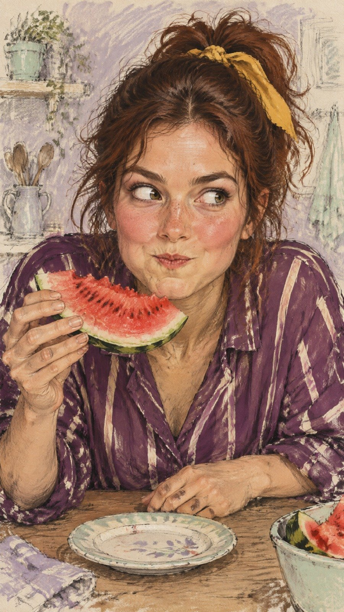

# Hand-Drawn Editorial: Chaotic Watermelon Snack

**中文标题：** 手绘社论插画：吃西瓜的搞怪瞬间  
**ID:** `gi25-x-686` · **Mode:** `generate`  
**Categories:** `general`  
**Tags:** `x-twitter`, `community`, `gpt-image-2.5`, `x-direct`, `en`



### Hand-Drawn Editorial: Chaotic Watermelon Snack

```text
Create an original vertical 9:16 semi-realistic hand-drawn editorial illustration of a quirky young adult woman caught in a funny, spontaneous moment while eating a slice of watermelon. She has realistic human facial anatomy, naturally flushed cheeks, detailed expressive hazel eyes, a few freckles, and messy dark auburn hair loosely tied in a high ponytail with a mustard-yellow ribbon. She wears a vivid plum-purple blouse with loose cream-colored stripes. Her body leans forward over a kitchen table, her head tilted slightly to one side, eyes glancing sideways with a comically suspicious expression, cheeks slightly puffed, and lips pressed together as she tries not to laugh. One hand holds a juicy watermelon slice close to her mouth while the other rests casually on the table beside a small ceramic plate.

The image must look like a traditional artist's expressive sketchbook illustration, with loose charcoal and graphite strokes, rough ink outlines, visible construction marks, scratchy cross-hatching, textured watercolor washes and opaque gouache brushwork. Realistic skin shading and believable human hands, painterly facial details, imperfect sketch lines extending beyond the figure, lively spontaneous brush marks. Background: a loosely sketched muted dusty-lavender kitchen wall with pale mint and warm ivory brush strokes, faint illegible handwritten-style artistic scribbles, and unfinished pencil marks.

Use a fresh, vibrant color palette of plum purple, watermelon red, mustard yellow, dusty lavender, pale mint, and warm peach skin tones. Medium close-up composition, face large and sharply readable, natural human proportions, expressive eyes and mouth, visible paper texture, sophisticated hand-illustrated magazine art aesthetic. Keep the character visually dominant and the background loose and sketchy.

IMPORTANT STYLE: semi-realistic human illustration, NOT cartoon, NOT anime, NOT 3D, NOT glossy digital art, NOT a photograph. Preserve the raw, loose, textured, imperfect hand-drawn quality of traditional editorial sketch art. Original character, original pose, original outfit, original composition.
```

- **Recommended model:** `gpt-image-2.5-sunburst`
- **Settings:** _(defaults)_
- **Source:** [community](https://x.com/hey_am_cherry/status/2108424213132697763) — @hey_am_cherry
- **License note:** Original public X post; quoted with attribution — remix with attribution
- **Notes:** Collected directly from X; original post https://x.com/hey_am_cherry/status/2108424213132697763; post text names GPT Image 2.5; verified=True
- **Preview:** `previews/gi25-x-686.jpg`
