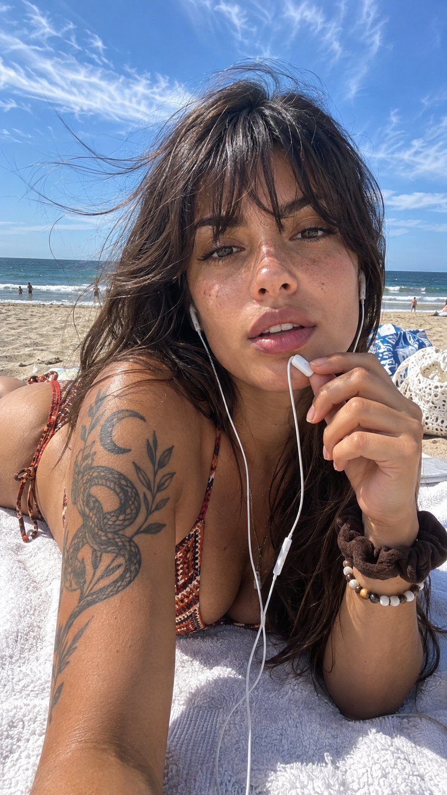

# JSON Lying-Down Beach Selfie

**中文标题：** JSON 躺姿海滩自拍  
**ID:** `gi25-x-690` · **Mode:** `generate`  
**Categories:** `general`  
**Tags:** `x-twitter`, `community`, `gpt-image-2.5`, `x-direct`, `en`



### JSON Lying-Down Beach Selfie

```text
{ "meta": { "aspect_ratio": "9:16", "orientation": "vertical", "quality": "ultra_photorealistic", "resolution": "4K", "camera": "Modern smartphone front-facing camera, likely iPhone 13 or newer", "lens": "Wide-angle selfie lens, approximately 24mm equivalent, f/2.2 aperture", "capture_style": "Casual arm's-length selfie, lying down", "style": "Candid, unposed, natural lifestyle photography" }, "scene": { "location": "Sandy public beach with the ocean in the background", "specific_spot": "Lying on a white terrycloth beach towel placed directly on the sand", "time_of_day": "Mid-afternoon, bright daylight", "atmosphere": "Breezy, relaxed, summery, casual and intimate" }, "environment": { "background_elements": [ "Bright blue sky with wispy, scattered white cirrus clouds", "Dark blue ocean horizon with gentle waves", "Tan sand stretching to the water", "Distant tiny figures of people in the water and on the beach", "A white and blue patterned beach towel or bag and a white crocheted bag slightly out of focus in the background to the right" ], "foreground_elements": [ "Thick, textured white terrycloth towel immediately beneath the subject", "White wires of Apple EarPods draping down the center of the frame" ], "lighting": { "source": "Direct, harsh sunlight from above and slightly in front of the subject", "direction": "Top-down, angled slightly from the camera's perspective", "color_temperature": "Daylight, approximately 5500K to 6000K, bringing out warm skin tones", "effect": "Creates bright highlights on the bridge of the nose, cheekbones, and forehead", "shadows": "Sharp, distinct shadows under the chin, beneath the bangs on the forehead, and cast by the earphone wires on the chest", "highlights": "Natural specular highlights on the lower lip, tip of the nose, and the apples of the cheeks due to slight skin oils/sweat" } }, "subject": { "identity": "A person matching the following exact description. Reproduce their appearance precisely.", "gender": "Female", "age_vibe": "Early to mid-20s", "ethnicity": "Latina or Mediterranean descent", "skin": { "tone": "Warm tan, olive complexion", "texture": "Natural, unretouched, visible pores, slight natural sheen from the sun", "condition": "Healthy, sun-kissed", "visible_details": [ "Sprinkling of natural brown freckles across the nose and upper cheeks", "Slight pinkish sun-flush on the cheeks", "Large, intricate black ink tattoo on the right shoulder and upper arm featuring a coiled snake, a botanical stem with leaves, and a crescent moon" ] }, "hair": { "color": "Dark brown, almost black", "length": "Long, cascading past the shoulders", "style": "Loose, wavy, messy beach hair with straight curtain bangs covering the forehead down to the eyebrows", "behavior": "Blown by the wind, with long, fine strands blowing across the sky on the left side of the frame", "details": "Strands are clustered and slightly piecey from the beach humidity, framing the face heavily" }, "face": { "shape": "Oval with softly defined jawline", "features": "Full lips with a slight natural part revealing the two front teeth with a very tiny gap, straight nose, thick natural dark eyebrows", "expression": "Relaxed, softly gazing, calm and slightly sultry", "eye_direction": "Looking directly and intensely into the camera lens", "makeup": "Very minimal or bare-faced, possibly a sheer tinted lip balm in a dark berry or natural red hue" }, "body": { "build": "Slim, athletic", "posture": "Lying prone on her stomach, torso propped up" } }, "outfit": { "top": { "type": "String bikini top", "color": "Warm earth tones: burnt orange, brown, dark red, and cream", "pattern": "Geometric, vaguely tribal or bohemian diamond/zigzag print", "fit": "Snug, typical triangle bikini fit", "fabric": "Standard swimwear spandex/nylon blend", "condition": "Dry", "details": "Thin red string halter straps extending from the top, visible over the left shoulder" }, "bottom": { "type": "String bikini bottoms", "color": "Matching burnt orange and dark red", "pattern": "Matching geometric pattern", "fit": "Low rise", "fabric": "Spandex/nylon", "details": "Thin red tie-strings resting on the hip bone, visible on the left side of the frame" }, "shoes": { "type": "None visible", "color": "", "details": "" }, "accessories": [ "White wired Apple EarPods, right earbud inserted in ear, wires draping down the front of the body", "Inline microphone/volume control module of the EarPods held near the mouth", "Thick, dark brown ruched fabric scrunchie worn on the left wrist", "Beaded bracelet with alternating white, brown, and black round beads worn on the left wrist below the scrunchie" ], "jewelry": [] }, "pose": { "body_position": "Lying on stomach on a beach towel, upper body propped up to face the camera", "legs": "Out of frame, trailing behind", "arms": "Right arm rests on the towel supporting the body weight. Left arm is bent upwards with the hand near the face.", "hands": "Left hand is loosely curled, delicately holding the white earphone wire/microphone module just below the chin. Natural, unpainted fingernails.", "shoulders": "Relaxed, right shoulder pushed forward towards the camera revealing the tattoo.", "head_tilt": "Very slight tilt to her left (viewer's right)", "micro_action": "Speaking into or resting the inline microphone against her mouth while listening" }, "camera_perspective": { "pov": "First-person selfie from the subject's extended arm or leaning over the device", "angle": "Eye-level, pointing very slightly downward", "framing": "Medium close-up, capturing from the top of the head down to the lower back/hips", "distance": "Approximately 1.5 to 2 feet away from the face", "depth_of_field": "Deep; subject is completely sharp, while the beach background is only very slightly out of focus, retaining structural clarity", "imperfections": [ "Minor lens distortion typical of wide-angle smartphone selfie cameras, slightly exaggerating the proximity of the right shoulder and face" ] }, "post_processing": { "editing_level": "None to minimal", "color_grading": "Natural smartphone color science, vibrant blues and true-to-life warm skin tones", "contrast": "High, natural sunlight contrast", "saturation": "Natural, slightly boosted by the smartphone's HDR processing for the sky", "retouching": "None. Skin texture, freckles, and stray hairs remain intact", "final_look": "Raw, authentic daytime beach selfie" }, "photography_rules": { "no_cgi": true, "no_plastic_skin": true, "no_exaggerated_anatomy": true, "hyper_realistic": true, "reproduce_exact_scene": true } }
```

- **Recommended model:** `gpt-image-2.5-sunburst`
- **Settings:** _(defaults)_
- **Source:** [community](https://x.com/SDDFounder/status/2108290949994414098) — @SDDFounder
- **License note:** Original public X post; quoted with attribution — remix with attribution
- **Notes:** Collected directly from X; original post https://x.com/SDDFounder/status/2108290949994414098; post text names GPT Image 2.5; verified=True
- **Preview:** `previews/gi25-x-690.jpg`
