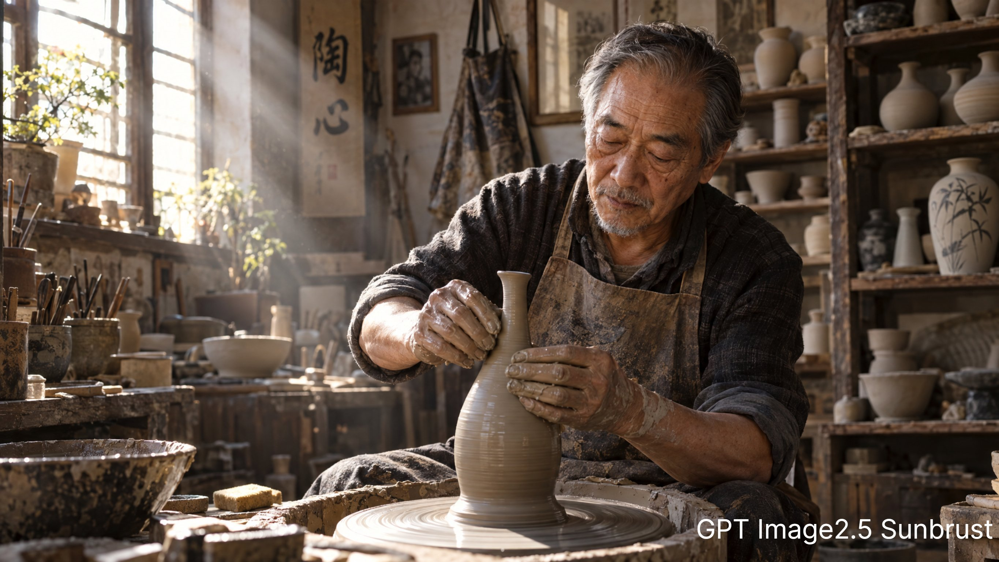

# Elderly Ceramic Artist at the Potter's Wheel

**中文标题：** 陶轮前的老陶艺家电影人像  
**ID:** `gi25-x-693` · **Mode:** `generate`  
**Categories:** `general`  
**Tags:** `x-twitter`, `community`, `gpt-image-2.5`, `x-direct`, `en`



### Elderly Ceramic Artist at the Potter's Wheel

```text
Ultra-realistic cinematic portrait: an elderly Asian ceramic artist sitting in a cluttered studio, hands covered in wet clay, shaping a slender-necked vase on a potter's wheel; afternoon sunlight streams through a dusty window, creating Tyndall rays; wooden shelves filled with unglazed pottery, an old apron hanging on the wall; shallow depth of field, 85mm lens, visible skin pores and clay texture, warm tones, natural light, highly detailed.
```

- **Recommended model:** `gpt-image-2.5-sunburst`
- **Settings:** _(defaults)_
- **Source:** [community](https://x.com/BernieCheuinbf/status/2108198584231358468) — @BernieCheuinbf
- **License note:** Original public X post; quoted with attribution — remix with attribution
- **Notes:** Collected directly from X; original post https://x.com/BernieCheuinbf/status/2108198584231358468; post text names GPT Image 2.5; verified=True; from a GPT Image 2.5 Sunburst vs Nano Banana 2.1 comparison — preview is the first image
- **Preview:** `previews/gi25-x-693.jpg`
