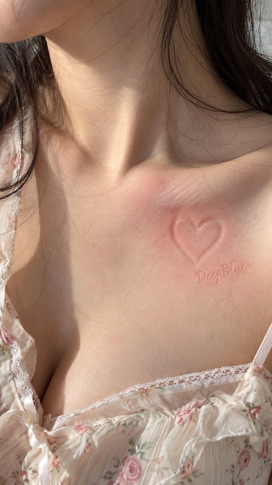

# Skin Bas-Relief Pressure-Mark Art

**中文标题：** 肌肤浅浮雕压痕画  
**ID:** `gi25-x-694` · **Mode:** `generate`  
**Categories:** `general`  
**Tags:** `x-twitter`, `community`, `gpt-image-2.5`, `x-direct`, `zh`



### Skin Bas-Relief Pressure-Mark Art

```text
【主体】 × 【身体不同部位】肌肤 × 浅浮雕压痕 × 局部红晕 × 浅宽凹压痕签名“DeepBlue”

说明：
压痕由外力形成，作画主体随肌肤曲面自然变形，留下浅而柔和的凹凸痕迹，压痕深浅自然不一，并伴随局部短暂泛红。整体细节保持克制，不追求过度精细的纹理与清晰边缘，保持皮肤柔软自然，避免过深、过硬、过度清晰的雕刻感。签名以非常浅、较宽的凹压痕自然呈现，笔画具有适度宽度与厚度，轻微陷入肌肤表面，与整体压痕保持一致，不呈现细线、刺青、印刷或雕刻效果。

——————————

举例，比如1图：

爱心 × 锁骨肌肤 × 浅浮雕压痕 × 局部红晕 × 浅宽凹压痕签名“DeepBlue”
```

- **Recommended model:** `gpt-image-2.5-sunburst`
- **Settings:** _(defaults)_
- **Source:** [community](https://x.com/DeepBlueX0/status/2108194229193461879) — @DeepBlueX0
- **License note:** Original public X post; quoted with attribution — remix with attribution
- **Notes:** Collected directly from X; original post https://x.com/DeepBlueX0/status/2108194229193461879; post text names GPT Image 2.5; verified=True
- **Preview:** `previews/gi25-x-694.jpg`
