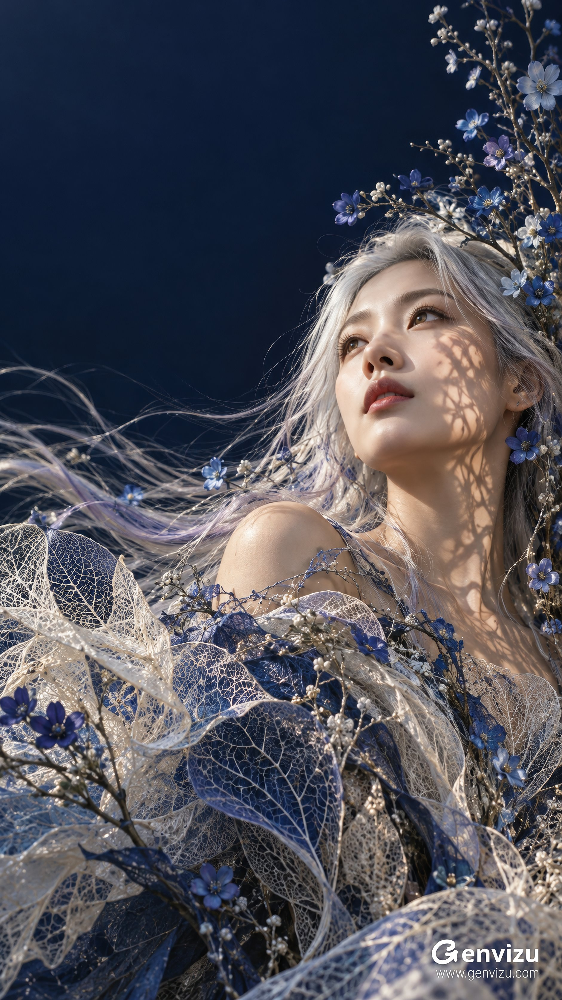

# Asymmetric Low-Angle Silver-Hair Fine-Art Portrait

**中文标题：** 不对称低角度银发艺术人像  
**ID:** `gi25-x-695` · **Mode:** `generate`  
**Categories:** `general`  
**Tags:** `x-twitter`, `community`, `gpt-image-2.5`, `x-direct`, `en`



### Asymmetric Low-Angle Silver-Hair Fine-Art Portrait

```text
Create a single 9:16 vertical fine-art fashion portrait, 1080x1920 composition. Clearly adult East Asian woman around 28 with refined natural East Asian facial proportions, real skin texture, subtle dusty-rose lips, long silver-white hair with faint pale lilac and icy-blue strands. Dramatic asymmetric low-angle upper-body portrait: her face occupies LOWER RIGHT, centered at x=79%, y=47%, chin lifted and eyes looking toward upper-left, shoulders turned obliquely; luminous face and visible upper shoulder surrounded by clothing, no exposed chest. Large uninterrupted midnight navy negative space in the UPPER LEFT, about upper 36 percent and left 48 percent. Floral framework rises along the right edge above her head, while fine hair and airy leaf-skeleton textile sweep diagonally toward the bottom left as if a gentle breeze carries them. Small cobalt, ultramarine and pale blue five-petal flowers with tiny bright centers, fine branching stems, bead-sized white buds woven into the hair and garments. Sculptural couture wraps shoulders and chest in intricate ivory and cobalt skeletonized-leaf mesh, translucent fibrous lace with irregular ragged edges, silver threads and blue botanical ribbons; open delicate vein networks, not solid paper or generic tulle. Thin silver hair streams left across foreground. Directional warm-white sunlight from upper left projects crisp tiny botanical silhouettes onto the right cheek, neck and upper shoulder, producing warm lifelike skin against cool navy. Sharp face, eyelashes, individual hairs and delicate leaf veins, layered depth and restrained highlights, painterly photographic finish. Eastern dreamlike elegance, quiet upward longing, nocturnal blue atmosphere with sunlit skin. Preserve lower-right face and upper-left void; do not center subject or clutter empty area. No text, signature, logo, watermark. Clean master image.
```

- **Recommended model:** `gpt-image-2.5-sunburst`
- **Settings:** _(defaults)_
- **Source:** [community](https://x.com/listudio/status/2108184319995047999) — @listudio
- **License note:** Original public X post; quoted with attribution — remix with attribution
- **Notes:** Collected directly from X; original post https://x.com/listudio/status/2108184319995047999; post text names GPT Image 2.5; verified=True
- **Preview:** `previews/gi25-x-695.jpg`
