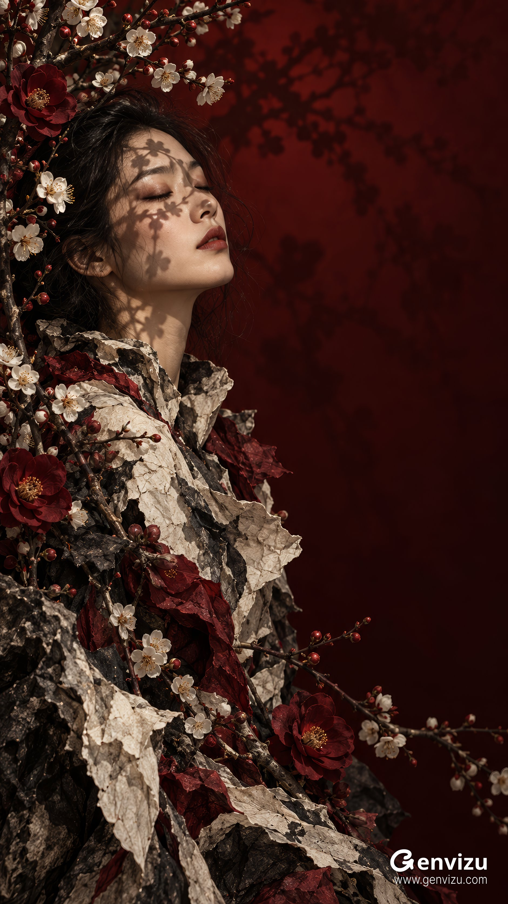

# Eastern Dusk Couture Fine-Art Photograph

**中文标题：** 东方黄昏高定艺术摄影  
**ID:** `gi25-x-696` · **Mode:** `generate`  
**Categories:** `general`  
**Tags:** `x-twitter`, `community`, `gpt-image-2.5`, `x-direct`, `en`



### Eastern Dusk Couture Fine-Art Photograph

```text
Create one 9:16 vertical fine-art couture photograph, 1080x1920 composition. A clearly adult East Asian woman about 28, graceful natural East Asian bone structure, realistic warm ivory skin, dark loose hair, softly closed eyes, subdued vermilion lips. She occupies the LEFT half, face centered at x=34%, y=29%; head gently tilted back and toward the right, three-quarter profile with nose pointing right. Shoulder slopes toward center, torso and material cascade down the left and bottom edges. Deep oxblood and black-red background creates a wide EMPTY right half, especially upper right, with blurred branch silhouettes. Tall branches arch over and around her along left and upper-left border, delicate ivory five-petal plum blossoms with tiny ochre stamens, dark crimson camellia blooms and small red buds. Hard warm sun from upper left projects crisp recognizably botanical branch-and-flower shadows directly onto forehead, closed eyelids, cheek and neck, with subdued soft branch shadows farther away on the burgundy background. An avant-garde high-collared garment is made of layered crumpled ivory paper, black ink-stained fibrous cloth, torn mineral-sheet surfaces, and burgundy petals: sculptural cracked edges and rocklike folds, not conventional smooth silk or printed flowers. Foreground botanical branches and paper fragments build a continuous diagonal from top-left to lower-right without filling the right-side breathing room. Face stays photographic and sharply focused amid tactile mixed-media couture, tiny pores and individual flyaway hairs, dramatic chiaroscuro, ink-black shadows, restrained reds, natural warm skin. Mood: hushed, introspective, Eastern poetic stillness at dusk. Anatomically natural, fully clothed adult, no text, signature, logo or watermark. Clean master image.
```

- **Recommended model:** `gpt-image-2.5-sunburst`
- **Settings:** _(defaults)_
- **Source:** [community](https://x.com/listudio/status/2108184314810692049) — @listudio
- **License note:** Original public X post; quoted with attribution — remix with attribution
- **Notes:** Collected directly from X; original post https://x.com/listudio/status/2108184314810692049; post text names GPT Image 2.5; verified=True
- **Preview:** `previews/gi25-x-696.jpg`
