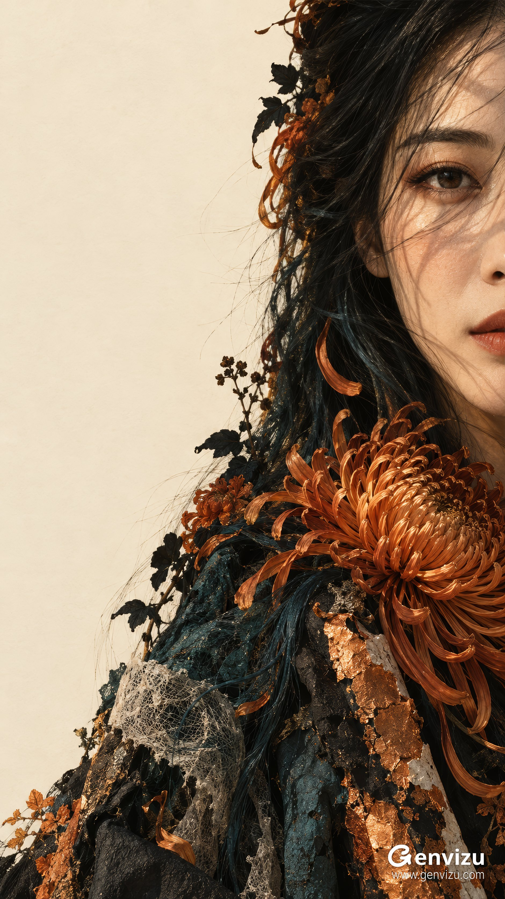

# Extreme Right-Edge Close-Up Fine-Art Portrait

**中文标题：** 极端右缘特写艺术人像  
**ID:** `gi25-x-697` · **Mode:** `generate`  
**Categories:** `general`  
**Tags:** `x-twitter`, `community`, `gpt-image-2.5`, `x-direct`, `en`



### Extreme Right-Edge Close-Up Fine-Art Portrait

```text
Create a single 9:16 vertical fine-art fashion portrait, 1080x1920 composition. An unmistakably adult East Asian woman around 28, refined natural East Asian facial proportions, long dark almond eyes, restrained expression, real pores and softly weathered skin, muted terracotta lips. Extreme asymmetric close-up: her head and torso occupy the RIGHT edge, face centered at x=89%, y=29%, the right border cuts through the nose and mouth so only the left side of the face is visible. One relaxed eye looks quietly toward the viewer. Vast uninterrupted warm ivory paper-colored negative space fills the left 43 percent. Black hair with deep petrol-teal strands cascades diagonally from top right toward lower left. Hard warm sunlight casts narrow horizontal and oblique hair shadows across eye and cheek; retain natural warm skin without paint covering face. Around hair, neck and shoulder, elaborate burnt-orange chrysanthemum petals curl in layered fine filaments, a large bloom at x=80%, y=72%, smaller black botanical silhouettes. Rough dark ink-black and petrol-teal textile surfaces are interwoven with torn, cracked, distressed copper-orange foil and fibrous paper fragments, extending out of the bottom edge. These are tactile collage-like couture materials surrounding a photographic face, not flat floral wallpaper. Teal shadow mass, orange mineral pigment, parchment void, precise eyelashes, fine loose hairs, sharp floral filigree and dry ragged edges. Eastern poetic restraint, autumnal stillness, a luminous fragment of a face emerging from an ink-and-flower silhouette. Preserve severe right-edge cropping and broad left emptiness. No centered face, no full face, no ornate backdrop, no text, signature, logo or watermark. Clean master image.
```

- **Recommended model:** `gpt-image-2.5-sunburst`
- **Settings:** _(defaults)_
- **Source:** [community](https://x.com/listudio/status/2108184310037753971) — @listudio
- **License note:** Original public X post; quoted with attribution — remix with attribution
- **Notes:** Collected directly from X; original post https://x.com/listudio/status/2108184310037753971; post text names GPT Image 2.5; verified=True
- **Preview:** `previews/gi25-x-697.jpg`
