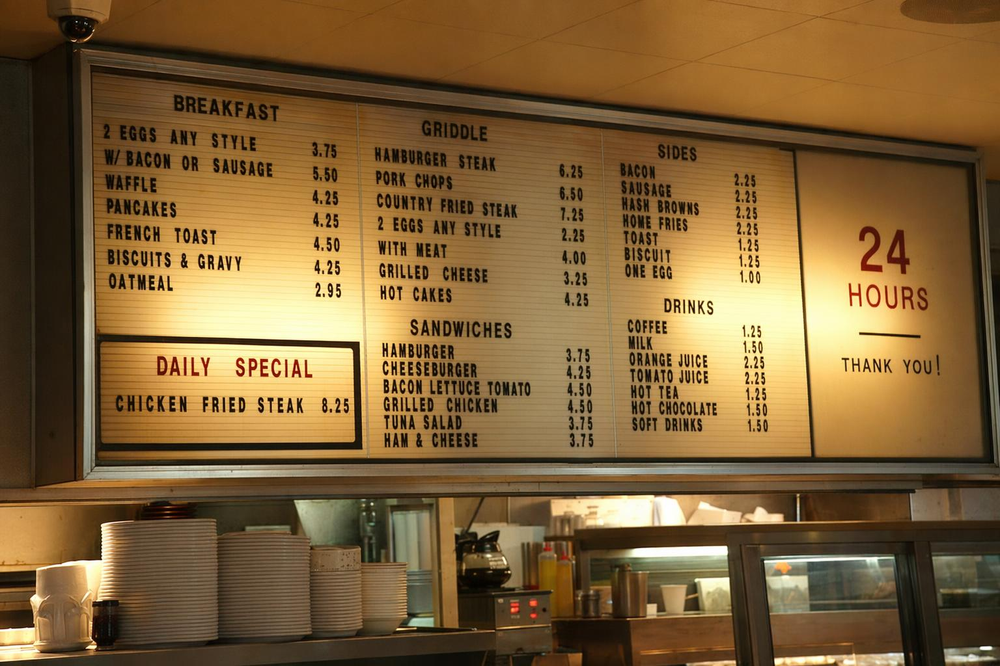

# 24h diner menu board exact categories

**中文标题：** 24小时餐馆菜单板精确文字  
**ID:** `gi25-typ-005` · **Mode:** `generate`  
**Categories:** `poster-typography`  
**Tags:** `signage`, `exact-text`, `fal`  



### 24h diner menu board exact categories

```text
Create a photoreal photograph of a 24 hour diner menu board at 5 in the morning,
shot from the counter seat at slight angle. Plastic letter tracks, uneven letter
spacing, one missing letter slot, yellowed light from incandescent bulbs, legible
prices, categories labeled BREAKFAST, GRIDDLE, SANDWICHES, SIDES, DRINKS, and a
daily special that reads CHICKEN FRIED STEAK 8.25. The type must be 100 percent
readable and physically believable. No watermark, no brand logos, no text
artifacts.
```

- **Recommended model:** `gpt-image-2.5-sunburst`
- **Settings:** `quality=high`
- **Source:** [Vendor blog](https://fal.ai/learn/tools/prompting-gpt-image-2) — Ilker Izgi / fal
- **License note:** fal blog examples; adapt for 2.5
