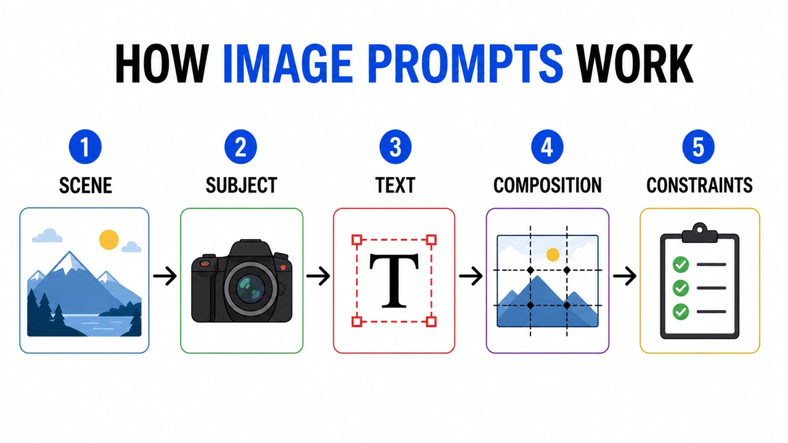

# How image prompts work infographic

**中文标题：** 图像提示如何工作 信息图  
**ID:** `gi25-typ-007` · **Mode:** `generate`  
**Categories:** `poster-typography`, `xiaohongshu`  
**Tags:** `infographic`, `pixverse`, `zh`  



### How image prompts work infographic

```text
创建一个标题为“图像提示如何工作”的干净信息图。五个标记步骤:“场景”、“主题”、“文本”、“构图”、“约束”。平面编辑图标、步骤之间的箭头、高对比度、白色背景、可读的无衬线标签、一致的间距、没有额外的文本、没有水印。纵横比 16:9。
```

- **Recommended model:** `gpt-image-2.5-sunburst`
- **Settings:** _(defaults)_
- **Source:** [Vendor blog](https://pixverse.ai/zh/blog/gpt-image-2-review-and-prompt-guide) — PixVerse
- **License note:** PixVerse blog copy-ready examples
