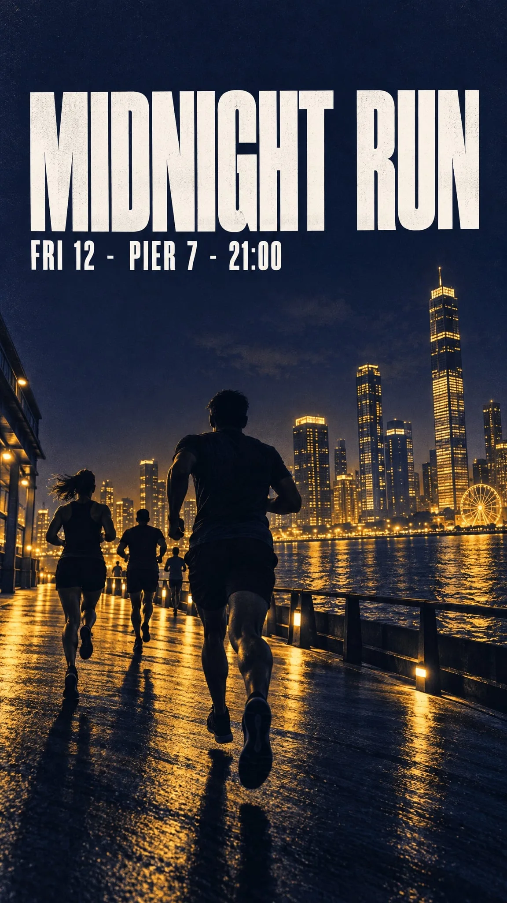

# Midnight Run night-run event poster

**中文标题：** Midnight Run 夜跑活动海报  
**ID:** `gi25-typ-013` · **Mode:** `generate`  
**Categories:** `poster-typography`  
**Tags:** `felo`, `vendor-blog`, `gpt-image-2.5`, `poster`, `exact-text`



### Midnight Run night-run event poster

```text
Bold minimalist event poster for a night run.
Headline (exact, once): "MIDNIGHT RUN"
Subline (exact, once): "FRI 12 · PIER 7 · 21:00"
Visual: deep indigo background, warm amber duotone skyline silhouette, strong diagonal
composition, headline sitting in the calm upper third.
Typography: heavy condensed sans-serif, high contrast, generous kerning.
Format: vertical, print quality.
Constraints: no extra text, no sponsor logos, no watermarks, no stock-photo people.
```

- **Recommended model:** `gpt-image-2.5-sunburst`
- **Settings:** _(defaults)_
- **Source:** [vendor-blog](https://felo.ai/blog/gpt-image-2-5-use-cases/) — Felo Search Blog
- **License note:** Felo blog copy-paste examples; remix with attribution
- **Notes:** Copy-paste GPT Image 2.5 use-case prompt from Felo Search Blog (2026-09-10); not previously in this repo.
