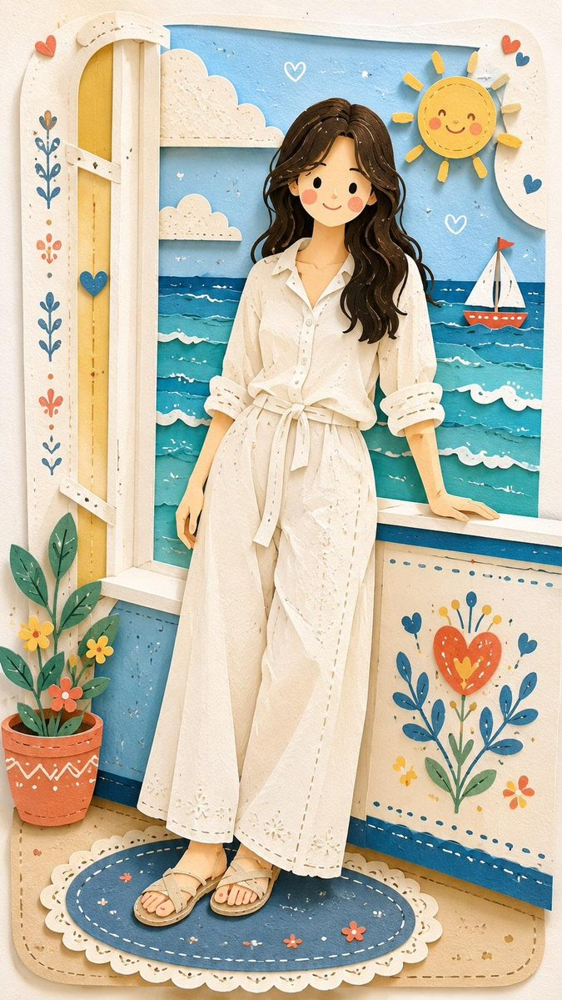

# Folk Papercraft Scene Remix

**中文标题：** 民俗剪纸风场景重绘  
**ID:** `gi25-x-003` · **Mode:** `edit`  
**Categories:** `poster-typography`  
**Tags:** `x-twitter`, `evolink`, `community`, `gpt-image-2`



### Folk Papercraft Scene Remix

```text
Reimagine the entire image as one cohesive Decorative Folk Flat Illustration blended with a soft handcrafted paper-cut layered style, inspired by charming papercraft diorama aesthetics. Preserve the original subject, composition, and overall mood, but simplify every element into clean flat forms, bold rounded shapes, and cute childlike proportions. Add playful doodle accents, decorative folk patterns, slightly uneven handmade outlines, and minimal facial details such as dot eyes and soft blush cheeks.

Use a vivid, cheerful color palette that feels fresh and different from the original image, while keeping the final artwork warm, sweet, innocent, whimsical, and storybook-like. Create the feeling of layered cardstock with stacked paper depth, clean cut edges, subtle shadows between layers, and gentle paper-crafted imperfections, as if the scene were carefully cut, colored, and assembled on clean white paper. The result should look cute, handcrafted, playful, and visually unified, with a polished yet charming handmade folk-art papercraft finish.
```

- **Recommended model:** `either`
- **Settings:** _(defaults)_
- **Source:** [X/Twitter](https://x.com/Ciri_ai/status/2068716810346860804) — @Ciri_ai (via EvoLinkAI)
- **License note:** CC0-1.0 (EvoLink catalog); original X post — remix with attribution
- **Notes:** Mirrored in EvoLink case 418 (poster.md); original post on X.
