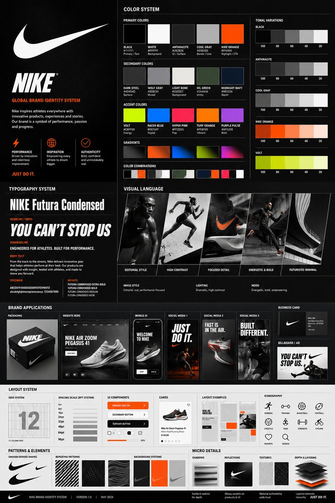

# Brand Identity Guideline Board

**中文标题：** 品牌识别规范板  
**ID:** `gi25-x-007` · **Mode:** `edit`  
**Categories:** `ui-mockup`, `poster-typography`  
**Tags:** `x-twitter`, `evolink`, `community`, `gpt-image-2`



### Brand Identity Guideline Board

```text
Using the uploaded logo for (Brand name) generate a high-end, agency-grade brand identity system poster.

OBJECTIVE
Create a complete, presentation-ready brand guideline board that looks like it was designed by a top branding studio. The result must feel commercial, realistic, and client-deliverable, not conceptual.

INTELLIGENCE RULE (THIS IS WHAT YOU WERE MISSING)
Before designing, analyze the logo and infer:
3 identity traits (based on analysis)

COLOR SYSTEM (SMART GENERATION)
Extract palette from logo automatically
Include:
Primary colors (3–5)
Secondary colors (3–5)
Accent colors

Each must show:
HEX codes
labeled usage (primary / UI / highlight / background)

Also generate:
gradients
color combinations
tonal variations

TYPOGRAPHY SYSTEM (MATCH PERSONALITY)
Select typography style based on brand:
luxury → elegant serif
tech → geometric sans
street → bold condensed
corporate → clean neutral sans

Show:
headline / subheadline / body
real text examples (brand-relevant, not lorem ipsum)
clear hierarchy

VISUAL LANGUAGE
Define and visualize:
image style (editorial / lifestyle / futuristic / minimal)
lighting (soft / dramatic / high contrast)
mood (energetic / premium / calm / disruptive)

Show:
3–5 visual tiles

BRAND APPLICATIONS (REALISM BOOST)
Generate consistent mockups:
packaging or product
website hero
mobile UI
3 social media creatives
business card
billboard / ad

All must feel real-world usable.

LAYOUT SYSTEM
grid system
spacing scale (4pt / 8pt system)

Show:
UI components
cards
buttons
layout examples

ICONOGRAPHY
6–10 icons style derived from brand (rounded / sharp / minimal / filled)

PATTERNS & ELEMENTS
shapes derived from logo
repeating motifs
background systems

MICRO DETAILS (THIS CREATES “PREMIUM FEEL”)
shadows
reflections
textures
depth layering

VISUAL STYLE CONTROL
modern editorial + system design hybrid
strong hierarchy
layered composition
controlled spacing

DENSITY RULE
minimum 30–50 elements
mix of macro + micro components
no empty or filler space

HARD RESTRICTIONS
no placeholders
no generic UI
no inconsistent styles
no random colors

FINAL OUTPUT
A high-end brand system poster that looks:
Behance feature-worthy
agency presentation-ready
visually consistent and detailed
```

- **Recommended model:** `gpt-image-2.5-sunburst`
- **Settings:** _(defaults)_
- **Source:** [X/Twitter](https://x.com/Shorelyn_/status/2055681687284293991) — @Shorelyn_ (via EvoLinkAI)
- **License note:** CC0-1.0 (EvoLink catalog); original X post — remix with attribution
- **Notes:** Mirrored in EvoLink case 390 (ui.md); original post on X.
