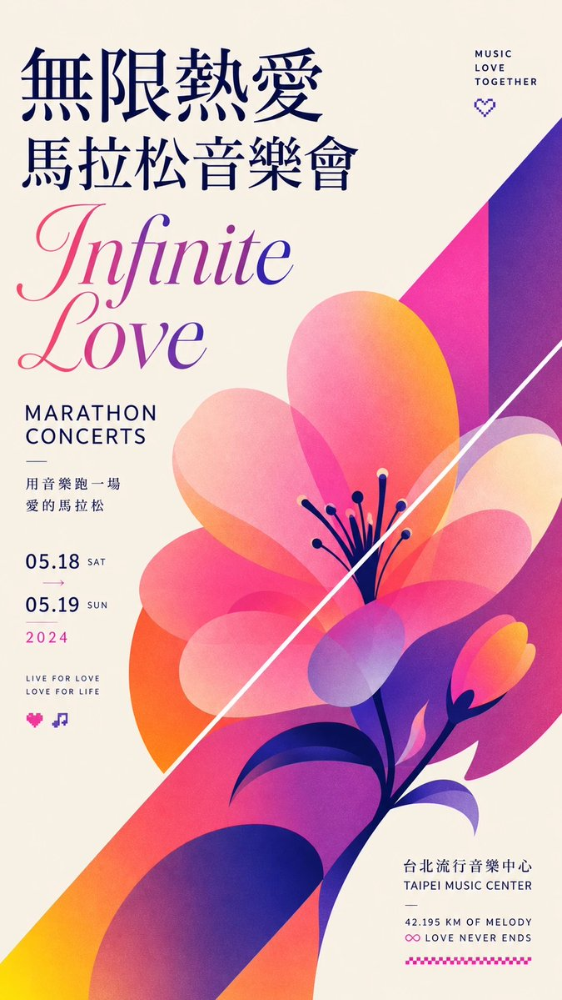

# Infinite Love Concert Poster

**中文标题：** 无限爱意音乐会海报  
**ID:** `gi25-x-009` · **Mode:** `generate`  
**Categories:** `poster-typography`  
**Tags:** `x-twitter`, `evolink`, `community`, `gpt-image-2`



### Infinite Love Concert Poster

```text
Swiss International design style, minimalist flat vector poster, vertical 9:16 format, diagonal-split layout. Top-left: Traditional Chinese headline in a serif typeface paired with flowing connected-script serif English. Bottom-right: key symbolic illustration — flat vector artwork with vivid fluorescent gradients, subtle grain texture, scattered pixel-art icons, cultural festival poster aesthetic, museum-quality graphic design. Theme: Infinite Love Marathon Concerts (floral motif). 4K.
```

- **Recommended model:** `gpt-image-2.5-sunburst`
- **Settings:** _(defaults)_
- **Source:** [X/Twitter](https://x.com/iamaiistudio/status/2069749509392052645) — @iamaiistudio (via EvoLinkAI)
- **License note:** CC0-1.0 (EvoLink catalog); original X post — remix with attribution
- **Notes:** Mirrored in EvoLink case 355 (poster.md); original post on X.
