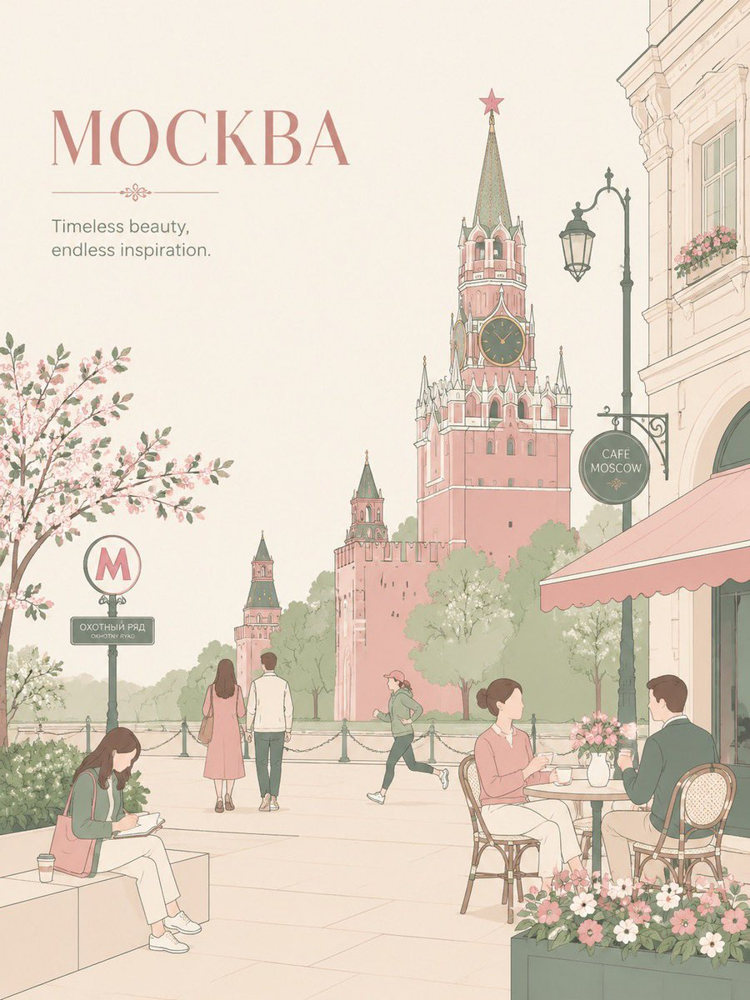

# Ufa Travel Sticker Poster

**中文标题：** 乌法旅行贴纸海报  
**ID:** `gi25-x-010` · **Mode:** `generate`  
**Categories:** `poster-typography`  
**Tags:** `x-twitter`, `evolink`, `community`, `gpt-image-2`



### Ufa Travel Sticker Poster

```text
Create an airy city scene with large typography-safe negative space in the upper-left. Add [УФА] and one short elegant English caption matching the city mood. Automatically adapt the background to the city: one iconic primary landmark, local architecture, café culture, transport sign, street lamp, flowers, trees, small decorative details, and calm daily-life moments. Use 3–6 people only, naturally interacting with the city: talking at a café, walking, jogging, sketching, or taking photos. Avoid crowds and avoid a single hero character. Style: Japanese stationery aesthetic, luxury sticker illustration, premium commercial flat-vector poster, clean thin outlines, consistent line weight, flat colors only, no shading, no gradients, no texture. Palette: blush pink, dusty rose, sage green, warm cream, soft beige, muted gray-green. Mood: minimal, elegant, calm, refined, high-end travel postcard and lifestyle branding. No realism, no watercolor, no painterly effects, no photorealism, no dense background. Установить соотношение сторон 3:4
```

- **Recommended model:** `gpt-image-2.5-sunburst`
- **Settings:** _(defaults)_
- **Source:** [X/Twitter](https://x.com/Sairah_0/status/2069779118535930286) — @Sairah_0 (via EvoLinkAI)
- **License note:** CC0-1.0 (EvoLink catalog); original X post — remix with attribution
- **Notes:** Mirrored in EvoLink case 354 (poster.md); original post on X.
