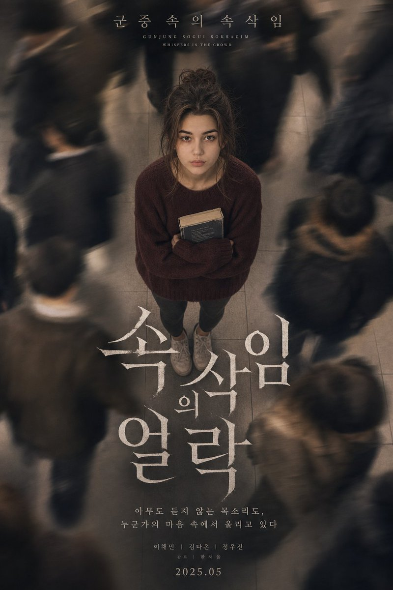

# Whispers in the Crowd Poster

**中文标题：** 人群低语心理剧海报  
**ID:** `gi25-x-011` · **Mode:** `generate`  
**Categories:** `poster-typography`  
**Tags:** `x-twitter`, `evolink`, `community`, `gpt-image-2`



### Whispers in the Crowd Poster

```text
A sorrowful Korean psychological drama movie poster depicting a beautiful young woman photographed from a dramatic overhead angle, camera pointing straight down at her face as she gazes upward. Her long dark hair is loosely gathered in an undone bun with loose strands framing her face. Pale complexion, an expression of quiet emotional exhaustion. She is dressed in an oversized burgundy wool sweater, dark grey leggings, and scuffed white sneakers, holding a worn paperback book tightly against her chest. Surrounding her, a busy subway station where commuters stream past in long-exposure motion blur, their figures becoming ghostly streaks of movement against cold grey platform tiles. The contrast between her stillness and their motion creates a powerful sense of solitude. Korean title text at the top reads: "군중 속의 속삭임 (Gunjung Sogui Soksagim - Whispers in the Crowd)". Bold white serif typography fills the center of the composition. Visual style: warm-beige film grade, fine analog grain, shallow depth of field, soft tungsten underground lighting, subtle atmospheric haze, cinematic K-drama mood. Shot on Sony A7R IV, 50mm, slow shutter speed.
```

- **Recommended model:** `gpt-image-2.5-sunburst`
- **Settings:** _(defaults)_
- **Source:** [X/Twitter](https://x.com/iamaiistudio/status/2067837876822581352) — @iamaiistudio (via EvoLinkAI)
- **License note:** CC0-1.0 (EvoLink catalog); original X post — remix with attribution
- **Notes:** Mirrored in EvoLink case 342 (poster.md); original post on X.
