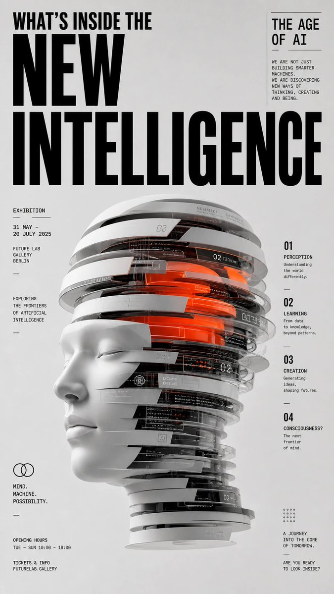

# New Intelligence Editorial Poster

**中文标题：** 新智能编辑海报  
**ID:** `gi25-x-012` · **Mode:** `edit`  
**Categories:** `poster-typography`  
**Tags:** `x-twitter`, `evolink`, `community`, `gpt-image-2`



### New Intelligence Editorial Poster

```text
Award-quality graphic design poster, neo-editorial and contemporary editorial style, D&AD / Awwwards / Behance-level visual impact.

Theme: What's Inside the New Intelligence — The Age of AI.

Build a powerful core visual metaphor for this theme — translate the abstract concept into a sculptural, iconic, installation-like object. The central object should appear cut, layered, stretched, stacked, reconstructed, wrapped, or deconstructed, carrying clear conceptual meaning rather than decorative ornament.

Clean, minimal light-gray background with generous whitespace.

High-contrast modern editorial typographic layout: oversized bold black English headline at the top, secondary subtitle, annotation text, exhibition-style information hierarchy.

Swiss editorial grid system with intentional breaks, asymmetric balance, precise alignment, strong rhythm, refined spacing.

Centered or near-centered composition with strong vertical tension.

Materials and rendering: premium product-rendering quality, matte surfaces, subtle reflections, hard-edge cuts, slight inter-layer translucency, suspended sliced structures, refined details, crisp silhouettes.

Color: predominantly black, white and gray with a single striking accent color and very limited secondary accents — restrained, high-end, contemporary.

Lighting: soft studio lighting, subtle shadows, ultra-clean rendering, highly polished but non-glossy, razor-sharp details.

Mood: conceptual, intellectual, exhibition-grade, contemporary, premium, restrained, iconic.

Aspect ratio 9:16, 4K, ultra sharp, ultra detailed, ultra clean, high resolution.
```

- **Recommended model:** `gpt-image-2.5-sunburst`
- **Settings:** _(defaults)_
- **Source:** [X/Twitter](https://x.com/iamaiistudio/status/2067778187644584418) — @iamaiistudio (via EvoLinkAI)
- **License note:** CC0-1.0 (EvoLink catalog); original X post — remix with attribution
- **Notes:** Mirrored in EvoLink case 339 (poster.md); original post on X.
