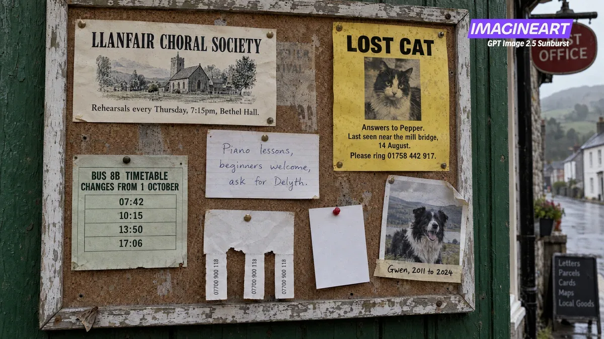

# Dense frame: Welsh post office notice board

**中文标题：** 威尔士邮局告示板  
**ID:** `gi25-x-047` · **Mode:** `generate`  
**Categories:** `poster-typography`  
**Tags:** `x-twitter`, `community`, `gpt-image-2.5`, `liuyaanng`



### Dense frame: Welsh post office notice board

```text
a cork notice board outside a Welsh village post office, overcast light, seven pinned items. A choral society flyer, a lost cat poster on yellow paper, a handwritten piano card, a bus timetable with four times, a sheepdog photo, tear off tabs, and one blank white card.
```

- **Recommended model:** `gpt-image-2.5-sunburst`
- **Settings:** _(defaults)_
- **Source:** [X/Twitter](https://x.com/ImagineArt_X/status/2097520459969601977) — @ImagineArt_X (via liuyaanng/awesome-gpt-image-2.5)
- **License note:** Community X post mirrored in awesome-gpt-image-2.5; remix with attribution
- **Notes:** Community X prompt #036 (infographics) curated in liuyaanng/awesome-gpt-image-2.5; same thread may hold multiple prompts; original on X.
