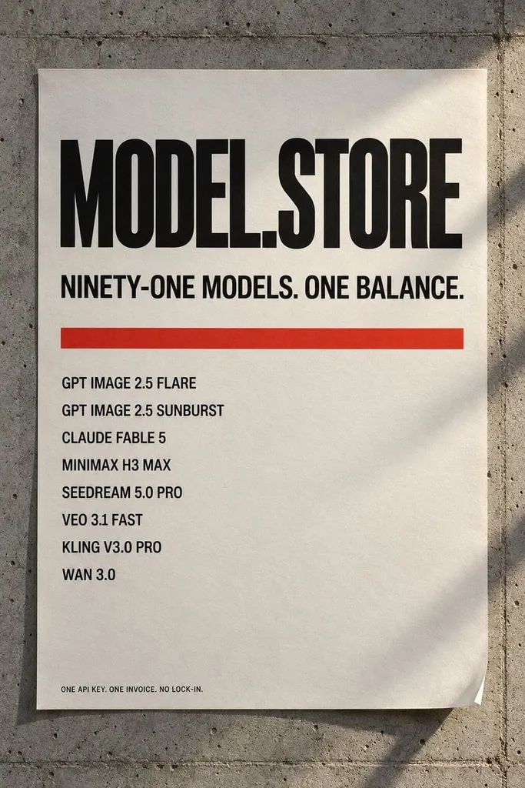

# Typography Poster and Magazine Cover

**中文标题：** 字体海报与杂志封面  
**ID:** `gi25-x-086` · **Mode:** `generate`  
**Categories:** `poster-typography`  
**Tags:** `x-twitter`, `community`, `gpt-image-2.5`, `renoise`, `layout-&-typography`, `en`

### Typography Poster and Magazine Cover

```text
a typographic poster with an eight-line model list. a magazine cover with a masthead, an issue line and three coverlines.
```

- **Recommended model:** `gpt-image-2.5-sunburst`
- **Settings:** _(defaults)_
- **Source:** [community](https://x.com/modelstoreai/status/2097641178191827333) — @modelstoreai (via renoise-ai/awesome-gpt-image-2-5-prompts)
- **License note:** Community X post mirrored in renoise-ai/awesome-gpt-image-2-5-prompts; remix with attribution
- **Notes:** Community X prompt curated in renoise-ai/awesome-gpt-image-2-5-prompts (typography-poster-and-magazine-cover); original on X; published 2026-09-09.



