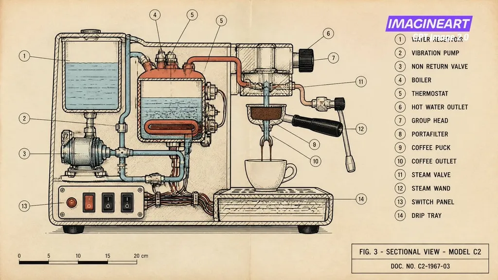

# Espresso Machine Technical Drawing

**中文标题：** 浓缩咖啡机机械制图剖面  
**ID:** `gi25-x-092` · **Mode:** `generate`  
**Categories:** `poster-typography`  
**Tags:** `x-twitter`, `community`, `gpt-image-2.5`, `renoise`, `zh`

### Espresso Machine Technical Drawing

```text
一款国产的浓缩咖啡机，采用 1960 年代的机械制图风格设计，线条精细，黑色线条描绘清晰，背景为奶油色纸张。有 14 条编号的剖面线，右侧列出了所有 14 个部件的名称，还有一个以厘米为单位的比例尺条，标题块上写着“图 3：C2 模型剖面图”
```

- **Recommended model:** `gpt-image-2.5-sunburst`
- **Settings:** _(defaults)_
- **Source:** [community](https://x.com/3three_AI/status/2097575614341628370) — @3three_AI (via renoise-ai/awesome-gpt-image-2-5-prompts)
- **License note:** Community X post mirrored in renoise-ai/awesome-gpt-image-2-5-prompts; remix with attribution
- **Notes:** Community X prompt curated in renoise-ai/awesome-gpt-image-2-5-prompts (espresso-machine-technical-drawing); original on X; published 2026-09-09.



