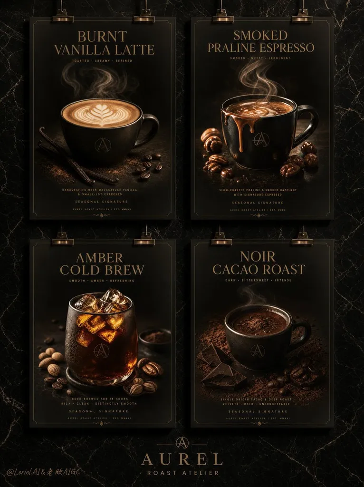

# Grid of Identical Coffee Menu Posters

**中文标题：** 统一框架咖啡菜单海报网格  
**ID:** `gi25-x-094` · **Mode:** `generate`  
**Categories:** `poster-typography`  
**Tags:** `x-twitter`, `community`, `gpt-image-2.5`, `renoise`, `layout-typography`, `en`

### Grid of Identical Coffee Menu Posters

```text
A menu becomes collectible when every flavor enters through the same frame. identical black poster fields, cup scale, title zone, bottom microcopy, and brass hanging clips across the full grid. The individual drinks feel like a designed edition, not four unrelated coffee.
```

- **Recommended model:** `gpt-image-2.5-sunburst`
- **Settings:** _(defaults)_
- **Source:** [community](https://x.com/ou_zhen599/status/2097349953010212919) — @Loriel.AI (via renoise-ai/awesome-gpt-image-2-5-prompts)
- **License note:** Community X post mirrored in renoise-ai/awesome-gpt-image-2-5-prompts; remix with attribution
- **Notes:** Community X prompt curated in renoise-ai/awesome-gpt-image-2-5-prompts (grid-of-identical-coffee-menu-posters); original on X; published 2026-09-08.



