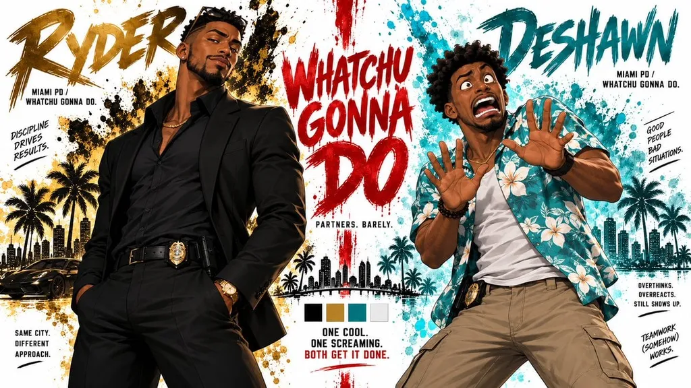

# Split-Screen Character Bible Sheet

**中文标题：** 分屏双角色设定表  
**ID:** `gi25-x-096` · **Mode:** `generate`  
**Categories:** `poster-typography`, `character-consistency`  
**Tags:** `x-twitter`, `community`, `gpt-image-2.5`, `renoise`, `layout-typography`, `en`

### Split-Screen Character Bible Sheet

```text
Create a premium cinematic original character bible sheet for RYDER & DESHAWN. Fully original characters, not based on any existing movie or franchise. LAYOUT: Split screen partner format, divided by a bold dramatic dividing element in the center.
```

- **Recommended model:** `gpt-image-2.5-sunburst`
- **Settings:** _(defaults)_
- **Source:** [community](https://x.com/MahnoorAi12/status/2096908839203557779) — @MahnoorFatima (via renoise-ai/awesome-gpt-image-2-5-prompts)
- **License note:** Community X post mirrored in renoise-ai/awesome-gpt-image-2-5-prompts; remix with attribution
- **Notes:** Community X prompt curated in renoise-ai/awesome-gpt-image-2-5-prompts (split-screen-character-bible-sheet); original on X; published 2026-09-07.



