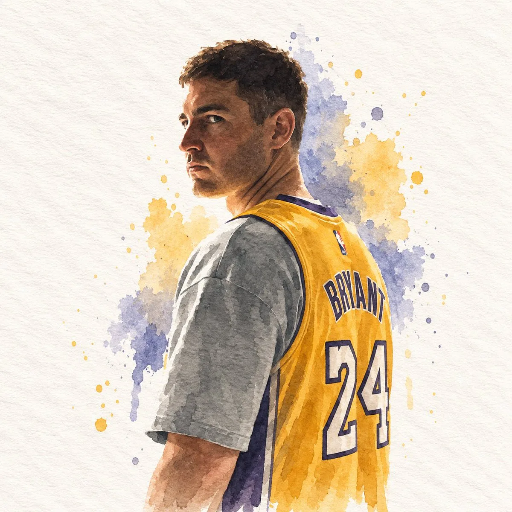

# Minimal Watercolor Paper Cover

**中文标题：** 极简水彩纸质封面  
**ID:** `gi25-x-152` · **Mode:** `edit`  
**Categories:** `poster-typography`, `edit-change-preserve`  
**Tags:** `x-twitter`, `community`, `gpt-image-2.5`, `seeapi`, `en`



### Minimal Watercolor Paper Cover

```text
## DIRECTIVE
Generate a single watercolor paper-cover illustration. Use the attached reference image only as a source to extract subject, silhouette, pose, objects, colors, and canvas proportion. Do not place, collage, overlay, split, or attach the original photograph anywhere in the frame. The entire canvas is the illustration.

## FORMAT
Match the exact aspect ratio and orientation of the attached reference image.
If the reference is horizontal, the illustration is horizontal.
If the reference is vertical, the illustration is vertical.
If the reference is square, the illustration is square.
One full-bleed handmade paper illustration.
No top/bottom split.
No photographic insert.
No diptych.
No letterboxing or added bars.

## ASPECT RATIO ADAPTATION
The output canvas must inherit the size relationship of the reference image.
Recompose the extracted elements to occupy that same proportion with intention.
Do not stretch, squash, or pad the drawing to fake another format.
Do not keep the original photograph's empty margins as dead space.
Use the full reference proportion as an editorial page: subject, a few supporting shapes, and paper ground arranged for that specific width and height.

## SUBJECT EXTRACTION
Study the attached reference image.
Preserve only:
- the most recognizable subject
- essential silhouette and proportions
- key pose or gesture
- important objects
- the core narrative relationship between people and objects

Highly simplify.
Remove unnecessary details.
Retain only the visual information needed for immediate recognition.

Never copy photographic texture, pores, lens blur, or camera grain into the illustration.
Never redraw the photograph as a painted photo.
Never keep the original photo visible.

## MEDIUM
Minimalist hand-drawn watercolor on paper.

Use:
- delicate, slightly imperfect hand-drawn lines
- transparent watercolor washes
- a small number of bold, clearly defined flat color shapes
- rough paper texture
- visible handmade brush marks
- slightly irregular, organic edges
- subtle pooling, bloom, and pigment granulation
- slight imperfections that make it feel genuinely handmade

The main illustrated subject should be small and carefully composed, occupying approximately 20–35% of the canvas.
Leave a large amount of negative space around the illustration, distributed according to the reference proportion.

## PAPER GROUND
The background should primarily resemble:
- rough white paper
- warm off-white paper
- pale natural paper
- minimal editorial book-cover stock

Use only a few lines or small watercolor shapes to suggest the surrounding environment.
Do not fill the page with a full scene.
Do not paint a photographic background.

## COLOR PALETTE
Extract the dominant colors directly from the attached reference image.
Compress the palette into no more than 4 main colors.
Keep the colors restrained, sophisticated, and harmonious.
Use bold but controlled flat watercolor blocks.
Avoid excessive color variation.
Preserve subtle paper grain and handmade brush texture.
The illustration should feel like a simplified watercolor interpretation of the reference, not a copy of it.

## TYPOGRAPHY
A small amount of simple typography may be included when it naturally fits.
Possible elements: a short title, keyword, object name, location, year, number, or short phrase.
Text should be minimal, understated, and editorial.
Place type in the negative space created by the reference proportion.
Do not force text into the composition if it does not naturally fit the subject.
No logos. No watermarks. No captions describing the image.

## VISUAL LANGUAGE
Quiet. Poetic. Refined. Minimal. Innocent. Relaxed. Artistic. Thoughtful. High-recognition. Premium.
Art-book cover. Independent publishing. Contemporary editorial design. Thoughtful picture book.

## NEGATIVE PROMPT
No original photograph in the frame, no split layout, no top photo / bottom drawing, no collage, no photomontage, no attached reference image, no photorealism, no camera look, no lens blur, no cinematic portrait, no beauty retouch, no extra people, no identity-heavy realism, no crowded composition, no full-bleed painted scene, no forced 3:4, no forced square, no letterboxing, no black bars, no stretched or squashed drawing, no unused margins copied from the photograph, no excessive detail, no more than four main colors, no loud typography, no logos, no watermarks, no HUD.
```

- **Recommended model:** `gpt-image-2.5-sunburst`
- **Settings:** _(defaults)_
- **Source:** [community](https://x.com/impaulxyz/status/2099770445595545766) — @impaulxyz (via SeeAPI/awesome-gpt-image-2.5-prompts)
- **License note:** Community X post mirrored in SeeAPI/awesome-gpt-image-2.5-prompts; remix with attribution
- **Notes:** SeeAPI P50
