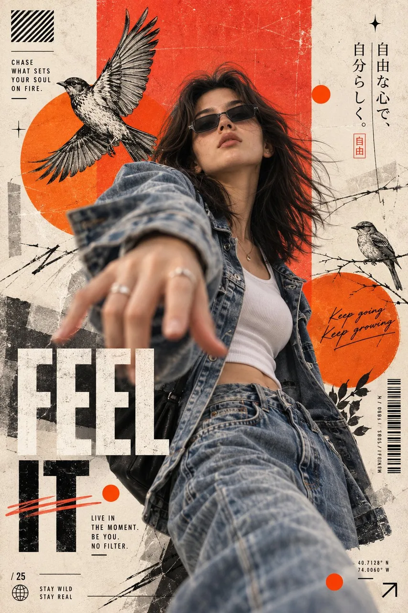

# Rebel Streetwear Editorial Poster

**中文标题：** 叛逆街头风编辑海报  
**ID:** `gi25-x-153` · **Mode:** `generate`  
**Categories:** `poster-typography`, `character-consistency`  
**Tags:** `x-twitter`, `community`, `gpt-image-2.5`, `seeapi`, `en`



### Rebel Streetwear Editorial Poster

```text
Create an ultra-realistic, high-end editorial fashion poster featuring a young woman with long, messy dark brown hair, wearing narrow black sunglasses, a faded blue denim jacket, a white fitted crop top, and relaxed blue jeans.

She is captured from a dramatic low-angle perspective, leaning forward and reaching one hand toward the camera. Her hand is close to the lens, creating a strong perspective and slight motion blur. Her head is tilted upward, with a confident, rebellious expression. Her hair flows naturally in the wind.

The background is a vintage mixed-media collage with a textured cream paper base, large distressed red and orange geometric circles and rectangles, hand-drawn black-and-white birds in flight, fine botanical branches, and subtle grunge marks.

Typography and graphic design: oversized bold white text reading “FEEL” across the lower-left section, with large black text reading “IT” underneath. Add small editorial text such as “CHASE WHAT SETS YOUR SOUL ON FIRE,” “LIVE IN THE MOMENT. BE YOU. NO FILTER,” and “KEEP GOING, KEEP GROWING.” Include vertical Japanese typography on the right, thin decorative lines, abstract symbols, barcode graphics, handwritten brush lettering, and minimalist editorial details.

Color palette: warm cream, distressed red, orange, black, white, and muted denim blue. Add vintage paper grain, screen-print texture, faded ink, subtle scratches, and authentic collage imperfections.

Composition: vertical fashion magazine cover, dramatic low-angle shot, dynamic subject placement, layered graphic elements, professional art direction, realistic skin texture, cinematic lighting, premium streetwear editorial aesthetic.

Aspect ratio: 2:3 vertical, ultra-detailed, 4K photorealistic.
```

- **Recommended model:** `gpt-image-2.5-sunburst`
- **Settings:** _(defaults)_
- **Source:** [community](https://x.com/harboriis/status/2099734295539790133) — @harboriis (via SeeAPI/awesome-gpt-image-2.5-prompts)
- **License note:** Community X post mirrored in SeeAPI/awesome-gpt-image-2.5-prompts; remix with attribution
- **Notes:** SeeAPI P51
