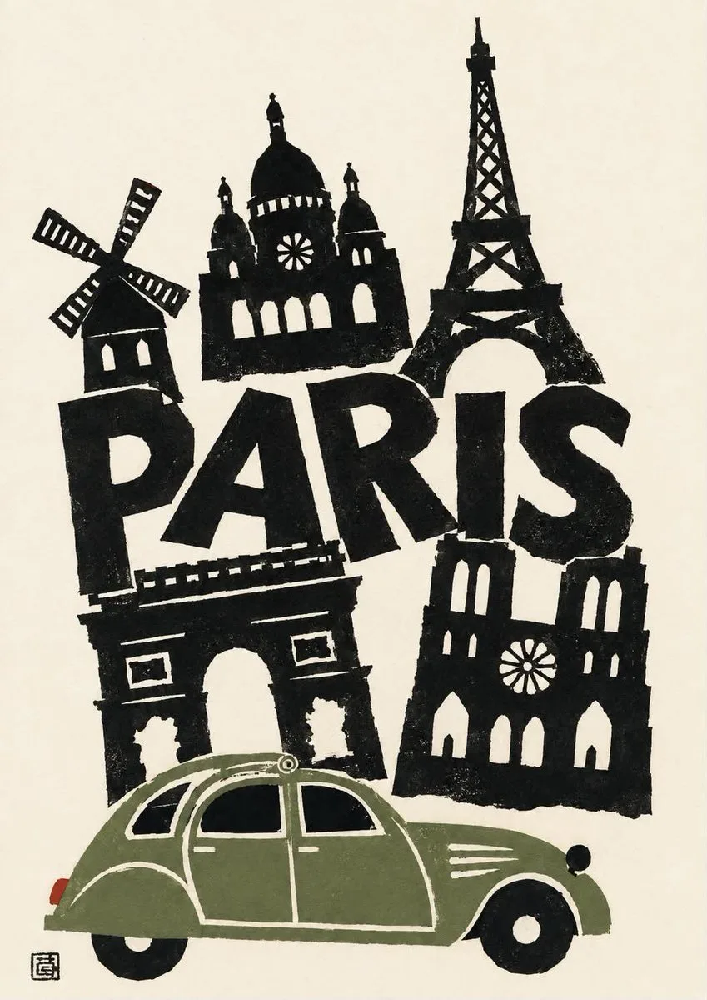

# Adaptive Vintage City Travel Poster

**中文标题：** 自适应复古城市旅行海报  
**ID:** `gi25-x-155` · **Mode:** `edit`  
**Categories:** `poster-typography`  
**Tags:** `x-twitter`, `community`, `gpt-image-2.5`, `seeapi`, `en`



### Adaptive Vintage City Travel Poster

```text
{
  "input": {
    "city_name": "{{USER_INPUT_CITY}}"
  },

  "reference_style": {
    "use_uploaded_reference_images": true,
    "reference_images_define": [
      "overall composition",
      "hand-cut screenprint aesthetic",
      "bold black graphic silhouettes",
      "limited color palette",
      "vintage travel poster character",
      "rough ink texture",
      "slightly imperfect handmade edges",
      "large oversized city typography",
      "layered landmark arrangement",
      "bottom transportation element",
      "cream/off-white paper background",
      "minimal editorial composition"
    ],
    "do_not_copy": [
      "specific landmarks",
      "specific city name",
      "specific vehicle",
      "specific color combinations",
      "exact typography arrangement",
      "exact landmark placement"
    ]
  },

  "generation": {
    "type": "vintage_city_travel_poster",
    "aspect_ratio": "3:4",
    "resolution": "high",
    "orientation": "portrait",

    "city_adaptation": {
      "primary_rule": "Everything must be redesigned around the user's city_name.",
      "identify_city": true,
      "research_visual_identity": true,

      "landmarks": {
        "count": "4-7",
        "selection": "Automatically select the most recognizable and visually distinctive landmarks of the specified city.",
        "prioritize": [
          "major landmark",
          "historic architecture",
          "modern architectural icon",
          "religious or cultural landmark",
          "bridge or monument",
          "recognizable skyline element"
        ],
        "rendering": "Convert each landmark into simplified bold black screenprint silhouettes while preserving its recognizable architectural identity."
      },

      "transportation": {
        "automatically_select": true,
        "instruction": "Choose a transportation vehicle strongly associated with the specified city, such as a taxi, tram, bus, metro train, tuk-tuk, cable car, rickshaw, classic car, ferry, or other iconic local transport.",
        "placement": "large foreground element along the bottom edge",
        "style": "simplified vintage screenprint illustration"
      },

      "colors": {
        "automatically_adapt": true,
        "instruction": "Select a restrained 2-4 color palette inspired by the city's visual identity, local transportation, flag, architecture, or cultural colors.",
        "black": "dominant graphic ink color",
        "background": "warm aged cream paper",
        "accent_colors": "city-specific and muted, never overly saturated"
      },

      "typography": {
        "text": "{{USER_INPUT_CITY}}",
        "case": "uppercase",
        "style": "large bold irregular condensed display lettering",
        "placement": "integrated prominently between or behind the landmarks",
        "texture": "rough printed ink",
        "alignment": "slightly imperfect and organic",
        "rule": "The city name must be perfectly spelled and clearly readable."
      },

      "secondary_text": {
        "enabled": false,
        "instruction": "Do not add arbitrary slogans, dates, tourist phrases, descriptions, or extra readable text."
      },

      "local_details": {
        "automatically_adapt": true,
        "instruction": "Add subtle visual details that immediately reinforce the identity of the specified city without overcrowding the composition."
      }
    },

    "composition": {
      "layout": "editorial vintage travel poster",
      "landmarks": "arranged dynamically around the typography",
      "typography": "large central visual anchor",
      "foreground": "one iconic city transportation element",
      "depth": "flat graphic layering with minimal overlap",
      "negative_space": "generous cream-colored negative space",
      "balance": "asymmetrical but visually balanced",
      "cropping": "allow selected landmarks or transportation to naturally extend toward the edges"
    },

    "art_direction": {
      "medium": "hand-pulled screenprint / linocut-inspired travel poster",
      "visual_language": [
        "bold silhouettes",
        "flat shapes",
        "rough ink edges",
        "visible print grain",
        "subtle ink distress",
        "slight registration imperfections",
        "handmade imperfections",
        "graphic editorial design",
        "mid-century travel poster influence"
      ],
      "linework": "strong, chunky and simplified",
      "texture": "authentic paper grain and uneven ink coverage",
      "finish": "physical printed artwork rather than digitally perfect vector art"
    },

    "background": {
      "color": "warm ivory / aged cream",
      "texture": "subtle natural paper fibers",
      "pattern": "none",
      "gradient": false
    },

    "quality": {
      "photorealism": false,
      "vector_perfection": false,
      "digital_gloss": false,
      "clean_modern_ui": false,
      "high_detail": true,
      "print_ready_appearance": true
    }
  },

  "constraints": {
    "user_controls_only": [
      "city_name"
    ],
    "model_controls": [
      "landmark selection",
      "landmark arrangement",
      "transportation",
      "color palette",
      "local visual details",
      "typographic composition",
      "graphic hierarchy"
    ],
    "must_have": [
      "correct city name",
      "recognizable landmarks from that city",
      "city-specific transportation or mobility element",
      "warm cream paper background",
      "bold black screenprint forms",
      "large city typography",
      "vintage handmade print texture",
      "cohesive travel-poster composition"
    ],
    "avoid": [
      "landmarks from other cities",
      "generic buildings",
      "generic tourist imagery",
      "photorealistic rendering",
      "3D rendering",
      "glossy gradients",
      "neon colors",
      "modern corporate poster design",
      "random text",
      "misspelled city name",
      "extra slogans",
      "watermarks",
      "logos",
      "AI artifacts",
      "overly clean vector edges"
    ]
  },

  "output_instruction": "Create a single finished vintage screenprint travel poster representing {{USER_INPUT_CITY}}. Preserve the artistic language and visual restraint of the supplied references, but completely redesign the landmarks, transportation, color accents and local details so they authentically belong to the specified city."
}
```

- **Recommended model:** `gpt-image-2.5-sunburst`
- **Settings:** _(defaults)_
- **Source:** [community](https://x.com/Maercihh/status/2099757585264251102) — @Maercihh (via SeeAPI/awesome-gpt-image-2.5-prompts)
- **License note:** Community X post mirrored in SeeAPI/awesome-gpt-image-2.5-prompts; remix with attribution
- **Notes:** SeeAPI P53
