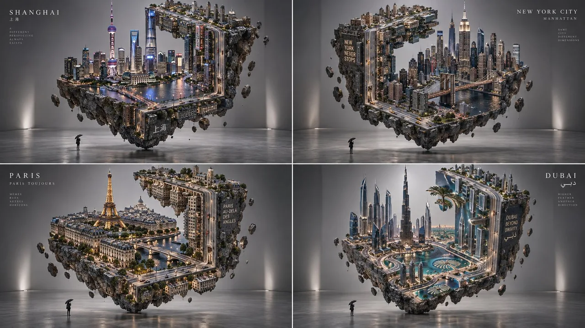

# Floating Diorama Grid of Iconic Cities

**中文标题：** 漂浮微缩城市立体网格  
**ID:** `gi25-x-157` · **Mode:** `generate`  
**Categories:** `poster-typography`, `general`  
**Tags:** `x-twitter`, `community`, `gpt-image-2.5`, `phimaker`, `en`



### Floating Diorama Grid of Iconic Cities

```text
2x2 grid, 16:9, do this for iconic cities: Do this for Shanghai: A floating diorama of [CITY_NAME] suspended in a grey studio::5  The Distortion: The
```

- **Recommended model:** `gpt-image-2.5-sunburst`
- **Settings:** _(defaults)_
- **Source:** [community](https://x.com/Gdgtify/status/2097738806564635028) — @Gdgtify (via PhiMaker5/awesome-gpt-image-2.5-prompts)
- **License note:** Community X post mirrored in PhiMaker5/awesome-gpt-image-2.5-prompts; remix with attribution
- **Notes:** PhiMaker id=107; published 2026-09-09; source_verified=True.
