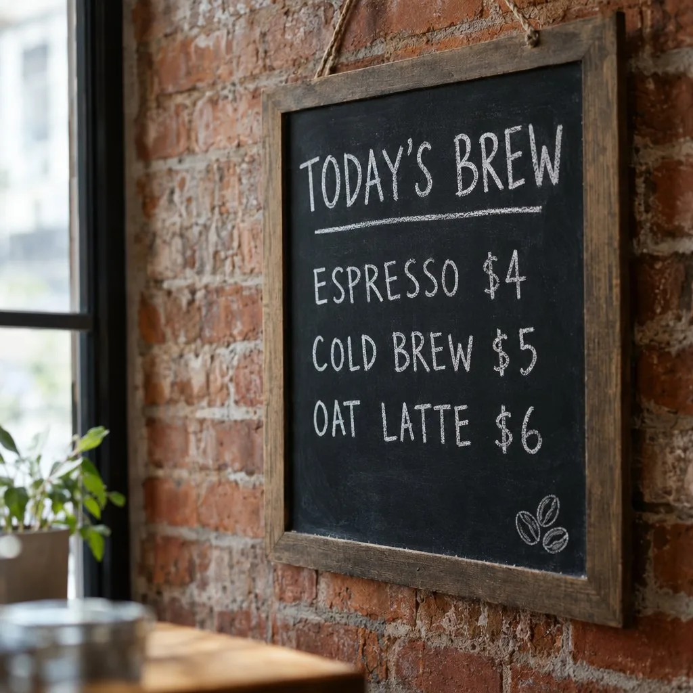

# Flare Chalkboard Menu with Exact Prices

**中文标题：** Flare 黑板菜单：四行价格文字全对  
**ID:** `gi25-x-160` · **Mode:** `generate`  
**Categories:** `poster-typography`, `flare-vs-sunburst`  
**Tags:** `x-twitter`, `community`, `gpt-image-2.5`, `xianyu`, `en`



### Flare Chalkboard Menu with Exact Prices

```text
Stress test (GPT Image 2.5 Flare):
Give Flare a four-line chalkboard menu with exact prices. No retries.
Acceptance: every word and every dollar amount must come back correct on the first pass.

Why it matters: text accuracy used to be the tell that gave away an AI image — menu / price boards are a hard gate for ads and storefront mocks.
```

- **Recommended model:** `gpt-image-2.5-flare`
- **Settings:** _(defaults)_
- **Source:** [community](https://x.com/modelstoreai/status/2100565452774650265) — @modelstoreai (via xianyu110/awesome-gpt-image2.5)
- **License note:** Community X post mirrored in xianyu110/awesome-gpt-image2.5; remix with attribution
- **Notes:** xianyu110/awesome-gpt-image2.5 case 2100565452774650265; category=选型评测.
