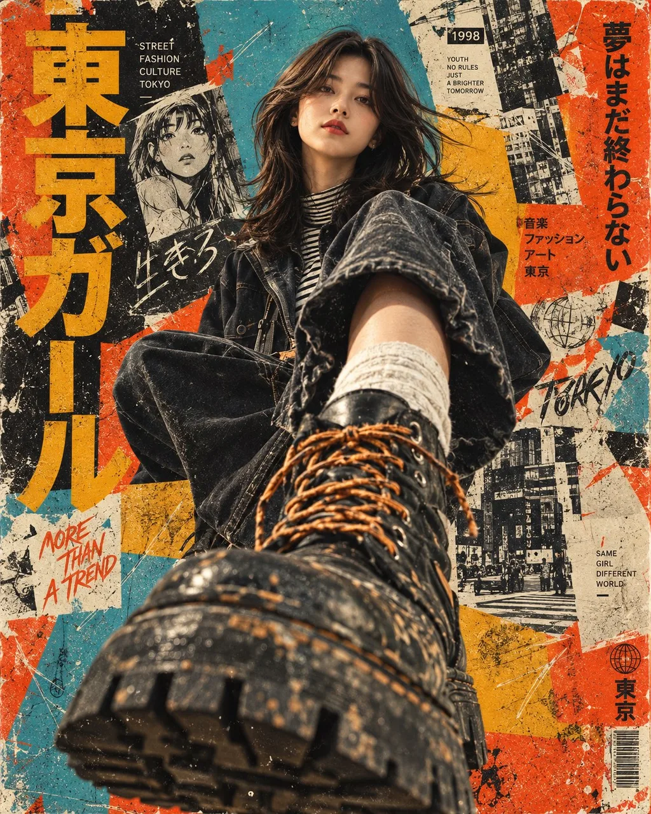

# Japanese Punk Street Fashion Low-Angle Poster

**中文标题：** 日式朋克街头时尚：极端低机位战斗靴海报  
**ID:** `gi25-x-162` · **Mode:** `generate`  
**Categories:** `poster-typography`, `character-consistency`  
**Tags:** `x-twitter`, `community`, `gpt-image-2.5`, `xianyu`, `en`



### Japanese Punk Street Fashion Low-Angle Poster

```text
Create an ultra-realistic cinematic street-fashion editorial poster with a strong retro Japanese punk / underground magazine aesthetic.

A young East Asian woman sits on the ground and looks directly into the camera from a dramatic extreme low-angle perspective. Her upper body is positioned near the center-top of the composition while one leg extends aggressively toward the camera, creating powerful forced perspective. Her oversized rugged black combat boot dominates the entire foreground, appearing much larger than her body. The boot has thick textured rubber soles, worn black leather, visible orange-brown laces, scuffed surfaces, and realistic dirt and imperfections.

She has straight, slightly messy shoulder-length black hair with wispy bangs, naturally flying outward as if caught by wind. Her expression is calm, confident, slightly rebellious, with a direct intense gaze. Subtle red-orange eye makeup and vivid red lips. Natural skin texture, realistic pores, delicate facial details.

She wears an oversized black denim jacket, layered over a patterned black-and-white striped high-neck top, with loose styling and visible fabric folds. Add rugged streetwear details and a worn urban fashion aesthetic.

The background is a highly textured mixed-media Japanese street-art collage, combining distressed turquoise blue, vivid burnt orange, mustard yellow and off-white paper textures. Include rough hand-painted geometric shapes, torn paper, photocopied manga-style sketches, faded illustrations, ink marks, scratches, paint splatters, grain, distressed typography and fragmented Japanese-inspired graphic elements. The background should feel like an old underground fashion magazine cover or experimental punk poster.

Use a vertical 4:5 composition, dramatic extreme wide-angle lens, camera positioned almost at ground level directly in front of the boot, strong perspective distortion, boot extremely close to the lens, subject receding into the background.

Lighting: cinematic natural daylight mixed with hard directional highlights, realistic shadows, subtle film grain, slightly faded analog color grading, high micro-detail, tactile textures, authentic photographic imperfections.

Style: photorealistic fashion photography fused with vintage Japanese punk collage design, experimental editorial poster, raw street culture, 1990s underground magazine aesthetic, distressed print texture, analog film look, highly detailed, visually striking, premium fashion campaign, sharp subject, realistic materials, realistic anatomy.

Aspect ratio: 4:5
```

- **Recommended model:** `gpt-image-2.5-sunburst`
- **Settings:** _(defaults)_
- **Source:** [community](https://x.com/Shorelyn_/status/2100545305200795816) — @Shorelyn_ (via xianyu110/awesome-gpt-image2.5)
- **License note:** Community X post mirrored in xianyu110/awesome-gpt-image2.5; remix with attribution
- **Notes:** xianyu110/awesome-gpt-image2.5 case 2100545305200795816; category=海报排版.
