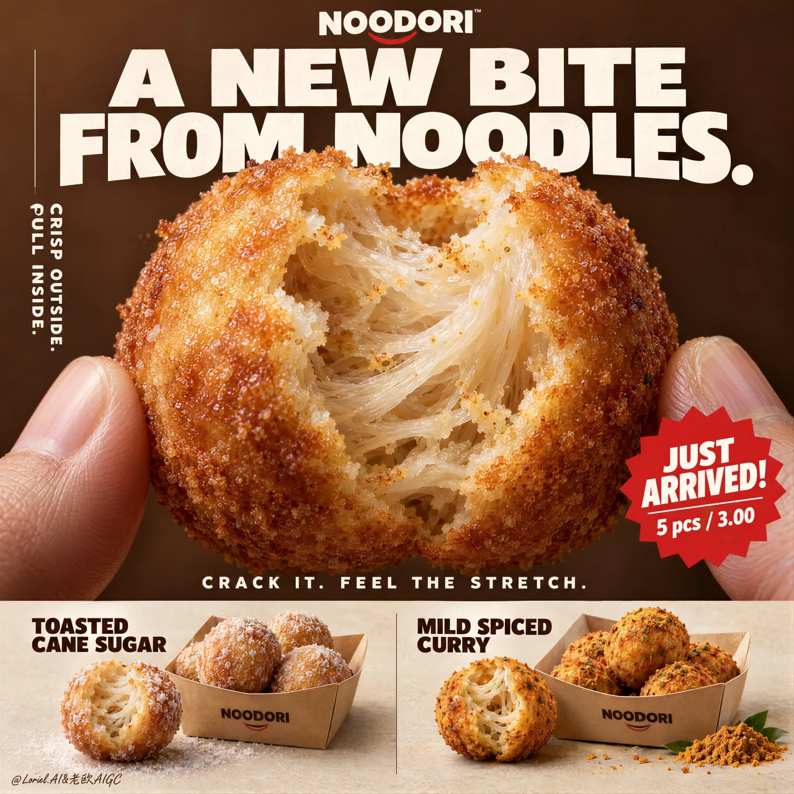

# Snack Poster with Noodle-Stretch Structure

**中文标题：** 零食海报：别写 gooey，写面条拉丝结构  
**ID:** `gi25-x-164` · **Mode:** `generate`  
**Categories:** `poster-typography`, `ecommerce`  
**Tags:** `x-twitter`, `community`, `gpt-image-2.5`, `xianyu`, `en`



### Snack Poster with Noodle-Stretch Structure

```text
Don’t write “gooey filling.” That turns this into cheese bread.
🧊 a naturally torn bite edge revealing translucent noodle strands, layered starch threads, and elastic pull inside the shell
This makes the center read as a real noodle structure—not a generic soft crumb.
🍊 thin blistered golden crust with fine fried granularity, light oil sheen, and a sharp material contrast against the pale interior
The bite becomes instantly legible: crisp outside, stretch inside.

A hyper-real premium poster advertisement for a fictional snack brand called NOODORI, designed in an Orbit-plus-Port direction: a bold product-launch key visual with one monumental macro food hero, highly controlled graphic typography, and a refined lower product strip. The core product is a fried noodle-dough snack ball called "Noodle Puff", presented as an ultra-real edible object with intense tactile realism and a surprising internal structure. One giant bitten snack ball dominates the center of the frame, delicately held between two natural human fingertips entering from the lower left and lower right edges. The bite opening reveals an airy fibrous interior with visible noodle-like stretch, layered starch threads, and a soft elastic pull inside a thin crisp golden shell. The product is the absolute visual hero.

Framing and composition: vertical poster layout, strong central macro composition, oversized hero product cropped large enough to feel immediate and almost architectural. Keep the upper field as a warm chestnut-brown poster plane with large white typographic mass, a cleaner vertical support text column on the left, one sharp promotional badge on the lower right of the hero area, and a highly disciplined product information strip running across the bottom. Preserve the original retail-poster logic, but reduce noise and make the entire page more sculptural, gallery-like, and premium. The fingers act only as scale and human interaction cues, never competing with the food.

Product design: the hero snack is a perfectly round fried noodle puff with a thin blistered golden crust, subtle fried granularity, light oil sheen, and a naturally torn bite edge exposing a mochi-like noodle matrix inside. The interior should feel surprising, soft, and layered rather than bread-like. In the bottom product strip, present two flavor variants in a clean side-by-side system: one pale sugar-dusted version and one deeper warm curry-spiced version. Each flavor sits beside a simple folded kraft takeaway tray with a few neatly arranged full snack balls. The lower strip must feel tidy, retail-ready, and secondary to the hero bite.

Lighting and color: soft but directional premium food lighting from upper front-right, gentle warm fill from the left, crisp readability inside the torn interior, elegant highlights on the crust, and subtle shadows under the bottom flavor presentations. Build stronger light-dark separation than a typical snack poster so the shell volume, interior fibers, and headline typography gain sculptural force. Palette balance: 60% chestnut brown, toasted amber, and warm golden crust; 30% creamy ivory interior and kraft-paper neutrals; 10% saturated red promotion accents and spice-yellow flavor notes. No muddy browns, no dead black patches, no greasy over-darkness.

Materials and finish: hyper-real food photography fused with premium Japanese-style poster design. Show crisp fried crust grain, delicate starch translucency in the inner layers, realistic soft tear fibers, matte paper tray texture, natural fingertip skin texture, and clean print-like typography integration. The final finish should feel like a Cannes-level convenience-food launch poster: tactile, surprising, minimal yet commercially explosive.

Typography: all visible copy in English only, highly art-directed and integrated into the poster. Top brand mark reads exactly: "NOODORI". Main headline at the top reads exactly: "A NEW BITE FROM NOODLES." Left vertical support line reads exactly: "CRISP OUTSIDE. PULL INSIDE." Small excitement line above the bottom strip reads exactly: "CRACK IT. FEEL THE STRETCH." Promotional burst on the lower right of the hero area reads exactly: "JUST ARRIVED!" and beneath it exactly: "5 pcs / 3.00". In the bottom strip, the left flavor label reads exactly: "TOASTED CANE SUGAR" and the right flavor label reads exactly: "MILD SPICED CURRY". Typography should be bold, soft-edged, graphic, and beautifully spaced, with large white forms against the brown field and restrained red accents.

Output and constraints: polished premium snack poster, product-first hierarchy, no copied source text, no real brand names, no extra props, no cluttered background scene, no people beyond the partial fingertips. Keep the hands anatomically correct with natural finger joints and correct finger count. Keep the hero snack spherical and believable, the bite natural, the lower strip orderly, and the overall page clean and high-end. Avoid fused fingers, swollen joints, broken snack geometry, messy crumb explosions, excessive oil, warped trays, duplicated snack balls, unreadable text, plastic-looking crust, oversharpening, AI gibberish text, muddy color cast, or drift away from premium commercial food realism.
```

- **Recommended model:** `gpt-image-2.5-sunburst`
- **Settings:** _(defaults)_
- **Source:** [community](https://x.com/ou_zhen599/status/2100554719274119461) — @ou_zhen599 (via xianyu110/awesome-gpt-image2.5)
- **License note:** Community X post mirrored in xianyu110/awesome-gpt-image2.5; remix with attribution
- **Notes:** xianyu110/awesome-gpt-image2.5 case 2100554719274119461; category=海报排版.
