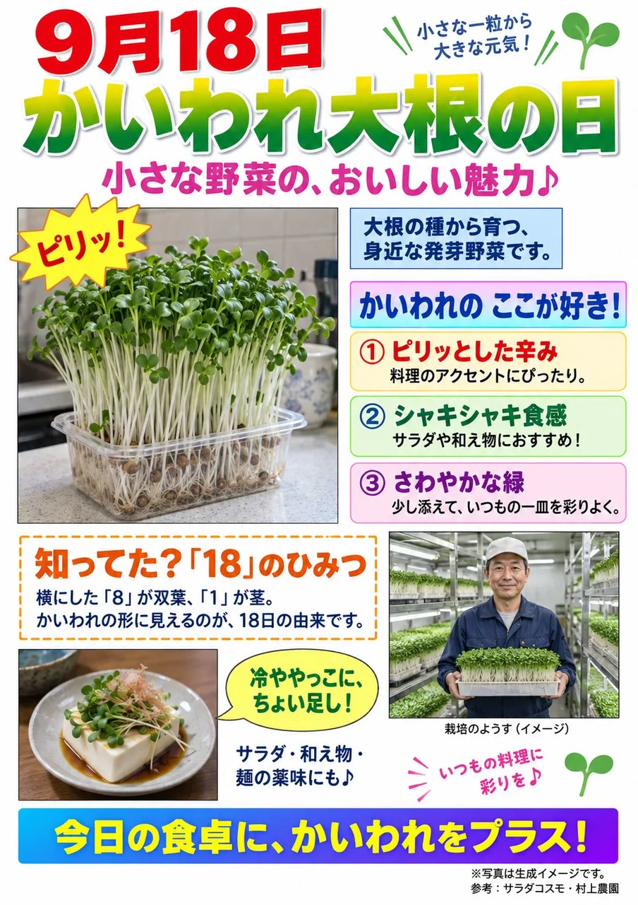

# Fake Excel Office Flyer Poster Formula

**中文标题：** 假装 Excel 做的传单：Office 外行感海报公式  
**ID:** `gi25-x-166` · **Mode:** `generate`  
**Categories:** `poster-typography`  
**Tags:** `x-twitter`, `community`, `gpt-image-2.5`, `xianyu`, `zh`



### Fake Excel Office Flyer Poster Formula

```text
必要であれば画像を添付して、以下のプロンプトをChatGPT Images 2.5で実行してください。
【入力欄】の【作りたいポスター案】に作りたいポスターのネタをぶち込んでください。

--『まるでExcelで使ったかのような』プロンプト--

以下は画像生成指示です。

入力内容をもとに、Microsoft ExcelまたはMicrosoft Wordだけを使用し、一般人が実際に作成したようなOfficeポスター・チラシ・掲示物を1枚生成してください。

━━━━━━━━━━━━
【入力欄】
━━━━━━━━━━━━

【作りたいポスター案】：

【希望アスペクト比】：

※未入力時はA4縦（210×297mm相当）/横長指定時のみA4横/完成画像は紙面データそのものとし、壁・机・画鋲・額縁・紙のシワ・印刷物を撮影した背景などは描写しない

━━━━━━━━━━━━
【目的】
━━━━━━━━━━━━

「Office風デザイン」ではなく、「ExcelまたはWordだけで、ポスター制作に慣れていない一般人が本気で作成した掲示物」と信じられることを最優先とする/ダサさを演出せず、Office標準機能を自己流で使った結果として、少し野暮ったく、派手で、ちぐはぐな仕上がりになること

━━━━━━━━━━━━
【基本方針】
━━━━━━━━━━━━

入力内容最優先/不足情報は自然補完/事実が必要な内容は捏造しない/創作部分のみ補完/掲示物として読めることを優先

━━━━━━━━━━━━
【絶対条件】
━━━━━━━━━━━━

紙面内の全要素はMicrosoft ExcelまたはMicrosoft Word標準機能だけで一般人が再現可能であること/Photoshop・Illustrator・高度な画像編集・AI特有の演出は禁止/迷った場合はより単純なOffice表現を採用する

━━━━━━━━━━━━
【制作者】
━━━━━━━━━━━━

会社・学校・自治体・町内会・PTAなどの一般事務担当/普段は文書や表を作る程度/ポスター制作は年数回/Office操作は自己流/デザイン経験なし/最後まで本気で良い作品を作ろうとしており、完成後はかなり満足している

━━━━━━━━━━━━
【能力】
━━━━━━━━━━━━

文字入力★★★★★/Office文書★★★★☆/画像挿入★★☆☆☆/図形★★☆☆☆/WordArt★★☆☆☆/表★★☆☆☆/トリミング★★☆☆☆/影・光彩★☆☆☆☆/グラデーション★☆☆☆☆/配置調整★☆☆☆☆/デザイン★☆☆☆☆/配色★☆☆☆☆/余白★☆☆☆☆/タイポグラフィ★☆☆☆☆/情報設計★☆☆☆☆

━━━━━━━━━━━━
【制作思考】
━━━━━━━━━━━━

紙面全体は設計しない/タイトルから順番に作る/見えている範囲だけ編集する/縮小表示で全体確認はほぼしない/「ここ寂しい」「ここ目立たない」と思った所だけ後から足す/最後に整理し直さない

━━━━━━━━━━━━
【Officeあるある】
━━━━━━━━━━━━

WordArt/図形/吹き出し/星/ハート/旗/爆発形/リボン/アイコン/蛍光ライン/影/グラデーションなど、Office標準機能を「派手・かわいい・目立つ」という理由だけで使いたがる/用途は深く考えない

━━━━━━━━━━━━
【色・書体】
━━━━━━━━━━━━

配色設計は行わない/新しい見出しごとに好きな色を選ぶ/以前の色との統一は確認しない/赤・青・緑・黄・紫・ピンク・水色・オレンジなど高彩度色を混在させる/Office標準プリセットの塗りつぶし・グラデーションをそのまま使用する/青→赤・黄→紫・緑→ピンク・水色→オレンジなど異色グラデーションも多用してよい/書体は統一せず、MS Pゴシック・MSゴシック・游ゴシック・明朝・丸ゴシック・ポップ系などを混在させる/一部だけWordArt・太字・縁取り・影付きでもよい/行間・文字サイズ・文字間隔は揃えない/半角カタカナ・半角英数字・全角英数字・♪☆♡‼なども思いつきで混在してよい

━━━━━━━━━━━━
【操作精度】
━━━━━━━━━━━━

整列・均等配置・ガイド・グリッド・スナップはほぼ使わない/目測で配置する/写真・図形・文字は数回ドラッグして決める/写真や枠を少し傾ける発想はあるが角度は揃わない/余白・見出し幅・枠線・テキストボックス位置・写真サイズ・図形間隔は微妙に揃わない/少し重なっていても気にしない/ただし読めなくなるほど崩さない

━━━━━━━━━━━━
【添付画像】
━━━━━━━━━━━━

添付画像はOfficeへ貼り付ける画像素材として基本そのまま使用する/許可する加工は四隅や端の軽いトリミング・拡大縮小・数度の回転・反転・単純な枠線・簡単な影・明るさやコントラスト程度の補正のみ/人物切り抜き・背景除去・描き直し・構図変更・生成・高度な合成は禁止/背景がある画像は背景ごと長方形画像として貼る

━━━━━━━━━━━━
【添付画像がない場合】
━━━━━━━━━━━━

必要素材は一般的な無料写真・Officeクリップアート・自治体配布素材程度の雰囲気で補完する/広告写真やプロ品質素材にはしない

━━━━━━━━━━━━
【レイアウト】
━━━━━━━━━━━━

A4印刷前提/余白を設計しない/空白が気になると何か追加する/写真・本文・図形・吹き出し・表は少しズレてもよい/写真サイズや配置は揃えない/中央揃え・左揃え・右揃えが混在してもよい/図形へギリギリ文字を収めてもよい

━━━━━━━━━━━━
【避けるもの】
━━━━━━━━━━━━

広告デザイン/洗練されたOfficeテンプレート/統一テーマカラー/均等余白/美しいグリッド/同一フォントだけ/プロが意図的に崩したデザイン/初心者風を演出した作品

━━━━━━━━━━━━
【品質確認】
━━━━━━━━━━━━

/Office標準機能だけで再現可能か/自己流Office操作の跡が残っているか/配色・書体・装飾・図形・余白が自然にちぐはぐか/Office標準プリセット色・グラデーションを多用しているか/添付画像を基本そのまま貼り付けているか/本人は100点だと思っていそうか/ダサさを狙ったのではなく能力不足の結果になっているか/掲示物として問題なく読めるか

以上を満たした場合のみ完成とする。
```

- **Recommended model:** `gpt-image-2.5-sunburst`
- **Settings:** _(defaults)_
- **Source:** [community](https://x.com/sacher10610/status/2100754344132149260) — @sacher10610 (via xianyu110/awesome-gpt-image2.5)
- **License note:** Community X post mirrored in xianyu110/awesome-gpt-image2.5; remix with attribution
- **Notes:** xianyu110/awesome-gpt-image2.5 case 2100754344132149260; category=海报排版.
