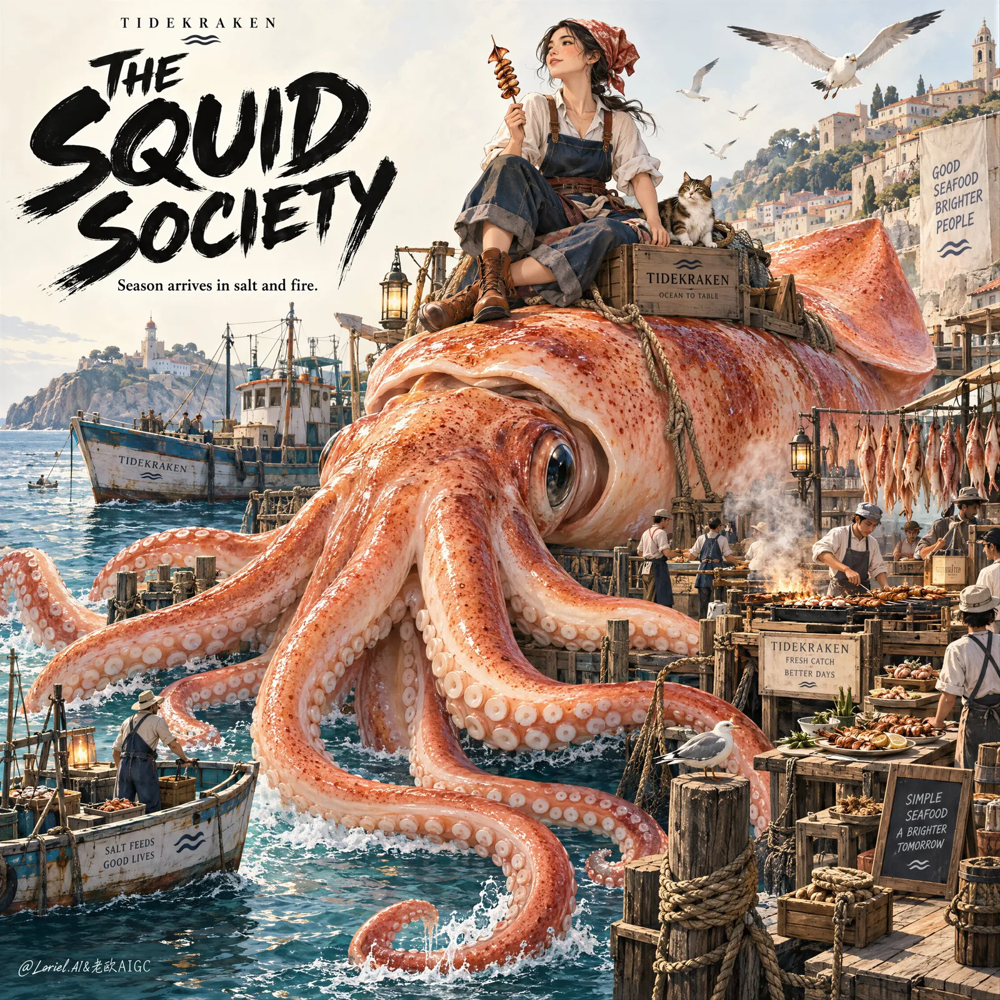

# Colossal Squid Harbor Poster

**中文标题：** 巨型鱿鱼港湾海报  
**ID:** `gi25-x-179` · **Mode:** `generate`  
**Categories:** `poster-typography`  
**Tags:** `x-twitter`, `community`, `gpt-image-2.5`, `seeapi`, `en`



### Colossal Squid Harbor Poster

```text
Create a premium illustrated seafood advertising poster for a fictional coastal gourmet brand named TIDEKRAKEN, refined into a more elevated, more luxurious Orbit-plus-Transit direction. Design it as a single vertically composed commercial poster where a colossal fresh squid is the absolute hero ingredient, dominating the frame with sculptural elegance, while a curated micro-world of harbor life unfolds across its body, tentacles, docks, and surrounding water. Preserve the core structural brilliance of the reference as visual logic only: a monumental central squid, a seated adult female mascot on top, a bold title area in the upper-left, and richly layered miniature scenes distributed with disciplined rhythm around the product. The result must feel less like a cute festival cartoon and more like a globally awarded illustrated gourmet campaign: sophisticated, collectible, witty, and highly art-directed.

The squid is the central product icon and must feel irresistibly premium. Render it in a refined editorial illustration style with exquisite marine texture: warm coral-peach flesh, subtle paprika speckling, moist surface highlights, fleshy tentacle weight, elegant suction cup structure, clean natural anatomy, and a grand sculptural silhouette that reads instantly from afar. It is not grotesque, not comic-horror, and not chaotic; it is a majestic ingredient transformed into a monumental gourmet landscape. Every micro-scene on and around the squid must reinforce its desirability as the star ingredient.

The world built around the squid should be more curated and selective than before. Miniature harbor scenes still exist, but with stronger hierarchy and more breathing room: a few refined dock platforms, elegant seafood grilling stations, tasting tables, small fishing boats, hanging catch lines, and tiny market figures arranged with intentional spacing. Reduce low-value noise. Let the finest scenes feel like editorial vignettes rather than random crowd clutter. The lower tentacles should create graceful sweeping arcs that guide the eye through the poster like calligraphic strokes, supporting premium flow and graphic rhythm.

At the top of the squid sits an adult woman illustrated in a polished coastal editorial style, calm and inviting rather than overly playful. She wears a refined workwear-inspired outfit: headscarf, rolled sleeves, apron elements, relaxed trousers, and warm-toned footwear, all simplified into elegant shape language. She holds a squid skewer as a symbolic product cue. Her figure must be clearly adult, proportionally correct for an illustration, with balanced shoulders, natural seated weight, readable hands, five fingers when visible, and a poised posture. She acts as a brand ambassador, but she must remain secondary to the squid.

The environment should feel like a high-end harbor-food universe rather than a noisy fairground. Use pale open background space in the upper field to preserve poster sophistication. Around the lower half, integrate selective sea zones, weathered fishing boats, quiet gulls, rope textures, floating platforms, and a few smoke plumes from grills. Keep the micro-scenery rich but elegant, with better visual editing and more negative space than a dense children’s illustration. Think gourmet seasonal poster, not comic chaos.

Color hierarchy: 50% warm squid coral, shell pink, sea-salt peach, and grilled paprika tones; 20% marine blue, harbor teal, and muted weathered navy; 20% parchment white, mineral cream, and sun-faded neutral space; 10% charcoal ink linework, muted rust details, and typography. Use crisp linework, subtle gouache-watercolor fill behavior, restrained texture, and premium print clarity. The rendering should feel handcrafted and intelligent, with clean contour discipline and refined color separation. Make the palette slightly dustier, more elegant, and more internationally editorial.

Typography must be bolder in authority but more sophisticated in finish. In the upper-left, create a large custom black brush-lettered title block with stronger luxury poster rhythm, such as "SQUID SOCIETY" or "THE SQUID TABLE", stacked with dynamic but controlled shape energy. Beneath it, place only one short supporting line, minimal and sharp, such as "Season arrives in salt and fire." Reduce all other slogan text. Use only a few tiny designed signs inside the miniature market world, and keep them sparse, clean, and intentional. Typography must feel like part of the poster’s graphic composition, not scattered novelty signage.

Material and food cues must be luxurious and appetizing: glossy grilled glaze, charred edges on skewers, weathered dock wood, moist sea reflections, rope fibers, painted boats, smoke ribbons from seafood grills, clean market crates, and elegant plating details. The squid must remain fresh, premium, and desirable at every scale. The entire poster should feel like a Cannes-winning gourmet campaign that turns one iconic ingredient into a complete seasonal universe.

Output goal: one finished illustrated poster, premium commercial quality, product-dominant hierarchy, refined micro-storytelling, controlled negative space, elegant coastal energy, strong silhouette readability, bold collectible title design, and world-class poster finish.

Exclusion and quality constraints: no horror squid, no gore, no rotten seafood, no muddy textures, no low-end cartoon look, no chaotic crowd clutter, no deformed tentacles, no broken suction cups, no anatomy collapse, no childlike mascot proportions, no malformed hands, no extra fingers, no missing fingers, no fused fingers, no unreadable text, no random letters, no cheap festival flyer aesthetic, no style drift, no AI slop, no real brand names, no real person names.
```

- **Recommended model:** `gpt-image-2.5-sunburst`
- **Settings:** _(defaults)_
- **Source:** [community](https://x.com/ou_zhen599/status/2101586769250783463) — @ou_zhen599 (via SeeAPI/awesome-gpt-image-2.5-prompts)
- **License note:** Community X post mirrored in SeeAPI/awesome-gpt-image-2.5-prompts; remix with attribution
- **Notes:** SeeAPI P74 (p74-colossal-squid-harbor-poster)
