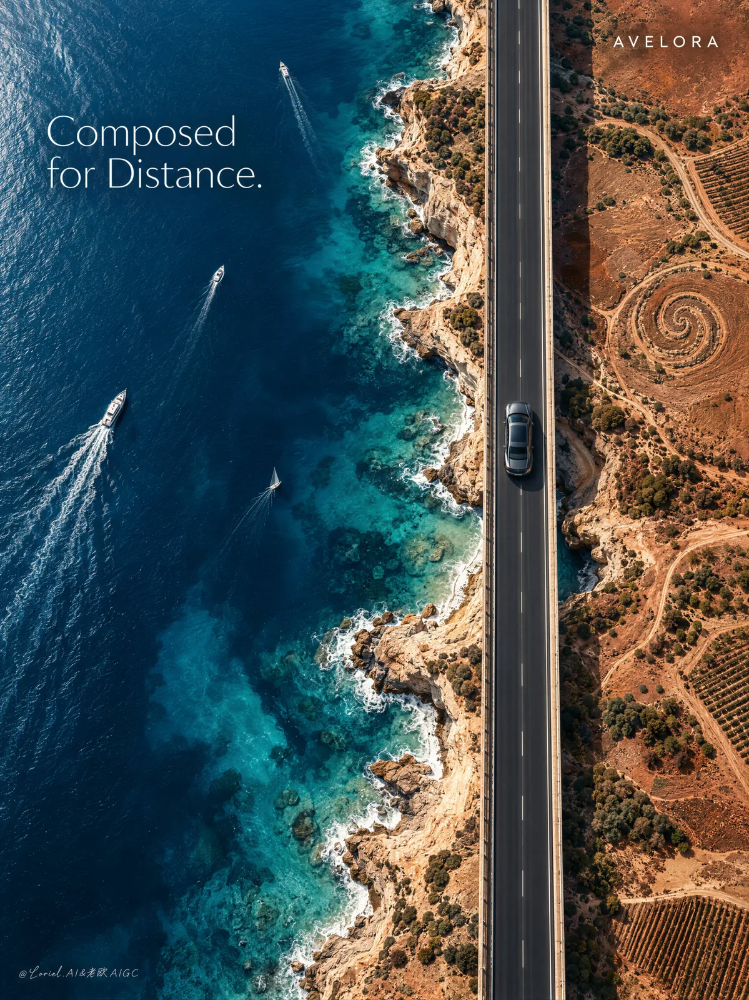

# Avelora Coastal Bridge Car Poster

**中文标题：** AVELORA 海岸大桥汽车海报  
**ID:** `gi25-x-181` · **Mode:** `generate`  
**Categories:** `poster-typography`  
**Tags:** `x-twitter`, `community`, `gpt-image-2.5`, `seeapi`, `en`



### Avelora Coastal Bridge Car Poster

```text
Create a premium automotive art-poster campaign for a fictional luxury grand touring brand named AVELORA, designed as a single vertical aerial composition with a monumental top-down perspective. Preserve the structural intelligence of the reference as pure visual architecture: a vast field of luminous coastal water on the left, a sun-scorched earthmass on the right, and a severe linear bridge running vertically near the right side of frame. The real hero product is a graphite metallic grand touring sedan traveling along the bridge, visually small yet compositionally dominant through placement, contrast, and the disciplined emptiness around it. The final image must feel more artistic, more elevated, and more like a museum-grade international advertising poster than a conventional car campaign.

The concept is that motion has carved a silent score into the landscape. The sea, coastline, agricultural geometry, shoreline curvature, wake lines, and land traces must imply rhythm, resonance, and orchestral order without becoming illustrative or literal. The image should feel like geography composed into music. The bridge reads like a single decisive line across a living canvas, and the car reads like the only note that matters.

On the left, the sea must be deep, mineral, and painterly in a photoreal way: saturated but elegant Mediterranean blue, teal depth shifts, pale wave edges, and elongated white wake trails from a few distant boats that feel like gestural strokes across the surface. On the right, the land must be dry, textural, and sculptural: terracotta fields, oxidized ochre soil, dusty umber, pale sand pockets, and one subtle spiral or calligraphic land trace embedded into the terrain as if the earth itself remembers movement. The coastline should feel naturally cut, irregular, and beautiful, with white shore foam and believable erosion lines. Every macro-shape must feel designed, but never artificial.

The car is a real premium sedan, highly photoreal and precisely engineered: low and elegant body line, dark panoramic roof glass, subtle metallic reflections, crisp window trim, refined wheel design, realistic tire contact, and a calm sense of speed rather than aggressive motion blur. The vehicle must remain legible despite its scale, through controlled road contrast, precise shadow, and exact positioning on the bridge. The bridge surface is immaculate dark asphalt with thin pale lane markings, engineered edges, and minimal structural interruption, rendered as a pure modernist line slicing through sea and land.

Color hierarchy: 55% luminous deep blue and teal water, 25% warm copper, rust, terracotta, and mineral earth, 10% charcoal bridge and graphite car, 10% soft white wake lines and typography. Lighting is high aerial daylight but refined into fine-art tonality: crisp coastal sun, sculpted texture in water and soil, exact white foam edges, very subtle atmospheric diffusion, and strong micro-contrast without harsh over-sharpening. The image must feel clean, expensive, breathable, and globally premium.

Typography must be fewer, colder, and more refined than before. Use only two text elements total. In the upper-left open water area, place one elegant headline: "Composed for Distance." Set in a modern refined sans-serif or restrained high-fashion serif-sans blend, bright white, carefully kerned, with quiet authority. In the upper-right, use a minimal brand block only: "AVELORA". No extra descriptors, no website, no explanatory copy, no information clutter. The typography should feel like a gallery-grade editorial intervention, suspended in the negative space, never competing with the landscape or the car.

Material semantics must be explicit and elevated: mineral-rich water depth, chalky coastline, dry agricultural soil, engineered asphalt, metallic automotive paint, reflective glass, subtle undercar shadow, and fine aerial photographic texture. The entire composition must read as a product-led luxury campaign where the car transforms the landscape into an emotional instrument of movement.

Rendering target: photoreal luxury automotive campaign, aerial fine-art realism, conceptually intelligent composition, premium editorial poster finish, clean negative space, restrained typography, world-class print quality, and seamless harmony between engineering, terrain, and visual poetry.

Structured exclusion constraints: no real car brands, no copied slogans, no garbled typography, no unreadable text, no extra vehicles cluttering the bridge, no low-resolution car, no distorted coastline, no cartoon music symbols, no warped bridge geometry, no muddy water, no dirty haze, no cheap tourism poster look, no oversaturated travel aesthetic, no style drift, no AI artifacts, no duplicate boats, no visual clutter.
```

- **Recommended model:** `gpt-image-2.5-sunburst`
- **Settings:** _(defaults)_
- **Source:** [community](https://x.com/ou_zhen599/status/2101556753762586720) — @ou_zhen599 (via SeeAPI/awesome-gpt-image-2.5-prompts)
- **License note:** Community X post mirrored in SeeAPI/awesome-gpt-image-2.5-prompts; remix with attribution
- **Notes:** SeeAPI P76 (p76-avelora-coastal-bridge-car-poster)
