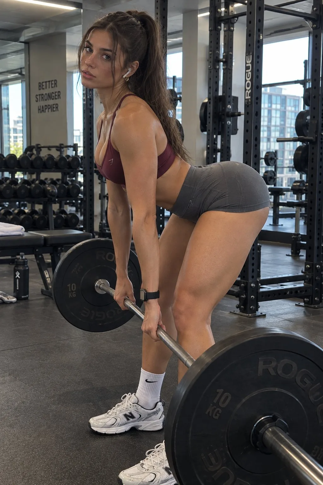

# Candid Gym Deadlift Photo

**中文标题：** 健身房硬拉抓拍  
**ID:** `gi25-x-183` · **Mode:** `generate`  
**Categories:** `poster-typography`, `general`  
**Tags:** `x-twitter`, `community`, `gpt-image-2.5`, `seeapi`, `en`



### Candid Gym Deadlift Photo

```text
{
  "prompt": {
    "type": "ultra_photorealistic_lifestyle_fitness_photography",
    "objective": "Generate a single extremely realistic high-resolution fitness photograph of a fictional young adult woman exercising inside a real contemporary gym. The image should feel naturally sexy, confident and feminine without looking staged, explicit or artificial. It must look like a genuine smartphone photograph casually taken during a workout, not AI-generated artwork, CGI, commercial fitness advertising or an over-retouched photoshoot. Prioritize believable anatomy, imperfect natural skin, realistic fabric behavior, authentic gym lighting, subtle asymmetry, physically correct equipment and ordinary photographic imperfections.",
    "image_format": {
      "orientation": "portrait",
      "aspect_ratio": "approximately 2:3",
      "framing": "vertical full-body to three-quarter-body fitness photograph",
      "resolution": "very high resolution",
      "composition_priority": "extremely high",
      "photographic_authenticity_priority": "maximum"
    },
    "subject": {
      "count": 1,
      "presentation": "young adult woman",
      "age_appearance": "clearly adult, approximately mid twenties",
      "appearance": {
        "physique": "athletic feminine physique with naturally developed glutes and legs, toned abdomen, moderately defined shoulders and arms, realistic waist-to-hip proportions and visible evidence of regular strength training without exaggerated bodybuilding proportions",
        "body_realism": [
          "subtle natural asymmetry between left and right sides",
          "realistic muscle tension from the exercise",
          "small natural skin folds caused by movement",
          "no impossible hourglass proportions",
          "no artificial extreme waist reduction",
          "no exaggerated breast or glute proportions"
        ],
        "skin": {
          "tone": "warm lightly tanned natural skin",
          "texture": "visible realistic pores and subtle skin texture",
          "details": [
            "tiny variations in skin tone",
            "very subtle redness from physical activity",
            "minor natural imperfections",
            "faint visible veins in appropriate areas",
            "slight natural sheen from workout perspiration",
            "subtle compression marks where clothing contacts the skin"
          ],
          "avoid": "perfect waxy skin, plastic texture, excessive smoothing or artificial beauty-filter appearance"
        },
        "hair": {
          "color": "rich dark brown",
          "length": "long",
          "style": "loosely tied high ponytail",
          "condition": "slightly messy from exercising",
          "details": [
            "individual strands visible",
            "small loose strands around forehead and temples",
            "natural flyaways",
            "slight unevenness rather than perfect salon styling"
          ]
        },
        "face": {
          "expression": "relaxed, confident and subtly flirtatious without exaggerated posing",
          "gaze": "looking toward the camera with a natural slightly intense expression",
          "mouth": "lips naturally relaxed and very slightly parted",
          "makeup": "minimal realistic gym makeup, subtle mascara, natural brows and muted nude-pink lips",
          "facial_structure": "attractive but believable adult face with natural proportions",
          "realism": [
            "minor facial asymmetry",
            "natural under-eye texture",
            "realistic nasolabial contours",
            "subtle skin texture on forehead and cheeks",
            "no perfectly mirrored features"
          ]
        }
      },
      "exercise": {
        "type": "Romanian deadlift with a barbell",
        "moment": "captured near the lower-middle portion of the repetition while the subject is hinging at the hips",
        "execution": {
          "feet": "approximately hip-width apart and firmly planted on the rubber flooring",
          "knees": "slightly bent in a realistic Romanian deadlift position",
          "hips": "pushed backward naturally",
          "spine": "neutral and anatomically plausible",
          "torso": "leaned forward due to the hip hinge while maintaining realistic posture",
          "barbell": "held close to the legs around mid-shin to just below knee level",
          "shoulders": "slightly pulled back and stable",
          "hands": "gripping the bar naturally at approximately shoulder width",
          "head": "slightly raised and turned enough for the subject to glance toward the camera"
        },
        "pose_character": "athletic and functional first, with the natural hip-hinge position creating a flattering silhouette without turning into an unrealistic pin-up pose"
      }
    },
    "clothing": {
      "top": {
        "type": "minimal fitted athletic sports bra",
        "color": "deep burgundy / wine red",
        "cut": "low-to-moderate athletic scoop neckline",
        "fit": "snug supportive compression fit",
        "straps": "thin-to-medium athletic shoulder straps",
        "back": "minimal racerback-inspired athletic construction",
        "fabric": "matte technical stretch material",
        "details": [
          "realistic stitching",
          "small seams",
          "slight natural fabric tension",
          "very small tonal logo or no visible branding"
        ]
      },
      "bottom": {
        "type": "very fitted high-waisted seamless gym shorts",
        "color": "dark charcoal gray",
        "length": "short upper-thigh athletic length",
        "waist": "high-rise ribbed compression waistband",
        "fit": "form-fitting contour style with realistic compression",
        "fabric": "matte seamless stretch knit",
        "details": [
          "subtle ribbed texture",
          "natural fabric tension",
          "realistic creases around the hip joints",
          "slight compression around thighs",
          "subtle center and contour seams",
          "no impossible painted-on texture"
        ]
      },
      "socks": {
        "type": "white athletic crew socks",
        "height": "mid-calf",
        "condition": "slightly worn but clean",
        "texture": "visible cotton ribbing and minor natural wrinkles"
      },
      "shoes": {
        "type": "flat-soled women's gym training shoes",
        "color": "white and off-white with muted gray details",
        "design": "practical strength-training silhouette",
        "condition": "clean but visibly used",
        "details": [
          "minor sole wear",
          "slightly uneven lace tension",
          "real textile mesh",
          "stitching",
          "small floor dust marks"
        ]
      },
      "accessories": {
        "headphones": {
          "type": "compact wireless in-ear earbuds",
          "color": "white",
          "details": "small and understated"
        },
        "watch": {
          "type": "fitness smartwatch",
          "position": "left wrist",
          "color": "black",
          "details": "slightly reflective screen with no readable interface text"
        },
        "jewelry": {
          "type": "small thin hoop earrings",
          "appearance": "subtle and believable"
        }
      }
    },
    "barbell": {
      "type": "standard Olympic barbell",
      "position": "held close to the legs during the Romanian deadlift",
      "plates": {
        "quantity": "one moderate-sized plate per side",
        "style": "black commercial rubber bumper plates",
        "weight_markings": "subtle and not necessarily readable"
      },
      "details": [
        "realistic knurling",
        "metal sleeves",
        "minor scratches from normal gym use",
        "physically correct plate thickness",
        "correct bar straightness and perspective"
      ]
    },
    "gym_environment": {
      "location": "real upscale urban commercial gym",
      "overall_style": "modern industrial minimalist strength-training area",
      "atmosphere": "active but not crowded, believable and slightly imperfect rather than pristine showroom-like",
      "floor": {
        "material": "dark charcoal rubber flooring",
        "texture": "fine speckled rubber texture",
        "condition": "minor shoe marks and normal gym wear",
        "details": "visible seams between flooring sections"
      },
      "walls": {
        "materials": [
          "warm off-white painted concrete",
          "dark metal",
          "large mirror panels"
        ],
        "condition": "clean but realistically used",
        "decoration": "minimal"
      },
      "windows": {
        "type": "large industrial floor-to-ceiling windows",
        "frames": "black metal",
        "lighting": "soft natural daylight entering from the side",
        "glass": "realistic slight reflections and subtle smudging",
        "view": "modern urban buildings outside"
      },
      "ceiling": {
        "style": "exposed industrial ceiling",
        "color": "dark charcoal",
        "details": [
          "HVAC ducts",
          "electrical conduit",
          "support beams",
          "linear LED fixtures",
          "small recessed lights"
        ]
      }
    },
    "gym_equipment": {
      "power_racks": {
        "position": "rear and side background",
        "type": "heavy black steel commercial racks",
        "details": [
          "uprights",
          "holes",
          "J-hooks",
          "safety arms",
          "stored plates"
        ]
      },
      "dumbbells": {
        "position": "background",
        "type": "commercial black rubber dumbbells",
        "arrangement": "imperfectly aligned along a multi-level rack",
        "realism": "minor wear and believable metallic reflections"
      },
      "benches": {
        "position": "background edges",
        "type": "black adjustable gym benches",
        "details": "subtle upholstery creases and metal support frames"
      },
      "weight_plates": {
        "position": "storage pegs and plate trees",
        "appearance": "slightly used black plates with minor surface wear"
      },
      "additional_details": [
        "water bottle partially visible in the background",
        "small gym towel on a distant bench",
        "cable handles hanging naturally",
        "no unnaturally perfect equipment arrangement"
      ]
    },
    "mirrors": {
      "presence": true,
      "position": "large mirror panels behind and slightly to one side of the subject",
      "reflection_behavior": "physically consistent with actual camera and subject positions",
      "reflection_quality": "slightly darker and fractionally softer than direct view",
      "details": [
        "correct reflected gym equipment",
        "correct reflected lighting",
        "no duplicate limbs",
        "no impossible alternative pose",
        "no impossible camera reflection"
      ]
    },
    "composition": {
      "subject_position": "slightly right of center",
      "body_coverage": "almost full body visible",
      "exercise_visibility": "barbell and complete hip-hinge position clearly readable",
      "visual_emphasis": "face, waist-to-hip silhouette, leg tension and athletic movement",
      "foreground": "subtle portion of rubber flooring with enough space around feet and barbell",
      "background": "recognizable gym interior with realistic depth but not distracting",
      "visual_hierarchy": [
        "subject's face and gaze",
        "natural athletic silhouette",
        "Romanian deadlift movement",
        "burgundy sports bra and charcoal shorts",
        "barbell",
        "gym equipment and windows"
      ],
      "camera_angle": "around hip-to-waist height relative to standing subject",
      "camera_position": "approximately three-quarter front-side angle rather than perfectly frontal",
      "camera_distance": "approximately 2.5 to 3.5 meters from subject",
      "framing_character": "slightly casual, as though another person quickly photographed the workout rather than precisely composing a fashion campaign"
    },
    "camera_characteristics": {
      "device": "modern flagship smartphone main camera",
      "lens": "approximately 28mm full-frame equivalent",
      "aperture_behavior": "smartphone-like natural depth of field rather than artificial DSLR portrait blur",
      "focus": "subject's torso and face sharply focused",
      "background_focus": "slightly softer due to distance but still clearly recognizable",
      "depth_of_field": "moderately deep",
      "dynamic_range": "realistic smartphone HDR",
      "exposure": "slightly imperfect but well-balanced natural exposure",
      "white_balance": "mostly neutral with slightly warm skin rendering",
      "sharpness": "high natural detail but not digitally crunchy",
      "noise": "very subtle fine sensor noise in darker regions",
      "lens_distortion": "small realistic wide-angle distortion near frame edges",
      "chromatic_aberration": "extremely subtle and only where physically plausible",
      "motion": "tiny natural motion softness in loose hair strands while face and torso remain sharp",
      "processing": "minimal computational photography look",
      "avoid": [
        "cinematic grading",
        "commercial studio lighting",
        "unrealistic edge sharpening",
        "fake depth-map blur",
        "perfectly uniform skin exposure"
      ]
    },
    "lighting": {
      "primary_source": "natural daylight from large side windows",
      "secondary_source": "existing neutral-white overhead gym lighting",
      "direction": "side-front daylight creating gentle body contouring",
      "quality": "soft but not flat",
      "contrast": "moderate and realistic",
      "face": "naturally lit with slight shadow variation",
      "body": "soft highlights across shoulders, abdomen and legs caused by real overhead and window light",
      "skin_specularity": "very subtle realistic post-workout sheen",
      "shadows": [
        "contact shadows under shoes",
        "soft shadow beneath barbell",
        "natural shadow between limbs",
        "subtle facial shadows",
        "equipment shadows consistent with ceiling lights"
      ],
      "avoid": [
        "beauty dish lighting",
        "strong rim lighting",
        "neon RGB lighting",
        "orange-and-teal cinema grading",
        "perfect symmetrical light",
        "unrealistic glowing skin",
        "overexposed windows"
      ]
    },
    "photographic_realism": {
      "goal": "The viewer should initially assume this is a normal real photograph uploaded by a fitness creator rather than generated imagery.",
      "required_imperfections": [
        "slightly asymmetric framing",
        "minor fabric wrinkles",
        "subtle skin texture",
        "natural hair flyaways",
        "tiny lighting inconsistencies",
        "minor equipment wear",
        "small rubber floor scuffs",
        "non-perfect shoe placement",
        "slight variation in muscle tension",
        "natural facial asymmetry",
        "realistic hand pressure on the bar"
      ],
      "avoid_ai_signatures": [
        "hyper-perfect face",
        "identical repeating dumbbells",
        "perfectly spaced equipment",
        "impossible reflections",
        "melting background objects",
        "random unreadable wall typography",
        "fake logos",
        "overly glossy surfaces",
        "uniform pore texture",
        "overly smooth legs",
        "overly dramatic body proportions"
      ]
    },
    "anatomical_requirements": {
      "hands": [
        "exactly five fingers per hand",
        "natural finger spacing",
        "thumb positioned correctly around bar",
        "correct wrist alignment",
        "no fused fingers"
      ],
      "legs": [
        "realistic knee structure",
        "correct calf and thigh proportions",
        "both feet connected naturally to floor",
        "no duplicated or distorted joints"
      ],
      "torso": [
        "natural ribcage dimensions",
        "realistic waist",
        "physically plausible spinal posture",
        "no twisted torso geometry"
      ],
      "face": [
        "two symmetrical but naturally non-identical eyes",
        "normal teeth if visible",
        "realistic ears",
        "correct hairline"
      ]
    },
    "fine_details": [
      "individual hair strands near temples",
      "tiny droplets or subtle perspiration along hairline",
      "natural eyebrow hairs",
      "slight texture on lips",
      "very subtle veins on hands",
      "realistic fingernails",
      "barbell knurling",
      "minor metal scratches",
      "fabric knit visible in shorts",
      "sports bra stitching",
      "sock ribbing",
      "shoe mesh",
      "shoelace fibers",
      "rubber floor granularity",
      "minor dust near equipment",
      "mirror edge seams",
      "subtle fingerprints or smudging on distant mirror",
      "window reflections",
      "small highlights on gym hardware"
    ],
    "color_palette": {
      "dominant": [
        "burgundy",
        "dark charcoal",
        "black",
        "white",
        "warm natural skin tones",
        "soft neutral gray"
      ],
      "secondary": [
        "cool daylight blue",
        "brushed steel",
        "muted city colors"
      ],
      "saturation": "natural and restrained",
      "contrast": "moderate",
      "grading": "minimal realistic smartphone color processing"
    },
    "negative_prompt": [
      "AI generated appearance",
      "CGI",
      "3D render",
      "illustration",
      "anime",
      "cartoon",
      "digital painting",
      "plastic skin",
      "porcelain skin",
      "airbrushed skin",
      "beauty filter",
      "perfectly smooth skin",
      "overly glossy skin",
      "exaggerated hourglass figure",
      "impossibly narrow waist",
      "oversized breasts",
      "exaggerated buttocks",
      "unnatural hip width",
      "elongated legs",
      "shortened limbs",
      "extra arms",
      "extra legs",
      "extra hands",
      "extra fingers",
      "missing fingers",
      "fused fingers",
      "warped hands",
      "broken wrists",
      "deformed knees",
      "warped feet",
      "floating shoes",
      "floating barbell",
      "bent barbell",
      "asymmetric weight plates",
      "duplicated gym equipment",
      "repeating dumbbell patterns",
      "warped racks",
      "warped mirrors",
      "incorrect reflections",
      "duplicate person in mirror",
      "fisheye distortion",
      "extreme low angle",
      "extreme wide angle",
      "heavy portrait blur",
      "fake bokeh",
      "cinematic lighting",
      "studio lighting",
      "RGB neon lights",
      "teal-orange grading",
      "excessive HDR",
      "oversharpening",
      "excessive contrast",
      "motion blur across face",
      "grainy low-quality image",
      "watermark",
      "random text",
      "unreadable wall text",
      "fake brand logos",
      "perfect showroom gym",
      "unnatural exercise form",
      "stiff model pose",
      "explicit nudity",
      "transparent clothing",
      "wardrobe malfunction",
      "pornographic framing"
    ],
    "identity_handling": {
      "instruction": "Create a completely fictional adult woman. Do not reproduce or imitate the recognizable identity of any real person."
    },
    "priority_order": [
      "1. The result must look like an actual real-world smartphone gym photograph",
      "2. Preserve believable adult human anatomy and exercise biomechanics",
      "3. Create a naturally attractive and sexy fitness aesthetic without explicit presentation",
      "4. Preserve realistic imperfect skin, hair, fabric and equipment details",
      "5. Make the Romanian deadlift position anatomically and mechanically plausible",
      "6. Preserve realistic burgundy sports bra and charcoal fitted shorts",
      "7. Use ordinary natural gym lighting instead of cinematic or studio lighting",
      "8. Preserve physically correct mirrors, shadows and reflections",
      "9. Include subtle real-world imperfections that reduce the AI-generated appearance",
      "10. Avoid all common AI artifacts in hands, equipment, background geometry and textures"
    ]
  },
  "output": {
    "style": "extremely photorealistic authentic fitness photography",
    "quality": "maximum",
    "detail": "maximum",
    "human_realism": "maximum",
    "skin_realism": "maximum",
    "anatomical_accuracy": "maximum",
    "exercise_accuracy": "very high",
    "environment_realism": "maximum",
    "photographic_authenticity": "maximum",
    "ai_artifact_suppression": "maximum",
    "retouching_level": "minimal"
  }
}
```

- **Recommended model:** `gpt-image-2.5-sunburst`
- **Settings:** _(defaults)_
- **Source:** [community](https://x.com/cartelfather/status/2101400765772542021) — @cartelfather (via SeeAPI/awesome-gpt-image-2.5-prompts)
- **License note:** Community X post mirrored in SeeAPI/awesome-gpt-image-2.5-prompts; remix with attribution
- **Notes:** SeeAPI P78 (p78-candid-gym-deadlift-photo)
