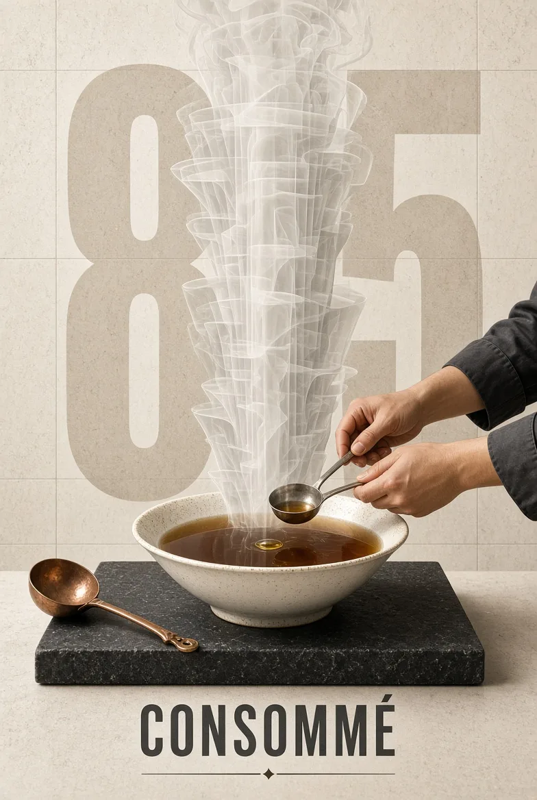

# Culinary Vapor Monument Poster

**中文标题：** 蒸汽纪念碑式美食海报  
**ID:** `gi25-x-187` · **Mode:** `generate`  
**Categories:** `poster-typography`  
**Tags:** `x-twitter`, `community`, `gpt-image-2.5`, `seeapi`, `en`



### Culinary Vapor Monument Poster

```text
Vertical culinary monument poster. A single [DISH] is plated on [SURFACE] and centered under a tall rising column of [VAPOR] that becomes the main graphic structure of the image. The vapor is architectural: stacked translucent planes, not fluffy cartoon steam. [HUMAN] appears only as hands and forearms entering from [ENTRY], wearing [SLEEVES], performing [ACTION]. Background is a flattened [KITCHEN PLANE] with one useful object: [UTENSIL]. Palette: [PALETTE]. Oversized numeral “[NUMBER]” behind the vapor. Dish name “[DISH NAME]” in tight condensed type at the foot. Heat, measure, stillness. 4:5
```

- **Recommended model:** `gpt-image-2.5-sunburst`
- **Settings:** _(defaults)_
- **Source:** [community](https://x.com/miratechtool/status/2101560392589758614) — @miratechtool (via SeeAPI/awesome-gpt-image-2.5-prompts)
- **License note:** Community X post mirrored in SeeAPI/awesome-gpt-image-2.5-prompts; remix with attribution
- **Notes:** SeeAPI P82 (p82-culinary-vapor-monument-poster)
