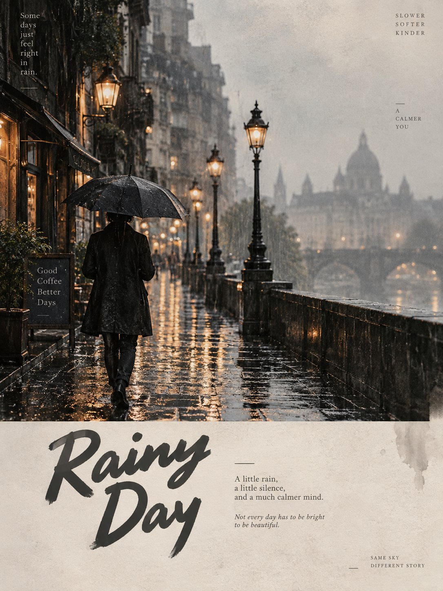

# Eternal Editorial Location Poster [COUNTRY/LOCATION]

**中文标题：** 永恒编辑风地点海报：[COUNTRY/LOCATION] 可替换模板  
**ID:** `gi25-x-489` · **Mode:** `edit`  
**Categories:** `poster-typography`  
**Tags:** `x-twitter`, `community`, `gpt-image-2.5`, `xianyu`, `en`



### Eternal Editorial Location Poster [COUNTRY/LOCATION]

```text
Create one premium 3:4 vertical editorial art poster for [COUNTRY / LOCATION / SUBJECT].

TEXT-TO-IMAGE GENERATION ONLY. Generate the complete artwork from [COUNTRY / LOCATION / SUBJECT] alone. No reference image or additional visual input is required.

Automatically interpret the subject and create a visually compelling composition that reflects its character, atmosphere, appearance, setting, colors, and distinctive visual identity.

LOWER SECTION

Use a refined background palette inspired by [COUNTRY / LOCATION / SUBJECT], using limited low-saturation tones such as misty gray, warm beige, light khaki, cream white, dusty rose, or soft gray-pink, selecting only the colors that naturally suit the subject.

Keep approximately 22–30% continuous negative space. Avoid complicated scenery, excessive objects, sticker-like elements, or meaningless decoration.

TYPOGRAPHY

Create a sophisticated editorial typography system based on the subject.

Automatically generate a short main title inspired by the subject's appearance, mood, action, or personality.

Add one natural 8–16 word English sentence written like a subtle editorial note or magazine caption.

Use a carefully designed hand-drawn or retro bubble-style font for the main title. Use smaller refined typography for supporting text, such as an elegant serif, subtle typewriter style, or delicate book-inspired font.

Create clear hierarchy, breathing room, and intentional spacing. Typography should feel integrated into the artwork rather than simply placed on top.

VISUAL STYLE

Keep the overall palette restrained and cohesive, with subtle film grain, tactile paper texture, and a gentle printed-editorial quality.

Allow slight asymmetry and imperfect positioning to create a sophisticated independent-magazine aesthetic without making the composition messy.

IMPORTANT

Keep the main subject recognizable and naturally proportioned. Do not cartoonize the person or subject.

Avoid:
multiple mascots, existing animated characters, brand logos, QR codes, watermarks, signatures, gibberish text, incorrect hands, extra limbs, excessive decoration, cheap templates, overly cute styling, or cluttered compositions.

FINAL LOOK

The finished artwork should feel like a premium independent fashion magazine, contemporary art publication, or sophisticated editorial ZINE—minimal, tactile, slightly imperfect, modern, and visually intelligent.

STRICT 3:4 VERTICAL | TEXT-ONLY GENERATION | RESTRAINED COLORS | 22–30% NEGATIVE SPACE | PREMIUM EDITORIAL TYPOGRAPHY | SUBTLE FILM GRAIN & PAPER PRINT TEXTURE.

Generate everything autonomously from [COUNTRY / LOCATION / SUBJECT] alone.
```

- **Recommended model:** `gpt-image-2.5-sunburst`
- **Settings:** _(defaults)_
- **Source:** [community](https://x.com/Goodmanprotocol/status/2100508937514897577) — @Goodmanprotocol (via xianyu110/awesome-gpt-image2.5)
- **License note:** Community X post mirrored in xianyu110/awesome-gpt-image2.5; remix with attribution
- **Notes:** xianyu110 case 2100508937514897577; category=海报排版
- **Preview:** `previews/gi25-x-489.jpg`
