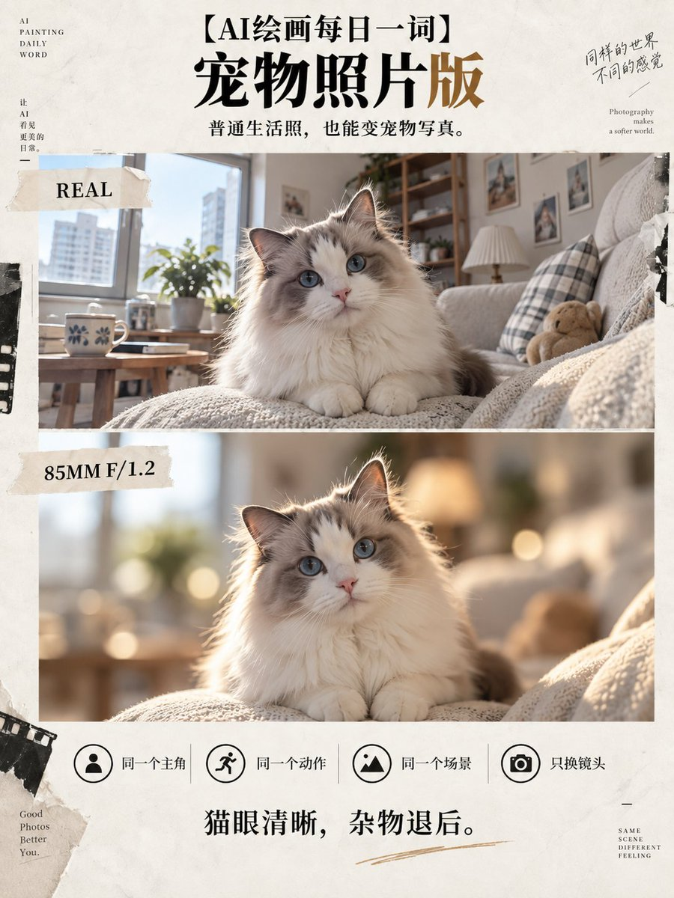

# Bokeh Twin Split: 85mm F1.2 Optical Poster

**中文标题：** 焦外抽离双生：上下分屏 85mm F1.2 光学对照海报  
**ID:** `gi25-x-490` · **Mode:** `edit`  
**Categories:** `poster-typography`, `character-consistency`  
**Tags:** `x-twitter`, `community`, `gpt-image-2.5`, `xianyu`, `zh`



### Bokeh Twin Split: 85mm F1.2 Optical Poster

```text
请基于我上传的照片，制作一张独立的3:4竖版“焦外抽离双生”视觉海报。

画面严格分为上下两个区域，高度1:1，各占50%。

上下必须保持：

同一个主体、同一张脸、同一个动作、同一个姿态、同一个视线方向、同一个主体位置、同一个场景、同一个拍摄角度、同一套构图关系。

不要重新设计人物。

不要更换背景。

不要改变照片内容。

上半部分｜REAL

完整保留上传的原始照片。

保持原始手机摄影、数码相机或生活抓拍质感。

人物、背景、环境信息全部保留。

可以进行轻度曝光和色彩整理，但不要改变景深关系。

让观众能够明确看到照片原本的真实状态。

下半部分｜85MM F/1.2

严格基于上半部分相同画面重新模拟一次专业全画幅大光圈人像摄影。

模拟：

85mm全画幅定焦镜头，f/1.2光圈。

主体眼睛、面部、主要轮廓保持高清锐利。

根据真实空间距离重新计算景深。

主体所在焦平面清晰。

主体前后的环境按照距离逐级进入失焦状态。

近距离背景保持少量结构。

中距离背景开始柔化。

远距离背景完全转化为自然奶油焦外。

背景中的：

路灯、车灯、橱窗、树叶反光、金属反射、阳光高光

自然转化为不同大小、不同虚化程度的真实光学bokeh。

焦外必须具有真实镜头特征：

柔和圆形光斑、边缘轻微猫眼形变、高光渐变、前后景深层次、真实空间压缩感。

人物头发、肩膀、衣服边缘不能出现人工抠图感。

发丝与焦外之间需要自然过渡。

保留轻微镜头呼吸、色散、颗粒、曝光误差和真实摄影缺陷。

最终效果必须像：

同一个摄影师没有移动位置，只把普通手机换成了一支85mm F1.2专业镜头重新拍了一次。

禁止：

整块背景高斯模糊。

禁止背景变成没有空间层级的一团颜色。

禁止把人物抠出来贴在模糊背景上。

禁止换脸。

禁止改变人物动作。

禁止增加不存在的建筑或景物。

禁止插画感。

禁止过度磨皮。

禁止塑料皮肤。

禁止AI棚拍感。
```

- **Recommended model:** `gpt-image-2.5-sunburst`
- **Settings:** _(defaults)_
- **Source:** [community](https://x.com/lovimg_com/status/2100498666763030990) — @lovimg_com (via xianyu110/awesome-gpt-image2.5)
- **License note:** Community X post mirrored in xianyu110/awesome-gpt-image2.5; remix with attribution
- **Notes:** xianyu110 case 2100498666763030990; category=海报排版
- **Preview:** `previews/gi25-x-490.jpg`
