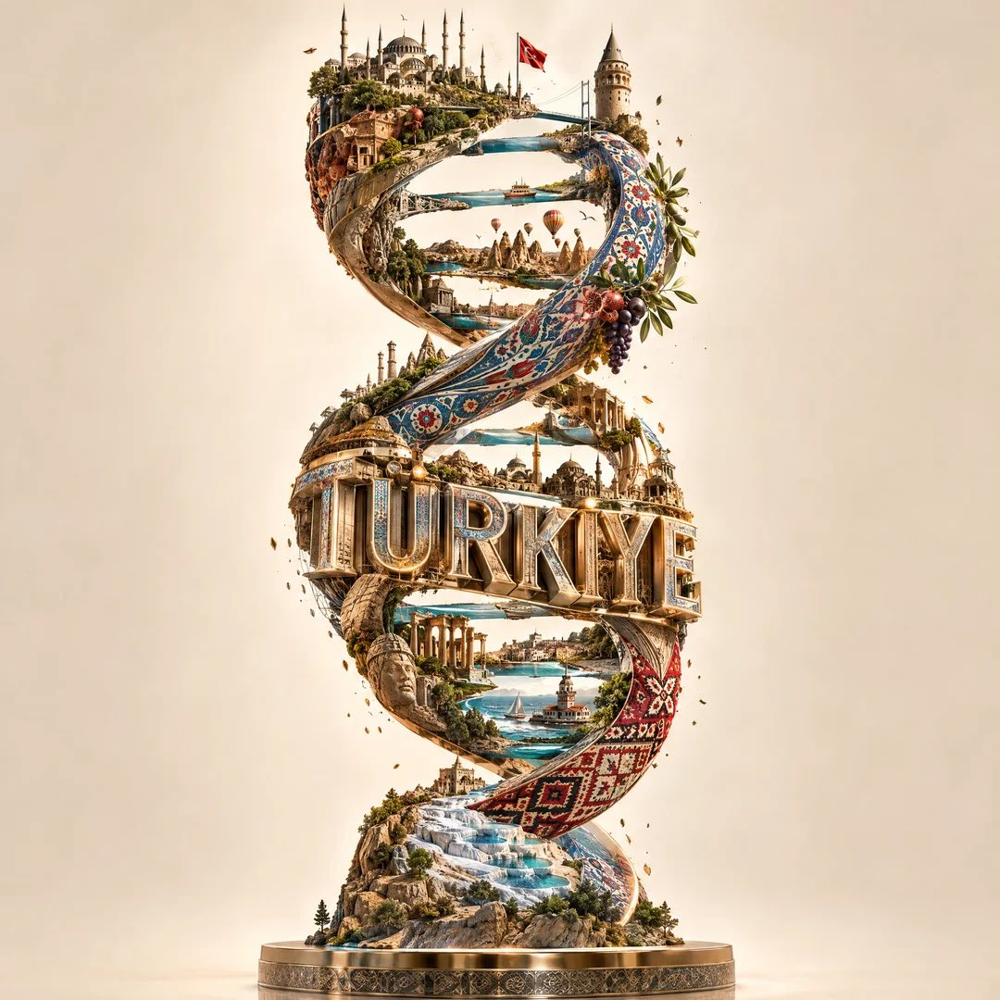

# Country DNA Double Helix Monument Sculpture [COUNTRY]

**中文标题：** 国家 DNA 双螺旋：[COUNTRY] 可替换纪念碑雕塑  
**ID:** `gi25-x-494` · **Mode:** `edit`  
**Categories:** `poster-typography`, `general`  
**Tags:** `x-twitter`, `community`, `gpt-image-2.5`, `xianyu`, `en`



### Country DNA Double Helix Monument Sculpture [COUNTRY]

```text
Create a breathtaking surreal architectural masterpiece where [COUNTRY] is transformed into a giant DNA double helix, with the word “[COUNTRY]” prominently integrated into the structure itself.

The DNA helix rises vertically as a monumental futuristic sculpture. The two twisting strands are built from the architecture, culture, landscapes, landmarks, patterns, and visual identity of [COUNTRY]. Intricate miniature buildings, famous landmarks, traditional architecture, roads, bridges, transportation, mountains, rivers, plants, and cultural details naturally grow along the twisting DNA strands.

The country name “[COUNTRY]” should be beautifully incorporated into the architecture, formed from elegant metallic architectural lettering near the center or lower section of the helix. The letters should feel physically built into the structure, with realistic depth, shadows, reflections, and architectural detailing — not like flat digital text.

Make the DNA base pairs connect different cultural elements of the country, creating the feeling that the entire identity of [COUNTRY] is encoded into its DNA.

Use sophisticated materials inspired by the country: stone, bronze, copper, glass, ceramic, and subtle illumination. Add tiny architectural details and floating particles around parts of the helix for a magical transformation effect.

Minimal warm ivory background, soft cinematic studio lighting, elegant shadows, premium museum-installation aesthetic, photorealistic materials, ultra-detailed, surreal yet believable, visually striking and highly shareable.

Composition: centered monumental hero sculpture, vertical 4:5, dramatic perspective, clean negative space, no people, no extra text, no logos, no watermark.
```

- **Recommended model:** `gpt-image-2.5-sunburst`
- **Settings:** _(defaults)_
- **Source:** [community](https://x.com/Naiknelofar788/status/2100487806481305998) — @Naiknelofar788 (via xianyu110/awesome-gpt-image2.5)
- **License note:** Community X post mirrored in xianyu110/awesome-gpt-image2.5; remix with attribution
- **Notes:** xianyu110 case 2100487806481305998; category=海报排版
- **Preview:** `previews/gi25-x-494.jpg`
