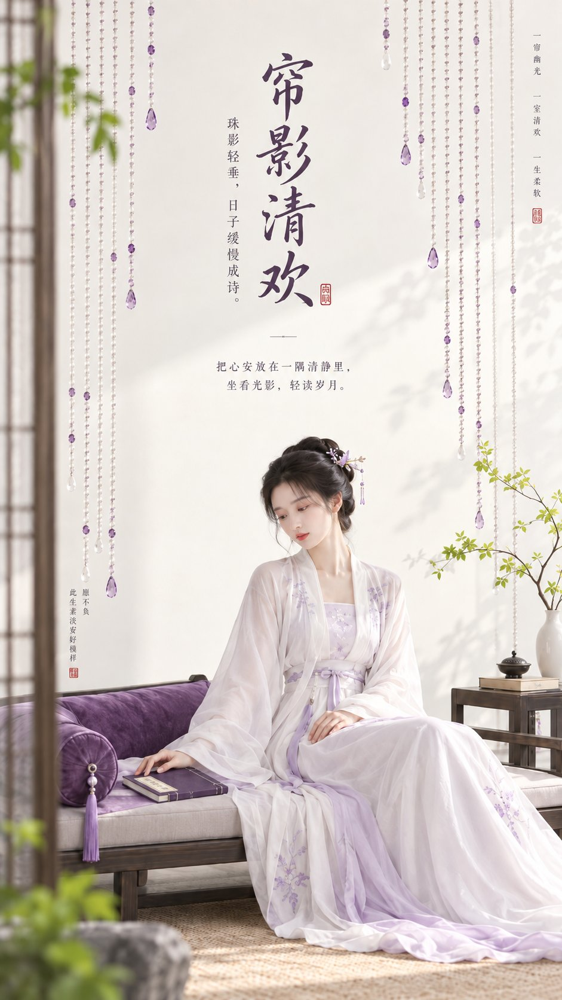

# Eastern Zen Minimal Cover Poster (Structured CN)

**中文标题：** 东方禅意极简封面：中文结构化海报配方  
**ID:** `gi25-x-498` · **Mode:** `generate`  
**Categories:** `poster-typography`  
**Tags:** `x-twitter`, `community`, `gpt-image-2.5`, `xianyu`, `zh`



### Eastern Zen Minimal Cover Poster (Structured CN)

```text
主题方向：东方禅意极简封面海报
风格分支：女性审美精致型
主体内容：一位古风女子坐在低榻上，手边放着一本合起的小册子
情绪母题：安静、柔美、精致松弛感
场景与意象：极简珠帘、低榻、葡萄紫软垫、青柠绿小枝叶、女子
构图与空间：9:16 竖版构图，低榻位于下方，珠帘从上方垂落形成柔和纵向节奏，中上部保留留白
色彩控制：奶白作为整体基底，葡萄紫用于软垫和局部点缀，青柠绿用于少量枝叶，人物服装建议珍珠白或浅紫白；避免全图泛紫
光线与质感：明亮室内柔光，轮廓清晰，低灰度，干净平面海报感
画幅比例：9:16
补充要求：整体要有精致女性感和封面感，珠帘要简洁，不要宫廷繁复感，画面留白处配上合适的艺术文字 。
```

- **Recommended model:** `gpt-image-2.5-sunburst`
- **Settings:** _(defaults)_
- **Source:** [community](https://x.com/liyue_ai/status/2100462806281941187) — @liyue_ai (via xianyu110/awesome-gpt-image2.5)
- **License note:** Community X post mirrored in xianyu110/awesome-gpt-image2.5; remix with attribution
- **Notes:** xianyu110 case 2100462806281941187; category=海报排版
- **Preview:** `previews/gi25-x-498.jpg`
